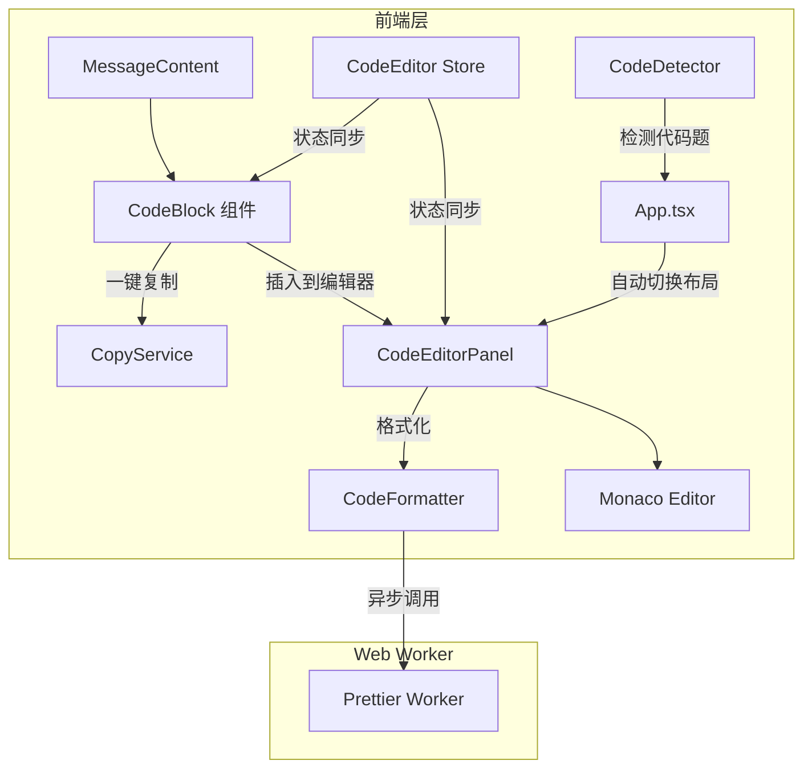
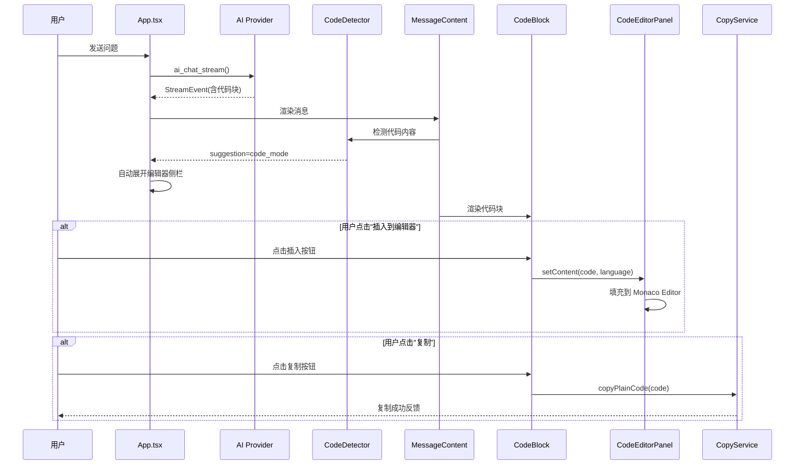
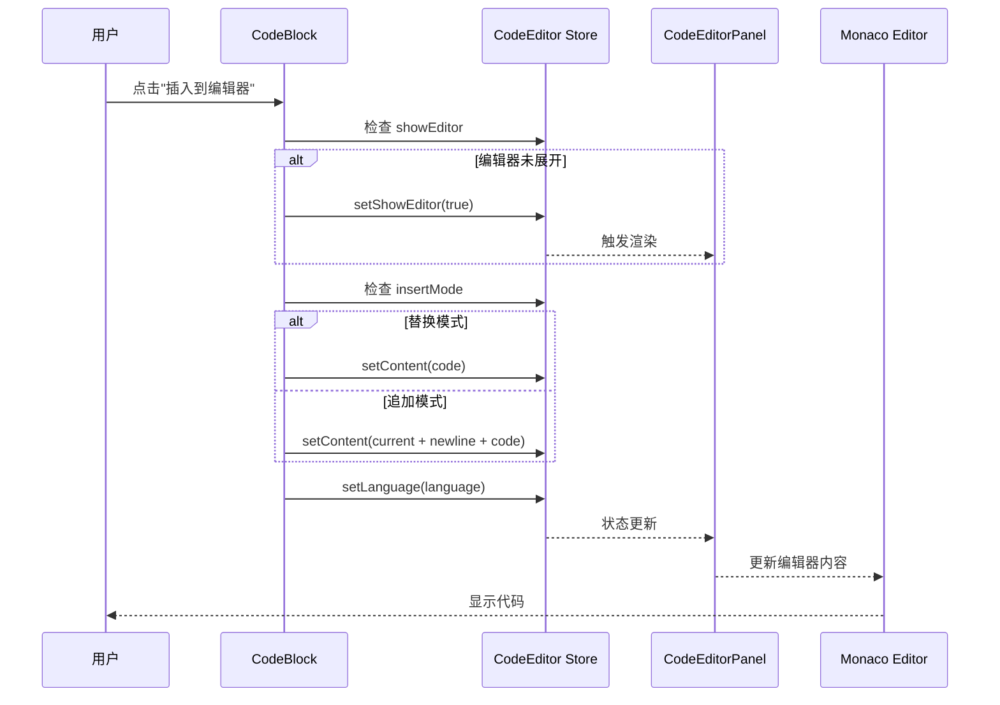
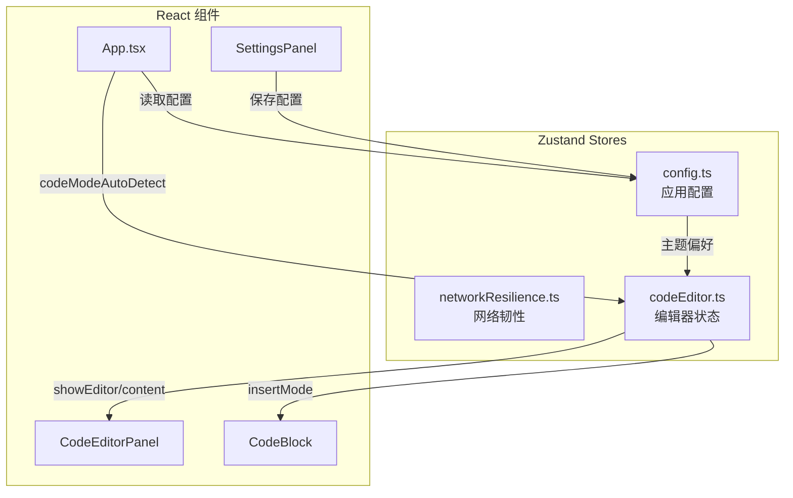
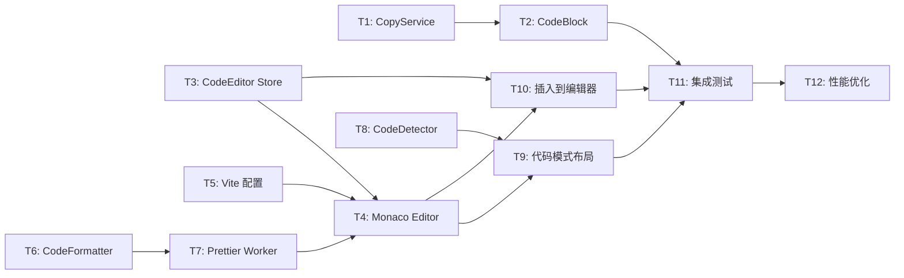

# 代码模式与编辑器集成架构设计文档

> **版本**: v1.0  
> **日期**: 2026-03-21  
> **范围**: TODO #35 ~ #39

---

## 一、概述

### 1.1 需求背景

当前 AI_Cue 应用在代码展示和交互方面存在以下不足：

| 问题 | 现状 | 影响 |
|------|------|------|
| **代码块无语法高亮** | MessageContent.tsx 使用正则提取代码块，渲染为纯 `<pre><code>` 标签 | 代码可读性差，无法快速识别语法结构 |
| **无代码复制按钮** | 用户需手动选中并复制代码 | 操作繁琐，复制时可能带入额外空格或标记 |
| **无代码编辑器** | 仅展示 AI 生成的代码，无法修改 | 无法基于 AI 代码进行二次编辑和调试 |
| **无代码格式化** | 代码保持 AI 原始输出格式 | 缩进和格式可能不符合用户习惯 |
| **无专用代码界面** | 截图识别到代码题后仍使用普通对话布局 | 代码编辑空间受限，交互效率低 |
| **紧凑模式代码丢失** | CompactView 中代码块被替换为 `[代码块]` 占位符 | 无法在紧凑模式下查看代码摘要 |

### 1.2 目标功能清单

| 编号 | 功能 | 优先级 | 描述 |
|------|------|--------|------|
| #35 | 代码模式自动切换 | P1 | 识别截图/对话中的代码题，自动切换为代码模式布局 |
| #36 | Monaco Editor 内嵌 | P0 | 集成轻量代码编辑器，支持语法高亮、基础编辑 |
| #37 | 代码块插入编辑器 | P1 | AI 回答中的代码块可一键插入到编辑器 |
| #38 | 代码自动格式化 | P1 | 支持常见语言的代码格式化 |
| #39 | 一键复制纯代码 | P0 | 去除 Markdown 标记，仅复制代码内容 |

### 1.3 设计原则

| 原则 | 说明 |
|------|------|
| **性能优先** | Monaco Editor 动态导入，Prettier 在 Web Worker 中运行，避免主线程阻塞 |
| **渐进式增强** | 先实现基础复制功能，再集成编辑器，最后添加高级特性 |
| **可扩展性** | 插件化架构支持未来添加新语言、新格式化器 |
| **代码安全** | 剪贴板操作降级处理、格式化超时保护、输入验证 |
| **UI 一致性** | 与项目咖啡色主题协调，使用 stone/amber Tailwind 色系 |

---

## 二、现有架构分析

### 2.1 代码块渲染现状

**当前实现**（`src/components/MessageContent.tsx`）：

```typescript
// 正则提取代码块
const codeBlockRegex = /```([a-zA-Z0-9_+-]*)?\n?([\s\S]*?)```/g;

// 返回 ContentSegment[] 数组（text/code 分段）
interface ContentSegment {
  type: "text" | "code";
  content: string;
  language?: string;
}

// 代码块渲染：纯文本 <pre><code>
<div className={`overflow-hidden rounded-xl ${codeWrapperClass}`}>
  {segment.language && (
    <div className="px-3 py-1.5 text-[11px] font-medium uppercase tracking-wide border-b border-black/10">
      {segment.language}
    </div>
  )}
  <pre className="overflow-x-auto px-3 py-3 text-[13px] leading-6 font-mono">
    <code>{segment.content}</code>
  </pre>
</div>
```

**现状问题**：
- 样式：Assistant `bg-stone-50 border-stone-200`，User `bg-white/80 border-amber-300`
- 语言标签：右上角 `text-[11px] uppercase`
- **无复制按钮、无行号、无语法高亮、无交互功能**

### 2.2 视图切换机制

**当前 App.tsx 视图状态**：

```typescript
const [currentView, setCurrentView] = useState<'main' | 'settings' | 'shortcuts' | 'sessions'>('main');
```

- 四种视图：main / settings / shortcuts / sessions
- 切换方式：全页覆盖（`absolute inset-0 z-50`）
- 紧凑模式：`compactMode` state，切换时调整窗口大小

### 2.3 依赖现状

| 类别 | 当前 | 缺失 |
|------|------|------|
| UI 框架 | React 19 + Tailwind 3.4 | - |
| 状态管理 | Zustand 5.0 | - |
| 图标 | lucide-react 0.460 | - |
| 代码编辑 | 无 | `monaco-editor`、`@monaco-editor/react` |
| 代码格式化 | 无 | `prettier`（及各语言 parser） |
| 代码高亮 | 无 | Monaco 内置（无需额外包） |
| Markdown 渲染 | 自定义正则解析 | 无需替换（保持轻量） |

### 2.4 架构现状图

```
┌─────────────────────────────────────────────────┐
│                 App.tsx 主应用                    │
├─────────────┬───────────────────────────────────┤
│  TitleBar   │  [●] [+] [📜] [📥] [🖱] [⊟] [⌨] [⚙]  │
├─────────────┴───────────────────────────────────┤
│  消息列表 (messages state)                        │
│  ┌───────────────────────────────────────────┐  │
│  │ MessageContent.tsx                        │  │
│  │ ┌───────────────────────────────────────┐ │  │
│  │ │ 代码块: <pre><code>纯文本</code></pre> │ │  │
│  │ │ 无复制 | 无高亮 | 无编辑               │ │  │
│  │ └───────────────────────────────────────┘ │  │
│  └───────────────────────────────────────────┘  │
├─────────────────────────────────────────────────┤
│  输入区域 (textarea)                             │
└─────────────────────────────────────────────────┘
```

---

## 三、整体架构设计（重构后）

### 3.1 架构拓扑图



### 3.2 核心模块职责表

| 模块 | 文件路径 | 职责 |
|------|---------|------|
| CodeBlock | `src/components/CodeBlock.tsx` | 代码块渲染 + 复制按钮 + 插入编辑器按钮 + 语法高亮预览 |
| CodeEditorPanel | `src/components/CodeEditorPanel.tsx` | Monaco Editor 容器 + 工具栏 + 格式化 + 复制 + 语言选择 |
| EditorSkeleton | `src/components/EditorSkeleton.tsx` | 编辑器加载骨架屏，模拟代码行的加载状态 |
| CodeDetector | `src/services/codeDetector.ts` | 代码题检测（正则 + AI 识别结果分析 + 置信度计算） |
| CodeFormatter | `src/services/codeFormatter.ts` | Prettier 集成 + Worker 管理 + 多语言支持 + 超时保护 |
| CopyService | `src/services/copyService.ts` | 剪贴板操作 + 多格式支持 + 降级处理 |
| CodeEditor Store | `src/store/codeEditor.ts` | 编辑器状态管理（内容、语言、主题、显示状态） |
| Prettier Worker | `src/workers/prettierWorker.ts` | 在 Worker 中运行 Prettier，避免主线程阻塞 |

### 3.3 数据流图



---

## 四、功能一：代码模式自动切换（#35）

### 4.1 代码题检测策略

#### 4.1.1 检测服务设计

```typescript
// src/services/codeDetector.ts

export interface CodeBlockInfo {
  content: string;
  language: string;
  startIndex: number;
  endIndex: number;
}

export interface CodeDetectionResult {
  isCodeRelated: boolean;
  confidence: number;        // 0-1
  detectedLanguages: string[];
  codeBlockCount: number;
  codeBlocks: CodeBlockInfo[];
  totalCodeLength: number;
  suggestion: 'code_mode' | 'normal_mode' | 'no_change';
}

class CodeDetector {
  private static instance: CodeDetector;
  
  static getInstance(): CodeDetector {
    if (!CodeDetector.instance) {
      CodeDetector.instance = new CodeDetector();
    }
    return CodeDetector.instance;
  }

  // 检测消息中的代码内容
  detect(content: string): CodeDetectionResult {
    const codeBlocks = this.extractCodeBlocks(content);
    const keywordScore = this.detectCodeKeywords(content);
    const codeRatio = this.calculateCodeRatio(content, codeBlocks);
    
    // 计算综合置信度
    let confidence = 0;
    
    // 规则1：包含代码块 (+0.4)
    if (codeBlocks.length >= 1) confidence += 0.4;
    
    // 规则2：多代码块加分 (+0.2)
    if (codeBlocks.length >= 3) confidence += 0.2;
    
    // 规则3：代码占比 > 50% (+0.2)
    if (codeRatio > 0.5) confidence += 0.2;
    
    // 规则4：代码关键词 (+0.1)
    if (keywordScore > 3) confidence += 0.1;
    
    // 规则5：用户意图关键词 (+0.1)
    if (this.hasUserIntentKeywords(content)) confidence += 0.1;
    
    confidence = Math.min(confidence, 1.0);
    
    return {
      isCodeRelated: confidence >= 0.4,
      confidence,
      detectedLanguages: [...new Set(codeBlocks.map(b => b.language).filter(Boolean))],
      codeBlockCount: codeBlocks.length,
      codeBlocks,
      totalCodeLength: codeBlocks.reduce((sum, b) => sum + b.content.length, 0),
      suggestion: confidence >= 0.6 ? 'code_mode' : 'no_change',
    };
  }

  // 提取代码块
  private extractCodeBlocks(content: string): CodeBlockInfo[] {
    const regex = /```([a-zA-Z0-9_+-]*)?\n?([\s\S]*?)```/g;
    const blocks: CodeBlockInfo[] = [];
    let match;
    
    while ((match = regex.exec(content)) !== null) {
      blocks.push({
        content: match[2].trim(),
        language: (match[1] || 'plaintext').toLowerCase(),
        startIndex: match.index,
        endIndex: match.index + match[0].length,
      });
    }
    
    return blocks;
  }

  // 检测代码关键词
  private detectCodeKeywords(content: string): number {
    const keywords = [
      'function', 'class', 'const', 'let', 'var', 'import', 'export',
      'def ', 'return', 'if ', 'else', 'for ', 'while',
      'public', 'private', 'static', 'void', 'int ', 'string',
      '=>', '===', '!==', '&&', '||',
    ];
    
    let score = 0;
    const lowerContent = content.toLowerCase();
    
    for (const keyword of keywords) {
      if (lowerContent.includes(keyword)) score++;
    }
    
    return score;
  }

  // 计算代码占比
  private calculateCodeRatio(content: string, blocks: CodeBlockInfo[]): number {
    const totalCodeLength = blocks.reduce((sum, b) => sum + b.content.length, 0);
    return totalCodeLength / Math.max(content.length, 1);
  }

  // 检测用户意图关键词
  private hasUserIntentKeywords(content: string): boolean {
    const intentKeywords = ['代码', '编程', '算法', '函数', '实现', 'code', 'coding', 'algorithm'];
    const lowerContent = content.toLowerCase();
    return intentKeywords.some(k => lowerContent.includes(k));
  }

  // 基于截图 OCR 结果检测
  detectFromScreenshot(ocrText: string): CodeDetectionResult {
    // 截图场景下更宽松的检测
    const result = this.detect(ocrText);
    
    // 截图中如果有代码格式特征，降低阈值
    const hasCodeFormatting = /[{}\[\]();]/.test(ocrText) && /\n\s+/.test(ocrText);
    if (hasCodeFormatting && result.confidence < 0.6) {
      result.confidence += 0.2;
      result.suggestion = result.confidence >= 0.6 ? 'code_mode' : 'no_change';
    }
    
    return result;
  }
}

export const codeDetector = CodeDetector.getInstance();
```

#### 4.1.2 检测规则表

| 条件 | 权重 | 说明 |
|------|------|------|
| 包含 ≥1 个代码块 | +0.4 | 最强信号 |
| 包含 ≥3 个代码块 | +0.2 | 多代码块加分 |
| 代码块占消息总长度 > 50% | +0.2 | 代码为主的回复 |
| 包含编程关键词（function/class/def/import 等） | +0.1 | 弱信号 |
| 用户提问包含"代码"/"编程"/"算法" | +0.1 | 用户意图 |
| **阈值** | **≥ 0.6** | 触发代码模式 |

#### 4.1.3 布局切换逻辑

```typescript
// 在 App.tsx 中集成
import { codeDetector } from './services/codeDetector';
import { useCodeEditor } from './store/codeEditor';

// 在 AI 回复流完成时检测（而非通过外部 useEffect）
// 集成到 requestAssistantReply 的 onChunk 完成回调中
const onChunk = (content: string, done: boolean, isComplete?: boolean) => {
  // ... 现有的流式更新逻辑 ...
  
  if (done && isComplete) {
    // 在流完成时检测是否需要切换代码模式
    const { codeModeAutoDetect, setShowEditor } = useCodeEditor.getState();
    if (codeModeAutoDetect) {
      const detection = codeDetector.detect(fullAssistantContent);
      if (detection.suggestion === 'code_mode') {
        setShowEditor(true);
        // 如果有代码块，预填充第一个到编辑器
        if (detection.codeBlocks?.length > 0) {
          const firstBlock = detection.codeBlocks[0];
          useCodeEditor.getState().insertCode(firstBlock.content, firstBlock.language, 'replace');
        }
      }
    }
  }
};
```

### 4.2 代码模式 UI 布局

#### 4.2.1 布局示意图

```
┌──────────────────────────────────────────────────────────────┐
│  AI Cue   [代码模式 ●]    [●] [+] [📜] [⊟] [⌨] [⚙] [—] [×]    │
├──────────────────────────┬───────────────────────────────────┤
│                          │  语言: [JavaScript ▼]  [格式化]    │
│  消息列表 (60%)          │  ┌─────────────────────────────┐  │
│                          │  │                             │  │
│  ┌────────────────────┐  │  │    Monaco Editor (40%)      │  │
│  │ AI: 这道题可以用   │  │  │                             │  │
│  │ 动态规划解决...    │  │  │  function solve(n) {        │  │
│  │                    │  │  │    // 编辑区域               │  │
│  │ ```javascript      │  │  │  }                          │  │
│  │ function solve() { │  │  │                             │  │
│  │   ...              │  │  └─────────────────────────────┘  │
│  │ ```                │  │  ┌─────────────────────────────┐  │
│  │ [插入编辑器][复制] │  │  │ [复制] [插入到输入框] [关闭] │  │
│  └────────────────────┘  │  └─────────────────────────────┘  │
├──────────────────────────┴───────────────────────────────────┤
│  输入区域                                                     │
└──────────────────────────────────────────────────────────────┘
```

#### 4.2.2 响应式布局策略

```typescript
// src/components/CodeEditorPanel.tsx
//
// 代码编辑器作为 main 视图内的侧栏组件
// 在 App.tsx 中条件渲染：
// {currentView === 'main' && showCodeEditor && <CodeEditorPanel />}

interface LayoutConfig {
  mode: 'sidebar' | 'drawer' | 'hidden';
  width: string;
  minWindowWidth: number;
}

const getLayoutConfig = (windowWidth: number, compactMode: boolean): LayoutConfig => {
  if (compactMode) {
    return { mode: 'hidden', width: '0', minWindowWidth: 0 };
  }
  
  if (windowWidth >= 900) {
    return { mode: 'sidebar', width: '40%', minWindowWidth: 900 };
  }
  
  if (windowWidth >= 600) {
    return { mode: 'drawer', width: '100%', minWindowWidth: 600 };
  }
  
  return { mode: 'hidden', width: '0', minWindowWidth: 0 };
};
```

- **宽屏 (≥900px)**：侧栏分屏布局，消息区 60%，编辑器区 40%
- **窄屏 (600-899px)**：底部抽屉形式，高度 50% 可拖拽
- **紧凑模式**：不启用代码模式，保持 `[代码块]` 占位符

---

## 五、功能二：Monaco Editor 内嵌（#36）

### 5.1 依赖安装与包体积优化

#### 5.1.1 包体积影响分析

| 包 | Minified | Gzipped | 加载策略 |
|----|----------|---------|---------|
| `monaco-editor` | ~2.3MB | ~500KB | 动态导入 + 代码分割 |
| `@monaco-editor/react` | ~15KB | ~5KB | 常规导入 |
| **总增量** | ~2.32MB | ~505KB | 仅在代码模式激活时加载 |

#### 5.1.2 Vite 配置优化

```typescript
// vite.config.ts 新增配置
import { defineConfig } from 'vite';
import react from '@vitejs/plugin-react';

export default defineConfig({
  plugins: [
    react(),
    // Monaco Editor 语言 Worker 配置
  ],
  build: {
    rollupOptions: {
      output: {
        manualChunks: {
          // 将 Monaco Editor 分离为独立 chunk
          'monaco-editor': ['monaco-editor'],
          '@monaco-editor/react': ['@monaco-editor/react'],
        },
      },
    },
  },
  optimizeDeps: {
    include: ['monaco-editor'],
  },
});
```

### 5.2 CodeEditorPanel 组件设计

```typescript
// src/components/CodeEditorPanel.tsx

import React, { Suspense, useCallback, useState } from 'react';
import { X, Copy, Check, Wand2, ChevronDown, ArrowDownToLine } from 'lucide-react';
import { useCodeEditor } from '../store/codeEditor';
import { copyService } from '../services/copyService';
import { codeFormatter } from '../services/codeFormatter';

// 懒加载 Monaco Editor
const MonacoEditor = React.lazy(() =>
  import('@monaco-editor/react').then(mod => ({ default: mod.Editor }))
);

// 支持的语言列表
const SUPPORTED_LANGUAGES = [
  { value: 'javascript', label: 'JavaScript' },
  { value: 'typescript', label: 'TypeScript' },
  { value: 'python', label: 'Python' },
  { value: 'cpp', label: 'C++' },
  { value: 'c', label: 'C' },
  { value: 'java', label: 'Java' },
  { value: 'go', label: 'Go' },
  { value: 'rust', label: 'Rust' },
  { value: 'sql', label: 'SQL' },
  { value: 'json', label: 'JSON' },
  { value: 'html', label: 'HTML' },
  { value: 'css', label: 'CSS' },
] as const;

interface CodeEditorPanelProps {
  className?: string;
  onClose?: () => void;
  onInsertToInput?: (code: string, language: string) => void;
}

export function CodeEditorPanel({
  className = '',
  onClose,
  onInsertToInput,
}: CodeEditorPanelProps) {
  const {
    content,
    language,
    theme,
    showEditor,
    setContent,
    setLanguage,
  } = useCodeEditor();
  
  const [copyStatus, setCopyStatus] = useState<'idle' | 'copied'>('idle');
  const [isFormatting, setIsFormatting] = useState(false);
  const [formatError, setFormatError] = useState<string | null>(null);

  // 复制代码
  const handleCopy = useCallback(async () => {
    const result = await copyService.copyPlainCode(content);
    if (result.success) {
      setCopyStatus('copied');
      setTimeout(() => setCopyStatus('idle'), 2000);
    }
  }, [content]);

  // 格式化代码
  const handleFormat = useCallback(async () => {
    if (!codeFormatter.isSupported(language)) {
      setFormatError(`不支持 ${language} 格式化`);
      setTimeout(() => setFormatError(null), 3000);
      return;
    }
    
    setIsFormatting(true);
    setFormatError(null);
    
    try {
      const formatted = await codeFormatter.format(content, language);
      setContent(formatted);
    } catch (error) {
      setFormatError(error instanceof Error ? error.message : '格式化失败');
      setTimeout(() => setFormatError(null), 3000);
    } finally {
      setIsFormatting(false);
    }
  }, [content, language, setContent]);

  // 插入到输入框
  const handleInsertToInput = useCallback(() => {
    onInsertToInput?.(content, language);
  }, [content, language, onInsertToInput]);

  if (!showEditor) return null;

  return (
    <div className={`flex flex-col bg-amber-50 border-l border-amber-200 ${className}`}>
      {/* 工具栏 */}
      <div className="flex items-center justify-between px-3 py-2 bg-amber-100/80 border-b border-amber-200">
        <div className="flex items-center gap-2">
          {/* 语言选择 */}
          <div className="relative">
            <select
              value={language}
              onChange={(e) => setLanguage(e.target.value)}
              className="appearance-none px-2 py-1 pr-6 text-xs bg-white border border-amber-300 rounded-lg text-amber-800 focus:outline-none focus:ring-1 focus:ring-amber-400"
            >
              {SUPPORTED_LANGUAGES.map(lang => (
                <option key={lang.value} value={lang.value}>
                  {lang.label}
                </option>
              ))}
            </select>
            <ChevronDown className="absolute right-1.5 top-1/2 -translate-y-1/2 w-3 h-3 text-amber-600 pointer-events-none" />
          </div>

          {/* 格式化按钮 */}
          <button
            onClick={handleFormat}
            disabled={isFormatting}
            className="flex items-center gap-1 px-2 py-1 text-xs bg-amber-200 hover:bg-amber-300 disabled:opacity-50 text-amber-800 rounded-lg transition-colors"
            title="格式化代码"
          >
            <Wand2 className={`w-3 h-3 ${isFormatting ? 'animate-spin' : ''}`} />
            格式化
          </button>
        </div>

        <div className="flex items-center gap-1">
          {/* 复制按钮 */}
          <button
            onClick={handleCopy}
            className="flex items-center gap-1 px-2 py-1 text-xs bg-amber-200 hover:bg-amber-300 text-amber-800 rounded-lg transition-colors"
            title="复制代码"
          >
            {copyStatus === 'copied' ? (
              <>
                <Check className="w-3 h-3 text-green-600" />
                已复制
              </>
            ) : (
              <>
                <Copy className="w-3 h-3" />
                复制
              </>
            )}
          </button>

          {/* 插入到输入框 */}
          {onInsertToInput && (
            <button
              onClick={handleInsertToInput}
              className="flex items-center gap-1 px-2 py-1 text-xs bg-amber-200 hover:bg-amber-300 text-amber-800 rounded-lg transition-colors"
              title="插入到输入框"
            >
              <ArrowDownToLine className="w-3 h-3" />
              插入
            </button>
          )}

          {/* 关闭按钮 */}
          <button
            onClick={onClose}
            className="p-1 text-amber-600 hover:text-amber-800 hover:bg-amber-200 rounded transition-colors"
            title="关闭编辑器"
          >
            <X className="w-4 h-4" />
          </button>
        </div>
      </div>

      {/* 格式化错误提示 */}
      {formatError && (
        <div className="px-3 py-1.5 text-xs text-red-600 bg-red-50 border-b border-red-200">
          {formatError}
        </div>
      )}

      {/* Monaco Editor */}
      <div className="flex-1 min-h-0">
        <Suspense fallback={<EditorSkeleton />}>
          <MonacoEditor
            value={content}
            language={language}
            theme={theme === 'vs-dark' ? 'vs-dark' : 'vs'}
            onChange={(value) => setContent(value || '')}
            options={{
              minimap: { enabled: false },
              wordWrap: 'on',
              fontSize: 13,
              lineNumbers: 'on',
              scrollBeyondLastLine: false,
              automaticLayout: true,
              tabSize: 2,
              insertSpaces: true,
              folding: true,
              renderLineHighlight: 'line',
              selectOnLineNumbers: true,
              roundedSelection: true,
              cursorBlinking: 'smooth',
              cursorSmoothCaretAnimation: 'on',
              smoothScrolling: true,
            }}
          />
        </Suspense>
      </div>
    </div>
  );
}
```

### 5.3 编辑器骨架屏组件

```typescript
// src/components/EditorSkeleton.tsx

export function EditorSkeleton() {
  // 使用 useMemo 固定随机宽度，避免每次渲染闪烁
  const lineWidths = useMemo(
    () => Array.from({ length: 12 }, () => 30 + Math.random() * 50),
    []
  );

  return (
    <div className="flex flex-col h-full bg-stone-50 p-3 animate-pulse">
      {/* 模拟代码行 */}
      {lineWidths.map((width, i) => (
        <div key={i} className="flex items-center gap-2 mb-2">
          {/* 行号 */}
          <div className="w-6 h-4 bg-stone-200 rounded" />
          {/* 代码内容 */}
          <div
            className="h-4 bg-stone-200 rounded"
            style={{ width: `${width}%` }}
          />
        </div>
      ))}
    </div>
  );
}
```

### 5.4 编辑器主题设计

```typescript
// 在 CodeEditorPanel 初始化时注册自定义主题
import * as monaco from 'monaco-editor';

// 咖啡色亮色主题
monaco.editor.defineTheme('ai-cue-light', {
  base: 'vs',
  inherit: true,
  rules: [
    { token: 'comment', foreground: '78716c' },   // stone-500
    { token: 'keyword', foreground: 'd97706' },   // amber-600
    { token: 'string', foreground: '059669' },    // emerald-600
    { token: 'number', foreground: 'dc2626' },    // red-600
  ],
  colors: {
    'editor.background': '#fffbeb',               // amber-50
    'editor.foreground': '#78350f',               // amber-900
    'editor.lineHighlightBackground': '#fef3c7',  // amber-100
    'editorLineNumber.foreground': '#d97706',     // amber-600
    'editorCursor.foreground': '#b45309',         // amber-700
  },
});

// 暗色主题（基于 vs-dark）
monaco.editor.defineTheme('ai-cue-dark', {
  base: 'vs-dark',
  inherit: true,
  rules: [],
  colors: {
    'editor.background': '#1c1917',               // stone-900
    'editor.lineHighlightBackground': '#292524',  // stone-800
  },
});
```

---

## 六、功能三：代码块"插入到编辑器"按钮（#37）

### 6.1 CodeBlock 组件设计

```typescript
// src/components/CodeBlock.tsx

import React, { useState, useCallback } from 'react';
import { Copy, Check, ArrowUpToLine } from 'lucide-react';
import { copyService } from '../services/copyService';
import { useCodeEditor } from '../store/codeEditor';

interface CodeBlockProps {
  content: string;
  language?: string;
  variant: 'user' | 'assistant';
}

export function CodeBlock({ content, language, variant }: CodeBlockProps) {
  const [copyStatus, setCopyStatus] = useState<'idle' | 'copied'>('idle');
  const { showEditor, setContent, setLanguage, setShowEditor, insertMode, setInsertMode } = useCodeEditor();

  // 一键复制
  const handleCopy = useCallback(async () => {
    const result = await copyService.copyPlainCode(content);
    if (result.success) {
      setCopyStatus('copied');
      setTimeout(() => setCopyStatus('idle'), 2000);
    }
  }, [content]);

  // 插入到编辑器
  const handleInsertToEditor = useCallback(() => {
    if (!showEditor) {
      // 如果编辑器未展开，先展开
      setShowEditor(true);
    }
    
    if (insertMode === 'replace') {
      setContent(content);
    } else {
      // 追加模式：在现有内容后添加空行和新代码
      const currentContent = useCodeEditor.getState().content;
      const separator = currentContent.trim() ? '\n\n' : '';
      setContent(currentContent + separator + content);
    }
    
    if (language) {
      setLanguage(language);
    }
  }, [content, language, showEditor, insertMode, setContent, setLanguage, setShowEditor]);

  // 样式
  const wrapperClass = variant === 'assistant'
    ? 'bg-stone-50 text-stone-900 border border-stone-200'
    : 'bg-white/80 text-amber-900 border border-amber-300';

  return (
    <div className={`overflow-hidden rounded-xl ${wrapperClass} group`}>
      {/* 头部：语言标签 + 操作按钮 */}
      <div className="flex items-center justify-between px-3 py-1.5 border-b border-black/10">
        {language && (
          <span className="text-[11px] font-medium uppercase tracking-wide text-stone-500">
            {language}
          </span>
        )}
        <div className="flex items-center gap-1 opacity-60 group-hover:opacity-100 transition-opacity">
          {/* 插入到编辑器按钮 */}
          <button
            onClick={handleInsertToEditor}
            className="flex items-center gap-1 px-1.5 py-0.5 text-[10px] text-stone-600 hover:text-amber-700 hover:bg-amber-100 rounded transition-colors"
            title="插入到编辑器"
          >
            <ArrowUpToLine className="w-3 h-3" />
            插入
          </button>
          
          {/* 复制按钮 */}
          <button
            onClick={handleCopy}
            className="flex items-center gap-1 px-1.5 py-0.5 text-[10px] text-stone-600 hover:text-amber-700 hover:bg-amber-100 rounded transition-colors"
            title="复制代码"
          >
            {copyStatus === 'copied' ? (
              <>
                <Check className="w-3 h-3 text-green-600" />
                已复制
              </>
            ) : (
              <>
                <Copy className="w-3 h-3" />
                复制
              </>
            )}
          </button>
        </div>
      </div>

      {/* 代码内容 */}
      <pre className="overflow-x-auto px-3 py-3 text-[13px] leading-6 font-mono">
        <code>{content}</code>
      </pre>
    </div>
  );
}
```

### 6.2 插入流程序列图



### 6.3 多代码块场景处理

```typescript
// 在 CodeBlock 组件中添加插入模式切换
interface InsertModeConfig {
  mode: 'replace' | 'append';
  label: string;
}

const INSERT_MODES: InsertModeConfig[] = [
  { mode: 'replace', label: '替换' },
  { mode: 'append', label: '追加' },
];

// 长按或右键显示模式选择菜单
const [showModeMenu, setShowModeMenu] = useState(false);

const handleContextMenu = useCallback((e: React.MouseEvent) => {
  e.preventDefault();
  setShowModeMenu(true);
}, []);
```

---

## 七、功能四：代码自动格式化（#38）

### 7.1 格式化服务设计

#### 7.1.1 格式化策略接口

```typescript
// src/services/codeFormatter.ts

export interface FormatOptions {
  tabWidth?: number;
  useTabs?: boolean;
  printWidth?: number;
  semi?: boolean;
  singleQuote?: boolean;
}

export interface FormatterPlugin {
  readonly name: string;
  readonly supportedLanguages: string[];
  format(code: string, language: string, options?: FormatOptions): Promise<string>;
}

class CodeFormatterService {
  private plugins: Map<string, FormatterPlugin> = new Map();
  private languageToPlugin: Map<string, string> = new Map();
  private worker: Worker | null = null;
  private requestId = 0;
  private pendingRequests: Map<number, {
    resolve: (value: string) => void;
    reject: (error: Error) => void;
    timeout: ReturnType<typeof setTimeout>;
  }> = new Map();

  constructor() {
    // 注册默认插件
    this.register(new PrettierFormatterPlugin(this));
    this.register(new MonacoFormatterPlugin());
  }

  // 注册格式化插件
  register(plugin: FormatterPlugin): void {
    this.plugins.set(plugin.name, plugin);
    
    for (const lang of plugin.supportedLanguages) {
      // 优先使用先注册的插件
      if (!this.languageToPlugin.has(lang)) {
        this.languageToPlugin.set(lang, plugin.name);
      }
    }
  }

  // 获取语言对应的格式化器
  getFormatter(language: string): FormatterPlugin | null {
    const pluginName = this.languageToPlugin.get(language);
    return pluginName ? this.plugins.get(pluginName) || null : null;
  }

  // 格式化代码
  async format(code: string, language: string, options?: FormatOptions): Promise<string> {
    const formatter = this.getFormatter(language);
    
    if (!formatter) {
      throw new Error(`不支持 ${language} 语言的格式化`);
    }
    
    return formatter.format(code, language, options);
  }

  // 检查语言是否支持格式化
  isSupported(language: string): boolean {
    return this.languageToPlugin.has(language);
  }

  // 获取或创建 Worker
  getWorker(): Worker {
    if (!this.worker) {
      this.worker = new Worker(
        new URL('../workers/prettierWorker.ts', import.meta.url),
        { type: 'module' }
      );
    }
    
    return this.worker;
  }

  // 使用 requestId + addEventListener 的 promise-based 模式处理并发请求
  private sendToWorker(code: string, language: string, options?: FormatOptions): Promise<string> {
    return new Promise((resolve, reject) => {
      const id = ++this.requestId;
      const timeout = setTimeout(() => {
        reject(new Error('格式化超时（5秒）'));
      }, 5000);
      
      const handleMessage = (event: MessageEvent) => {
        const { requestId, formatted, error } = event.data;
        if (requestId === id) {
          this.getWorker().removeEventListener('message', handleMessage);
          clearTimeout(timeout);
          error ? reject(new Error(error)) : resolve(formatted);
        }
      };
      
      this.getWorker().addEventListener('message', handleMessage);
      this.getWorker().postMessage({ requestId: id, code, language, options });
    });
  }

  // 在 Worker 中格式化
  formatInWorker(code: string, language: string, options?: FormatOptions): Promise<string> {
    return new Promise((resolve, reject) => {
      const id = ++this.requestId;
      const timeout = setTimeout(() => {
        this.pendingRequests.delete(id);
        reject(new Error('格式化超时（5秒）'));
      }, 5000);
      
      this.pendingRequests.set(id, { resolve, reject, timeout });
      
      this.getWorker().postMessage({
        requestId: id,
        code,
        language,
        options,
      });
    });
  }

  // 清理资源
  dispose(): void {
    this.worker?.terminate();
    this.worker = null;
    
    for (const pending of this.pendingRequests.values()) {
      clearTimeout(pending.timeout);
      pending.reject(new Error('格式化服务已关闭'));
    }
    this.pendingRequests.clear();
  }
}

export const codeFormatter = new CodeFormatterService();
```

#### 7.1.2 Prettier 插件实现

```typescript
class PrettierFormatterPlugin implements FormatterPlugin {
  readonly name = 'prettier';
  readonly supportedLanguages = [
    'javascript', 'typescript', 'jsx', 'tsx',
    'json', 'css', 'scss', 'less',
    'html', 'markdown', 'yaml',
  ];

  constructor(private service: CodeFormatterService) {}

  async format(code: string, language: string, options?: FormatOptions): Promise<string> {
    return this.service.formatInWorker(code, language, options);
  }
}
```

#### 7.1.3 Monaco 内置格式化插件

```typescript
class MonacoFormatterPlugin implements FormatterPlugin {
  readonly name = 'monaco-builtin';
  readonly supportedLanguages = ['cpp', 'c', 'java', 'go', 'rust', 'python', 'sql'];

  async format(code: string, language: string): Promise<string> {
    // 使用基础缩进规范化
    const lines = code.split('\n');
    let indentLevel = 0;
    const indentSize = 2;
    const formattedLines: string[] = [];
    
    for (const line of lines) {
      const trimmed = line.trim();
      
      // 减少缩进的情况
      if (trimmed.startsWith('}') || trimmed.startsWith(')') || trimmed.startsWith(']')) {
        indentLevel = Math.max(0, indentLevel - 1);
      }
      
      // 添加缩进
      if (trimmed) {
        formattedLines.push(' '.repeat(indentLevel * indentSize) + trimmed);
      } else {
        formattedLines.push('');
      }
      
      // 增加缩进的情况
      if (trimmed.endsWith('{') || trimmed.endsWith('(') || trimmed.endsWith('[') ||
          trimmed.endsWith(':') && ['python'].includes(language)) {
        indentLevel++;
      }
    }
    
    return formattedLines.join('\n');
  }
}
```

### 7.2 Web Worker 设计

```typescript
// src/workers/prettierWorker.ts

// 语言到 Parser 的映射
const PARSER_MAP: Record<string, string> = {
  javascript: 'babel',
  typescript: 'typescript',
  jsx: 'babel',
  tsx: 'typescript',
  json: 'json',
  css: 'css',
  scss: 'scss',
  less: 'less',
  html: 'html',
  markdown: 'markdown',
  yaml: 'yaml',
};

// 动态加载 Parser
// 注：Prettier 3.x 内置了主要语言的 parser 插件，无需额外安装 @prettier/plugin-* 包
async function loadParser(language: string): Promise<any> {
  switch (language) {
    case 'babel':
    case 'babel-flow':
      return import('prettier/plugins/babel');
    case 'typescript':
      return import('prettier/plugins/typescript');
    case 'html':
      return import('prettier/plugins/html');
    case 'css':
    case 'scss':
    case 'less':
      return import('prettier/plugins/postcss');
    case 'markdown':
    case 'mdx':
      return import('prettier/plugins/markdown');
    case 'yaml':
      return import('prettier/plugins/yaml');
    default:
      return import('prettier/plugins/babel');
  }
}

self.onmessage = async (event: MessageEvent) => {
  const { code, language, options = {}, requestId } = event.data;
  
  try {
    const prettier = await import('prettier/standalone');
    const parser = await loadParser(language);
    const parserName = PARSER_MAP[language];
    
    const formatted = await prettier.format(code, {
      parser: parserName,
      plugins: [parser],
      tabWidth: options.tabWidth ?? 2,
      useTabs: options.useTabs ?? false,
      printWidth: options.printWidth ?? 80,
      semi: options.semi ?? true,
      singleQuote: options.singleQuote ?? true,
    });
    
    self.postMessage({ requestId, formatted, error: null });
  } catch (error) {
    self.postMessage({
      requestId,
      formatted: null,
      error: error instanceof Error ? error.message : String(error),
    });
  }
};
```

### 7.3 语言支持矩阵

| 语言 | 格式化器 | 状态 | 说明 |
|------|---------|------|------|
| JavaScript/TypeScript | Prettier | ✅ 完整支持 | 包含 JSX/TSX |
| JSON | Prettier | ✅ 完整支持 | - |
| CSS/SCSS/Less | Prettier | ✅ 完整支持 | - |
| HTML | Prettier | ✅ 完整支持 | - |
| Markdown | Prettier | ✅ 完整支持 | - |
| YAML | Prettier | ✅ 完整支持 | - |
| Python | Monaco 内置 | ⚠️ 基础支持 | 缩进规范化 |
| C/C++ | Monaco 内置 | ⚠️ 基础支持 | 未来可接入 clang-format |
| Java | Monaco 内置 | ⚠️ 基础支持 | 未来可接入 google-java-format |
| Go | Monaco 内置 | ⚠️ 基础支持 | 未来可通过后端调用 gofmt |
| Rust | Monaco 内置 | ⚠️ 基础支持 | 未来可通过后端调用 rustfmt |
| SQL | Monaco 内置 | ⚠️ 基础支持 | 未来可接入 sql-formatter |

---

## 八、功能五：一键复制纯代码（#39）

### 8.1 复制服务设计

```typescript
// src/services/copyService.ts

export type CopyFormat = 'plain' | 'markdown' | 'html';

export interface CopyResult {
  success: boolean;
  format: CopyFormat;
  fallback: boolean;   // 是否使用了降级方案
  error?: string;
}

class CopyService {
  // 复制纯代码（去除所有 Markdown 标记）
  async copyPlainCode(code: string): Promise<CopyResult> {
    const normalizedCode = this.normalizeIndentation(code);
    return this.copyToClipboard(normalizedCode, 'plain');
  }

  // 复制为 Markdown 代码块
  async copyAsMarkdown(code: string, language: string): Promise<CopyResult> {
    const markdown = `\`\`\`${language}\n${code}\n\`\`\``;
    return this.copyToClipboard(markdown, 'markdown');
  }

  // 复制为 HTML（带基础样式）
  async copyAsHtml(code: string, language: string): Promise<CopyResult> {
    const html = `<pre><code class="language-${language}">${this.escapeHtml(code)}</code></pre>`;
    return this.copyToClipboard(html, 'html');
  }

  // 核心复制方法
  private async copyToClipboard(text: string, format: CopyFormat): Promise<CopyResult> {
    // 尝试使用 Clipboard API
    if (navigator.clipboard && window.isSecureContext) {
      try {
        await navigator.clipboard.writeText(text);
        return { success: true, format, fallback: false };
      } catch {
        // Clipboard API 失败，尝试降级方案
      }
    }
    
    // 降级方案
    const success = this.fallbackCopy(text);
    return { success, format, fallback: true };
  }

  // 降级方案：使用 textarea + execCommand
  // 注意：Tauri WebView 已内置 Clipboard API，document.execCommand('copy') 已弃用
  // 优先使用 navigator.clipboard.writeText()，此方法仅作为最终回退
  private fallbackCopy(text: string): boolean {
    const textarea = document.createElement('textarea');
    textarea.value = text;
    textarea.style.cssText = 'position:fixed;left:-9999px;top:-9999px;opacity:0;pointer-events:none';
    textarea.setAttribute('readonly', '');
    
    document.body.appendChild(textarea);
    textarea.select();
    textarea.setSelectionRange(0, textarea.value.length);
    
    try {
      return document.execCommand('copy');
    } catch {
      return false;
    } finally {
      document.body.removeChild(textarea);
    }
  }

  // 清理代码：去除行首公共缩进
  private normalizeIndentation(code: string): string {
    const lines = code.split('\n');
    
    // 找出最小非空行缩进
    let minIndent = Infinity;
    for (const line of lines) {
      if (line.trim()) {
        const indent = line.match(/^(\s*)/)?.[1].length ?? 0;
        minIndent = Math.min(minIndent, indent);
      }
    }
    
    if (minIndent === Infinity || minIndent === 0) {
      return code;
    }
    
    // 移除公共缩进
    return lines
      .map(line => line.slice(minIndent))
      .join('\n');
  }

  // HTML 转义
  private escapeHtml(text: string): string {
    return text
      .replace(/&/g, '&amp;')
      .replace(/</g, '&lt;')
      .replace(/>/g, '&gt;')
      .replace(/"/g, '&quot;')
      .replace(/'/g, '&#39;');
  }
}

export const copyService = new CopyService();
```

### 8.2 复制按钮交互设计

```typescript
// 复制按钮状态机
type CopyButtonState = 'idle' | 'copying' | 'copied' | 'error';

const [copyState, setCopyState] = useState<CopyButtonState>('idle');

const handleCopy = async () => {
  setCopyState('copying');
  
  const result = await copyService.copyPlainCode(content);
  
  if (result.success) {
    setCopyState('copied');
    // 2秒后恢复
    setTimeout(() => setCopyState('idle'), 2000);
  } else {
    setCopyState('error');
    setTimeout(() => setCopyState('idle'), 3000);
  }
};

// 按钮渲染
const renderCopyButton = () => {
  switch (copyState) {
    case 'copying':
      return <Loader className="w-3 h-3 animate-spin" />;
    case 'copied':
      return (
        <>
          <Check className="w-3 h-3 text-green-600" />
          <span>已复制</span>
        </>
      );
    case 'error':
      return (
        <>
          <X className="w-3 h-3 text-red-500" />
          <span>失败</span>
        </>
      );
    default:
      return (
        <>
          <Copy className="w-3 h-3" />
          <span>复制</span>
        </>
      );
  }
};
```

---

## 九、状态管理设计

### 9.1 CodeEditor Store

```typescript
// src/store/codeEditor.ts

import { create } from 'zustand';

export type EditorTheme = 'vs' | 'vs-dark' | 'ai-cue-light' | 'ai-cue-dark';
export type InsertMode = 'replace' | 'append';

interface CodeEditorState {
  // 编辑器显示状态
  showEditor: boolean;
  editorWidth: number;         // 百分比，默认 40
  
  // 编辑器内容
  content: string;
  language: string;
  
  // 编辑器配置
  theme: EditorTheme;
  fontSize: number;
  tabSize: number;
  wordWrap: boolean;
  
  // 代码模式
  codeModeEnabled: boolean;
  codeModeAutoDetect: boolean;  // 是否自动检测代码模式
  
  // 插入模式
  insertMode: InsertMode;
  
  // Actions
  setShowEditor: (show: boolean) => void;
  toggleEditor: () => void;
  setEditorWidth: (width: number) => void;
  setContent: (content: string) => void;
  setLanguage: (language: string) => void;
  setTheme: (theme: EditorTheme) => void;
  setFontSize: (size: number) => void;
  setTabSize: (size: number) => void;
  setWordWrap: (wrap: boolean) => void;
  setCodeModeAutoDetect: (autoDetect: boolean) => void;
  setInsertMode: (mode: InsertMode) => void;
  insertCode: (code: string, language: string, mode?: InsertMode) => void;
  resetEditor: () => void;
}

const DEFAULT_STATE = {
  showEditor: false,
  editorWidth: 40,
  content: '',
  language: 'javascript',
  theme: 'vs' as EditorTheme,
  fontSize: 13,
  tabSize: 2,
  wordWrap: true,
  codeModeEnabled: false,
  codeModeAutoDetect: true,
  insertMode: 'replace' as InsertMode,
};

export const useCodeEditor = create<CodeEditorState>((set, get) => ({
  ...DEFAULT_STATE,
  
  setShowEditor: (show) => set({ showEditor: show }),
  
  toggleEditor: () => set((state) => ({ showEditor: !state.showEditor })),
  
  setEditorWidth: (width) => set({ editorWidth: Math.min(80, Math.max(20, width)) }),
  
  setContent: (content) => set({ content }),
  
  setLanguage: (language) => set({ language }),
  
  setTheme: (theme) => set({ theme }),
  
  setFontSize: (fontSize) => set({ fontSize: Math.min(24, Math.max(10, fontSize)) }),
  
  setTabSize: (tabSize) => set({ tabSize: Math.min(8, Math.max(2, tabSize)) }),
  
  setWordWrap: (wordWrap) => set({ wordWrap }),
  
  setCodeModeAutoDetect: (codeModeAutoDetect) => set({ codeModeAutoDetect }),
  
  setInsertMode: (insertMode) => set({ insertMode }),
  
  insertCode: (code, language, mode) => set((state) => {
    const currentMode = mode || state.insertMode;
    const newContent = currentMode === 'replace'
      ? code
      : state.content.trim()
        ? state.content + '\n\n' + code
        : code;
    return {
      content: newContent,
      language,
      showEditor: true,
    };
  }),
  
  resetEditor: () => set(DEFAULT_STATE),
}));
```

### 9.2 Store 关系图



---

## 十、可扩展性设计

### 10.1 新增语言格式化器的步骤

1. **实现 `FormatterPlugin` 接口**

```typescript
class NewLanguageFormatterPlugin implements FormatterPlugin {
  readonly name = 'new-formatter';
  readonly supportedLanguages = ['newlang'];
  
  async format(code: string, language: string, options?: FormatOptions): Promise<string> {
    // 实现格式化逻辑
  }
}
```

2. **注册到 `CodeFormatterService`**

```typescript
codeFormatter.register(new NewLanguageFormatterPlugin());
```

3. **更新 `SUPPORTED_LANGUAGES` 列表**

```typescript
const SUPPORTED_LANGUAGES = [
  // ...existing
  { value: 'newlang', label: 'New Language' },
];
```

4. **无需修改现有代码**

### 10.2 新增编辑器功能的步骤

| 功能 | 扩展方式 | 示例 |
|------|---------|------|
| 代码补全 | 注册 Monaco CompletionItemProvider | `monaco.languages.registerCompletionItemProvider()` |
| 代码检查 | 注册 Monaco DiagnosticsAdapter | `monaco.editor.setModelMarkers()` |
| 自定义主题 | 调用 `monaco.editor.defineTheme()` | 见 5.4 节 |
| 自定义快捷键 | 使用 `editor.addAction()` | `editor.addAction({ id, label, keybindings, run })` |

### 10.3 未来扩展方向

| 功能 | 扩展方式 | 复杂度 | 优先级 |
|------|---------|--------|--------|
| AI 代码补全 | Monaco CompletionProvider + AI API | 高 | 中 |
| 代码执行沙箱 | 后端 Rust 进程隔离 / Webcontainer | 很高 | 低 |
| 多文件编辑 | Monaco 多 Model 管理 | 中 | 低 |
| Diff 对比视图 | Monaco DiffEditor | 低 | 中 |
| 代码片段模板 | Monaco Snippet Provider | 低 | 中 |
| 语法错误检查 | Monaco DiagnosticsAdapter + Language Server | 高 | 中 |

---

## 十一、安全性设计

### 11.1 剪贴板安全

| 风险 | 缓解措施 |
|------|----------|
| Clipboard API 需要 HTTPS | Tauri 应用默认 HTTPS 上下文，支持 Clipboard API |
| 部分浏览器限制 | 提供 textarea + execCommand 降级方案 |
| 敏感代码泄露 | 复制操作需用户主动触发（不自动复制） |

### 11.2 Monaco Editor 安全

| 风险 | 缓解措施 |
|------|----------|
| XSS 注入 | Monaco 内置 XSS 防护，代码作为纯文本渲染 |
| 文件系统访问 | 禁用 Monaco 文件系统功能，仅内存操作 |
| 恶意代码执行 | 当前版本不支持代码执行，预留沙箱接口 |

### 11.3 输入验证

```typescript
// 代码块内容长度限制
const MAX_CODE_LENGTH = 100000; // 100KB

function validateCodeInput(code: string): { valid: boolean; error?: string } {
  if (code.length > MAX_CODE_LENGTH) {
    return { valid: false, error: `代码长度超过限制 (${MAX_CODE_LENGTH} 字符)` };
  }
  return { valid: true };
}

// 语言标识符白名单验证
const ALLOWED_LANGUAGES = new Set([
  'javascript', 'typescript', 'python', 'java', 'cpp', 'c',
  'go', 'rust', 'sql', 'json', 'html', 'css', 'markdown',
]);

function validateLanguage(language: string): string {
  return ALLOWED_LANGUAGES.has(language.toLowerCase())
    ? language.toLowerCase()
    : 'plaintext';
}
```

### 11.4 格式化超时保护

```typescript
// 在 codeFormatter.ts 中已实现
const timeout = setTimeout(() => {
  this.pendingRequests.delete(id);
  reject(new Error('格式化超时（5秒）'));
}, 5000);
```

---

## 十二、改动文件清单

| 操作 | 文件路径 | 说明 |
|------|---------|------|
| 新增 | `src/components/CodeBlock.tsx` | 独立代码块组件（复制+插入+高亮） |
| 新增 | `src/components/CodeEditorPanel.tsx` | Monaco 编辑器面板 |
| 新增 | `src/components/EditorSkeleton.tsx` | 编辑器加载骨架屏 |
| 新增 | `src/services/codeDetector.ts` | 代码题检测服务 |
| 新增 | `src/services/codeFormatter.ts` | 代码格式化服务 |
| 新增 | `src/services/copyService.ts` | 剪贴板复制服务 |
| 新增 | `src/store/codeEditor.ts` | 编辑器状态管理 |
| 新增 | `src/workers/prettierWorker.ts` | Prettier Web Worker |
| 修改 | `src/App.tsx` | 集成代码模式布局、编辑器侧栏、代码检测 |
| 修改 | `src/components/MessageContent.tsx` | 使用 CodeBlock 组件替换原代码块渲染 |
| 修改 | `src/index.css` | 编辑器相关样式 |
| 修改 | `package.json` | 新增 monaco-editor、@monaco-editor/react、prettier 依赖 |
| 修改 | `vite.config.ts` | Monaco 代码分割配置 |

---

## 十三、分阶段实施路线图

| 阶段 | Task | 改动文件 | 依赖 | 验收标准 |
|------|------|---------|------|----------|
| **阶段一** | T1: CopyService 服务 | `copyService.ts` | 无 | 复制功能正常，支持降级 |
| | T2: CodeBlock 组件 | `CodeBlock.tsx`, `MessageContent.tsx` | T1 | 每个代码块有复制按钮，点击后复制纯代码 |
| **阶段二** | T3: CodeEditor Store | `codeEditor.ts` | 无 | 状态管理正常工作 |
| | T4: Monaco Editor 集成 | `CodeEditorPanel.tsx`, `EditorSkeleton.tsx` | T3 | 编辑器可正常渲染和编辑 |
| | T5: Vite 配置优化 | `vite.config.ts`, `package.json` | 无 | 代码分割生效，Monaco 独立加载 |
| **阶段三** | T6: CodeFormatter 服务 | `codeFormatter.ts` | 无 | Prettier 格式化正常工作 |
| | T7: Prettier Worker | `prettierWorker.ts` | T6 | 格式化在 Worker 中运行，不阻塞主线程 |
| | T8: CodeDetector 服务 | `codeDetector.ts` | 无 | 代码检测逻辑正确 |
| **阶段四** | T9: 代码模式布局 | `App.tsx` | T3, T4, T8 | AI 回复含代码时自动切换代码模式 |
| | T10: 插入到编辑器功能 | `CodeBlock.tsx` | T3, T4 | 点击按钮可将代码插入编辑器 |
| **阶段五** | T11: 集成测试 | 全链路 | T1~T10 | 各场景端到端测试通过 |
| | T12: 性能优化 | 全链路 | T11 | 包体积增量 < 600KB gzip |

### Task 依赖关系图



---

## 十四、风险评估与应对策略

| 风险 | 影响程度 | 发生概率 | 缓解措施 |
|------|----------|----------|----------|
| Monaco Editor 包体积过大（2.3MB） | 高 | 高 | 动态导入 + 代码分割 + 仅在需要时加载 + 骨架屏过渡 |
| Prettier 格式化阻塞主线程 | 中 | 中 | Web Worker 线程隔离 + 5秒超时保护 |
| 代码模式自动切换误判 | 中 | 中 | 可关闭自动检测 + 手动切换按钮 + 置信度阈值可调 |
| Clipboard API 跨平台兼容 | 低 | 低 | textarea + execCommand 降级方案 |
| Vite + Monaco Worker 配置复杂 | 中 | 中 | 使用 `@monaco-editor/react` 封装，简化配置 |
| 大文件代码块渲染性能 | 低 | 低 | 超过 1000 行时提示用户分段查看 |
| Tauri 窗口大小限制 | 低 | 低 | 响应式设计 + 最小宽度检测 + 底部抽屉降级 |
| Web Worker 兼容性 | 低 | 低 | Tauri 内置 WebView 支持 ES Module Worker |

---

## 十五、技术选型对比表

### 15.1 代码编辑器对比

| 方案 | 优点 | 缺点 | 包体积 | 推荐度 |
|------|------|------|--------|--------|
| **Monaco Editor** | 完整 IDE 体验、VSCode 同源、多语言支持完善 | 包体积大（2.3MB） | ~500KB gz | ⭐⭐⭐⭐⭐ |
| CodeMirror 6 | 轻量、高性能、现代架构 | 生态不如 Monaco，配置复杂 | ~150KB gz | ⭐⭐⭐⭐ |
| Ace Editor | 成熟稳定、轻量 | 架构老旧、维护频率低 | ~200KB gz | ⭐⭐⭐ |
| 自定义 textarea | 最小体积、完全可控 | 需重复造轮子，无语法高亮 | ~0KB | ⭐ |

**选择 Monaco**：项目面向面试代码场景，需要完整的语法高亮、自动缩进和语言识别能力。Monaco 作为 VSCode 的核心编辑器，在这些方面是业界标准。动态加载策略可有效控制首屏影响。

### 15.2 代码格式化方案对比

| 方案 | 优点 | 缺点 | 推荐度 |
|------|------|------|--------|
| **Prettier (前端 Worker)** | 离线可用、无后端依赖、社区标准 | 仅支持 Web 语言为主 | ⭐⭐⭐⭐⭐ |
| 后端调用系统工具 | 支持所有语言（clang-format/black 等） | 需安装系统工具，增加后端复杂度 | ⭐⭐⭐ |
| Monaco 内置格式化 | 零额外依赖 | 格式化能力有限，效果不如 Prettier | ⭐⭐⭐ |
| **混合方案** | 覆盖面广，兼顾性能和效果 | 实现复杂度稍高 | ⭐⭐⭐⭐ |

**选择混合方案**：Prettier 作为主格式化器（覆盖 JS/TS/JSON/CSS/HTML），Monaco 内置格式化作为回退（覆盖其他语言的基础缩进）。

### 15.3 代码模式切换方案对比

| 方案 | 优点 | 缺点 | 推荐度 |
|------|------|------|--------|
| **侧栏分屏** | 对话+代码同时可见、交互自然 | 需要足够宽度 | ⭐⭐⭐⭐⭐ |
| 弹出窗口 | 不影响主窗口布局 | 窗口管理复杂、上下文割裂 | ⭐⭐⭐ |
| 全页切换 | 实现简单 | 无法同时查看对话和代码 | ⭐⭐ |
| 底部抽屉 | 竖屏友好 | 编辑空间受限 | ⭐⭐⭐ |

**选择侧栏分屏 + 底部抽屉降级**：宽屏时使用侧栏分屏（60:40），窄屏时降级为底部抽屉。

---

## 十六、附录：代码块渲染改造对照表

| 项目 | 现状 | 改造后 |
|------|------|--------|
| 组件 | MessageContent.tsx 内联渲染 | 独立 CodeBlock.tsx 组件 |
| 语法高亮 | 无 | Monaco tokenizer（复杂场景）/ 简易正则（轻量场景） |
| 复制功能 | 无 | 一键复制纯代码，支持多格式 |
| 编辑器集成 | 无 | 插入到 Monaco Editor 按钮 |
| 格式化 | 无 | Prettier + Monaco 内置 |
| 样式 | `<pre><code>` 纯文本 | 带工具栏、hover 效果、主题适配 |
| 行号 | 无 | 编辑器中支持 |
| 代码折叠 | 无 | 编辑器中支持 |
