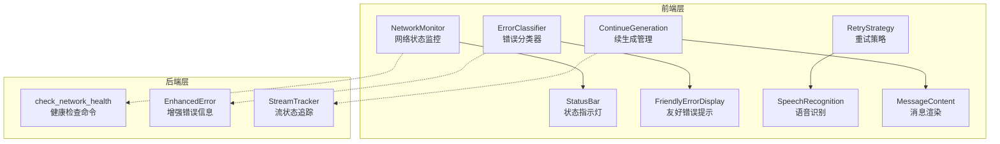
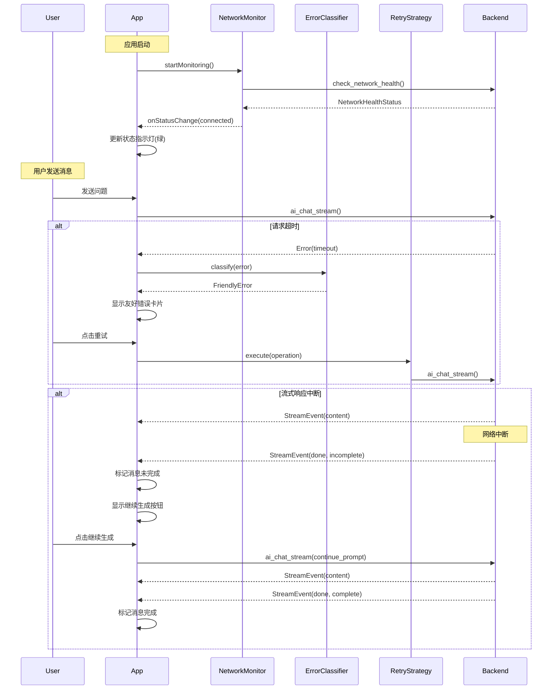
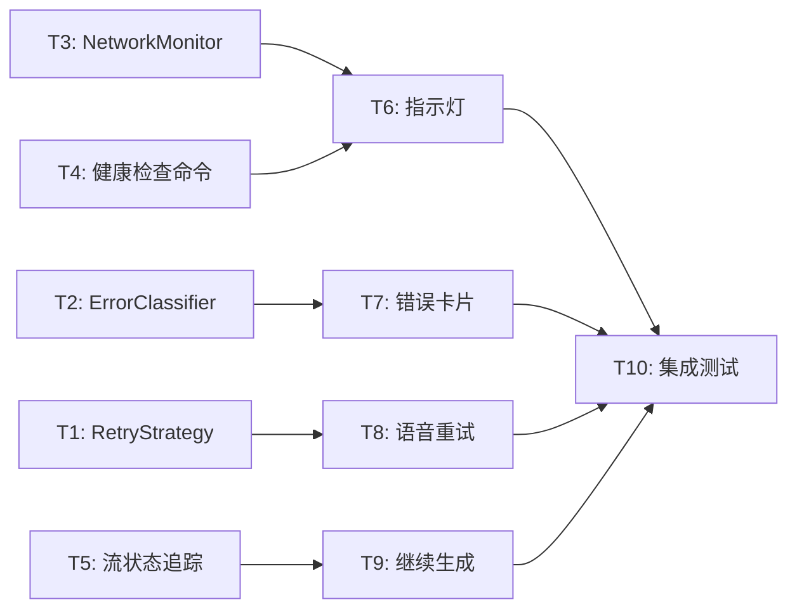

# 网络状态监控与用户体验增强架构设计文档

> **版本**: v1.0  
> **日期**: 2026-03-21  
> **范围**: TODO #31 ~ #34

---

## 一、概述

### 1.1 需求背景

当前 AI Cue 应用在网络状态感知和用户体验方面存在以下不足：

| 问题 | 现状 | 影响 |
|------|------|------|
| **网络状态不可见** | 用户无法直观感知当前网络连接质量 | 网络异常时用户困惑，不知是网络问题还是应用故障 |
| **错误提示技术化** | 错误直接显示 `❌ 出错了: ${error}` | 非技术用户无法理解错误原因和解决方法 |
| **无自动重试** | 语音识别 HTTP 调用失败后直接报错 | 临时网络抖动导致用户需手动重试 |
| **流式生成不可恢复** | AI 回复中断后无法继续，只能重新提问 | 长回答中断后需从头开始，浪费 token 和时间 |

### 1.2 目标功能清单

| 编号 | 功能 | 优先级 | 描述 |
|------|------|--------|------|
| #31 | 网络连接状态指示灯 | P1 | 界面顶部标题栏显示实时网络状态（绿/黄/红灯） |
| #32 | API 超时友好提示 | P1 | 将技术性错误转换为用户可理解的友好提示 + 建议操作 |
| #33 | 语音识别自动重试 | P2 | HTTP 调用失败后自动重试（指数退避），最多 3 次 |
| #34 | AI 继续生成按钮 | P2 | 流式回复中断后支持一键续接未完成的内容 |

### 1.3 设计原则

| 原则 | 说明 |
|------|------|
| **可观测性** | 网络状态对用户透明可见，问题发生时有明确反馈 |
| **优雅降级** | 网络异常时应用仍可用，自动重试 + 离线缓存 |
| **用户友好** | 错误提示非技术化，提供可操作的建议 |
| **可扩展性** | 新错误类型、重试策略可通过配置扩展 |
| **安全性** | 网络检测不泄露敏感信息，重试防止滥用 |

---

## 二、现有架构分析

### 2.1 错误处理现状

**Rust 层 `AIError` 枚举**（`src-tauri/src/ai/traits.rs`）：

```rust
pub enum AIError {
    Timeout,                    // 请求超时
    Network(String),            // 网络错误
    Auth(String),               // 401/403 认证失败
    RateLimit(String),          // 429 频率限制
    Api(u16, String),           // 其他 HTTP 状态码
    InvalidRequest(String),     // 请求格式错误
    StreamParse(String),        // 流解析错误
    Config(String),             // 配置错误
}
```

**前端错误处理**（`src/services/aiChat.ts`）：

```typescript
// requestAssistantReply 函数的 catch 块
updateAssistantMessage(
  assistantId,
  (imageBase64 ? "❌ 图片识别失败: " : "❌ AI 回答失败: ") +
    (error instanceof Error ? error.message : String(error)),
);
```

**超时配置**（硬编码）：
- AI 聊天：120 秒（`client.timeout(Duration::from_secs(120))`）
- 连通性测试：15 秒
- 语音识别：无显式超时（依赖系统默认）

### 2.2 流式传输架构

```
┌─────────────────────────────────────────────────────────────────────┐
│  前端 (React/TypeScript)                                             │
│                                                                       │
│  App.tsx → requestAssistantReply()                                   │
│     ↓                                                                 │
│  aiChat.ts → sendStream() → streamWithEvent()                        │
│     ↓                          ↓                                      │
│  invoke('ai_chat_stream')   listen('ai-stream')                      │
│     │                          │                                      │
│     │   字符队列 + 30ms 定时器打字动画                                  │
│     │                          │                                      │
└─────┼──────────────────────────┼──────────────────────────────────────┘
      │ Tauri IPC                │ Tauri Event
┌─────┼──────────────────────────┼──────────────────────────────────────┐
│     ▼                          │                                      │
│  commands.rs → ai_chat_stream()                                      │
│     ↓                                                                 │
│  ProviderRegistry.get() → provider.chat_stream()                     │
│     ↓                          ↑                                      │
│  reqwest HTTP POST (SSE)   app.emit("ai-stream", StreamEvent)        │
│     ↓                          │                                      │
│  stream.rs → parse_openai_sse_stream() ──────────────────────────────┘
│              parse_claude_sse_stream()                                │
│                                                                       │
└─────────────────────────────────────────────────────────────────────┘
      │
      ▼
┌─────────────────────────────────────────────────────────────────────┐
│  Provider API (HTTPS)                                                │
│  - DashScope: https://dashscope.aliyuncs.com/compatible-mode/v1     │
│  - OpenAI: https://api.openai.com/v1                                 │
│  - Claude: https://api.anthropic.com/v1                              │
└─────────────────────────────────────────────────────────────────────┘
```

**流中断处理现状**：
- 前端：流结束时仅设置 `isStreaming = false`，无恢复机制
- `requestAssistantReply` 中的 `abortController` 仅用于阻止新请求，不支持断点续传
- 后端：SSE 解析器检测 `[DONE]`（OpenAI）或 `message_stop`（Claude）标记流结束

### 2.3 语音识别架构

**重要发现**：当前语音识别并非 WebSocket，而是基于阿里云 NLS REST API 的单次 HTTP POST。

```
┌────────────────────────────────────────────────────────────────┐
│  前端                                                           │
│  speechRecognition.ts → recognizeSpeech()                      │
│     ↓                                                           │
│  invoke('nls_recognize_speech', { audioData, ... })            │
└────────────────────────────────────────────────────────────────┘
      │ Tauri IPC
┌─────▼──────────────────────────────────────────────────────────┐
│  Rust 后端 (nls.rs)                                             │
│                                                                  │
│  1. get_nls_token() → POST nls-meta.cn-shanghai.aliyuncs.com   │
│     ↓                                                           │
│  2. recognize_speech() → POST nls-gateway-cn-shanghai/stream/v1/asr │
│     ↓                                                           │
│  3. 返回识别结果或错误                                            │
└────────────────────────────────────────────────────────────────┘
```

**问题**：无重连/重试逻辑，任何失败直接返回错误。

### 2.4 UI 布局分析

```
┌──────────────────────────────────────────────────────────────┐
│  [●] AI Cue    [+] [📜] [📥] [🖱] [⊟] [⌨] [⚙] [—] [×]         │ ← 标题栏
│        ↑                                                      │
│   录音状态灯                   指示灯可放置位置 ↑               │
├──────────────────────────────────────────────────────────────┤
│                                                              │
│  💬 用户消息...                                                │
│                                                              │
│  🤖 AI 回复...                                                 │
│                                                              │
├──────────────────────────────────────────────────────────────┤
│  [🎤] [输入框...                    ] [📷] [➤]                │ ← 输入区
│                                                              │
│       Shift + Enter 换行 · Enter 发送 · 🎤 录音 · 📷 截图      │
└──────────────────────────────────────────────────────────────┘
```

---

## 三、整体架构设计（重构后）

### 3.1 网络韧性层概念

引入「网络韧性层」（Network Resilience Layer）作为统一抽象：



### 3.2 模块职责

| 模块 | 层 | 职责 |
|------|-----|------|
| `NetworkMonitor` | 前端 | 统一网络状态监控，定时检测 + 事件驱动 |
| `ErrorClassifier` | 前端 | 将技术错误映射为用户友好提示 |
| `RetryStrategy` | 前端 | 可复用的重试策略（指数退避 + 抖动） |
| `ContinueGeneration` | 前端 | 管理消息完整性标记 + 续生成逻辑 |
| `check_network_health` | 后端 | Tauri 命令：检测网络 + Provider 可达性 |
| `StreamTracker` | 后端 | SSE 流状态追踪，区分正常结束与中断 |

### 3.3 状态管理设计

```typescript
// src/store/networkResilience.ts

interface NetworkResilienceState {
  // 网络状态
  networkStatus: NetworkStatus;
  
  // 活跃的错误（按消息 ID 索引）
  activeErrors: Map<string, FriendlyError>;
  
  // 重试状态（按操作 ID 索引）
  retryStates: Map<string, RetryState>;
  
  // 未完成消息（消息 ID 集合）
  incompleteMessages: Set<string>;
}
```

---

## 四、功能一：网络连接状态指示灯（#31）

### 4.1 后端健康检查设计

新增 Tauri 命令 `check_network_health`：

**Rust 类型定义**（`src-tauri/src/ai/types.rs` 扩展）：

```rust
#[derive(Debug, Clone, Serialize, Deserialize)]
#[serde(rename_all = "camelCase")]
pub struct NetworkHealthStatus {
    pub internet_connected: bool,      // 基础网络连通
    pub provider_reachable: bool,      // Provider API 可达
    pub latency_ms: Option<u64>,       // RTT 延迟
    pub last_check: String,            // ISO 8601 时间戳
    pub error_detail: Option<String>,  // 错误详情（可选）
    pub error_type: Option<String>,    // 错误类型: "timeout" | "dns_error" | "connection_refused" | "ssl_error" 等
}

#[derive(Debug, Clone, Serialize, Deserialize, PartialEq)]
#[serde(rename_all = "snake_case")]
pub enum NetworkState {
    Connected,      // 一切正常（绿灯）
    Degraded,       // 网络连通但 Provider 不可达（黄灯）
    Disconnected,   // 无网络（红灯）
    Checking,       // 检测中（脉冲动画）
}
```

**Rust 命令实现**（`src-tauri/src/commands.rs` 新增）：

```rust
use std::time::{Duration, Instant};
use tokio::time::timeout;

#[tauri::command]
pub async fn check_network_health(
    provider_type: String,
    base_url: Option<String>,
) -> Result<NetworkHealthStatus, String> {
    let start = Instant::now();
    
    // 1. 确定检测目标 URL
    let target_url = base_url.unwrap_or_else(|| {
        match provider_type.as_str() {
            "qwen" => "https://dashscope.aliyuncs.com".to_string(),
            "openai_compat" => "https://api.openai.com".to_string(),
            "claude" => "https://api.anthropic.com".to_string(),
            _ => "https://www.google.com".to_string(),
        }
    });
    
    // 2. 基础连通性检测（DNS + TCP）
    let client = reqwest::Client::builder()
        .timeout(Duration::from_secs(10))
        .build()
        .map_err(|e| e.to_string())?;
    
    // 3. HEAD 请求检测 Provider 可达性（不带 API Key，仅检测网络层）
    let internet_check = timeout(
        Duration::from_secs(5),
        client.head(&target_url).send()
    ).await;
    
    let latency = start.elapsed().as_millis() as u64;
    let now = chrono::Utc::now().to_rfc3339();
    
    match internet_check {
        Ok(Ok(response)) => {
            // 精确的状态码判断逻辑
            let provider_reachable = match response.status().as_u16() {
                200..=299 => true,  // 2xx 成功
                300..=399 => true,  // 3xx 重定向（服务可达）
                401 | 403 => true,  // 认证失败但服务可达
                429 => true,        // 频率限制但服务可达
                400 | 404 => false, // 请求错误或资源不存在
                500..=599 => false, // 服务端错误
                _ => false,
            };
            Ok(NetworkHealthStatus {
                internet_connected: true,
                provider_reachable,
                latency_ms: Some(latency),
                last_check: now,
                error_detail: if !provider_reachable {
                    Some(format!("HTTP {}", response.status()))
                } else {
                    None
                },
            })
        }
        Ok(Err(e)) => {
            // 网络错误
            Ok(NetworkHealthStatus {
                internet_connected: false,
                provider_reachable: false,
                latency_ms: None,
                last_check: now,
                error_detail: Some(e.to_string()),
            })
        }
        Err(_) => {
            // 超时
            Ok(NetworkHealthStatus {
                internet_connected: false,
                provider_reachable: false,
                latency_ms: None,
                last_check: now,
                error_detail: Some("连接超时".to_string()),
            })
        }
    }
}
```

### 4.2 前端 NetworkMonitor 服务设计

```typescript
// src/services/networkMonitor.ts

import { invoke } from '@tauri-apps/api/core';

export interface NetworkStatus {
  state: 'connected' | 'degraded' | 'disconnected' | 'checking';
  internetConnected: boolean;
  providerReachable: boolean;
  latencyMs: number | null;
  lastCheck: Date;
  errorDetail: string | null;
}

type NetworkStatusListener = (status: NetworkStatus) => void;

class NetworkMonitor {
  private static instance: NetworkMonitor;
  private status: NetworkStatus;
  private listeners: Set<NetworkStatusListener> = new Set();
  private intervalId: ReturnType<typeof setInterval> | null = null;
  private checkInterval: number = 30000; // 默认 30 秒

  private constructor() {
    this.status = {
      state: 'checking',
      internetConnected: true,
      providerReachable: true,
      latencyMs: null,
      lastCheck: new Date(),
      errorDetail: null,
    };
  }

  static getInstance(): NetworkMonitor {
    if (!NetworkMonitor.instance) {
      NetworkMonitor.instance = new NetworkMonitor();
    }
    return NetworkMonitor.instance;
  }

  startMonitoring(intervalMs?: number): void {
    if (this.intervalId) return;
    
    if (intervalMs) {
      this.checkInterval = intervalMs;
    }
    
    // 立即执行一次检测
    this.checkNow();
    
    // 定时检测
    this.intervalId = setInterval(() => {
      this.checkNow();
    }, this.checkInterval);
    
    // 监听浏览器离线/在线事件（作为补充检测）
    window.addEventListener('offline', this.handleOffline);
    window.addEventListener('online', this.handleOnline);
  }

  stopMonitoring(): void {
    if (this.intervalId) {
      clearInterval(this.intervalId);
      this.intervalId = null;
    }
    // 移除浏览器事件监听
    window.removeEventListener('offline', this.handleOffline);
    window.removeEventListener('online', this.handleOnline);
  }
  
  // 浏览器离线事件处理：立即更新状态并加快检测频率
  private handleOffline = (): void => {
    this.updateStatus({
      state: 'disconnected',
      internetConnected: false,
      providerReachable: false,
      errorDetail: '浏览器检测到网络断开',
    });
    // 立即开始快速检测
    this.adjustCheckInterval('disconnected', this.status.state);
  };
  
  // 浏览器在线事件处理：立即触发一次完整检测
  private handleOnline = (): void => {
    // 浏览器报告在线，立即触发完整的后端检测
    this.checkNow();
  };

  async checkNow(): Promise<NetworkStatus> {
    const previousState = this.status.state;
    
    this.updateStatus({ state: 'checking' });
    
    try {
      // 从配置获取当前 Provider
      const { loadConfig } = await import('../store/config');
      const config = await loadConfig();
      const provider = config.activeProvider;
      const baseUrl = config.providerConfigs[provider]?.baseUrl;
      
      const result = await invoke<{
        internetConnected: boolean;
        providerReachable: boolean;
        latencyMs: number | null;
        lastCheck: string;
        errorDetail: string | null;
      }>('check_network_health', {
        providerType: provider,
        baseUrl: baseUrl || null,
      });
      
      const newState = this.determineState(result);
      
      this.updateStatus({
        state: newState,
        internetConnected: result.internetConnected,
        providerReachable: result.providerReachable,
        latencyMs: result.latencyMs,
        lastCheck: new Date(result.lastCheck),
        errorDetail: result.errorDetail,
      });
      
      // 智能频率调节
      this.adjustCheckInterval(newState, previousState);
      
    } catch (error) {
      this.updateStatus({
        state: 'disconnected',
        internetConnected: false,
        providerReachable: false,
        latencyMs: null,
        lastCheck: new Date(),
        errorDetail: String(error),
      });
    }
    
    return this.status;
  }

  private determineState(result: {
    internetConnected: boolean;
    providerReachable: boolean;
  }): NetworkStatus['state'] {
    if (!result.internetConnected) return 'disconnected';
    if (!result.providerReachable) return 'degraded';
    return 'connected';
  }

  private adjustCheckInterval(
    newState: NetworkStatus['state'],
    previousState: NetworkStatus['state']
  ): void {
    // 三级频率调节：无网络 5 秒，降级 15 秒，正常 30 秒
    const targetInterval = 
      newState === 'disconnected' ? 5000 :     // 无网络：5秒快速检测
      newState === 'degraded' ? 15000 :        // 降级：15秒中等频率
      30000;                                    // 正常：30秒低频率
    
    if (targetInterval !== this.checkInterval) {
      this.checkInterval = targetInterval;
      
      // 重启定时器
      if (this.intervalId) {
        clearInterval(this.intervalId);
        this.intervalId = setInterval(() => {
          this.checkNow();
        }, this.checkInterval);
      }
    }
  }

  onStatusChange(listener: NetworkStatusListener): () => void {
    this.listeners.add(listener);
    // 立即通知当前状态
    listener(this.status);
    return () => this.listeners.delete(listener);
  }

  getStatus(): NetworkStatus {
    return { ...this.status };
  }

  private updateStatus(partial: Partial<NetworkStatus>): void {
    this.status = { ...this.status, ...partial };
    this.listeners.forEach(listener => listener(this.status));
  }
}

export const networkMonitor = NetworkMonitor.getInstance();
```

### 4.3 状态指示灯 UI 组件设计

```typescript
// src/components/NetworkStatusIndicator.tsx

import { useState, useEffect } from 'react';
import { networkMonitor, NetworkStatus } from '../services/networkMonitor';

interface Props {
  className?: string;
}

export function NetworkStatusIndicator({ className }: Props) {
  const [status, setStatus] = useState<NetworkStatus>(networkMonitor.getStatus());
  const [showTooltip, setShowTooltip] = useState(false);

  useEffect(() => {
    const unsubscribe = networkMonitor.onStatusChange(setStatus);
    networkMonitor.startMonitoring();
    
    return () => {
      unsubscribe();
    };
  }, []);

  // 颜色方案（与咖啡色主题协调）
  const colors = {
    connected: 'bg-emerald-500',      // 绿色
    degraded: 'bg-amber-500',         // 琥珀色
    disconnected: 'bg-red-500',       // 红色
    checking: 'bg-amber-400 animate-pulse', // 脉冲动画
  };

  const labels = {
    connected: '网络正常',
    degraded: 'AI 服务不可用',
    disconnected: '网络已断开',
    checking: '检测中...',
  };

  return (
    <div 
      className={`relative ${className}`}
      onMouseEnter={() => setShowTooltip(true)}
      onMouseLeave={() => setShowTooltip(false)}
    >
      {/* 指示灯 */}
      <div 
        className={`w-2 h-2 rounded-full ${colors[status.state]} cursor-pointer`}
        onClick={() => networkMonitor.checkNow()}
        title="点击刷新"
      />
      
      {/* Tooltip */}
      {showTooltip && (
        <div className="absolute top-full left-1/2 -translate-x-1/2 mt-2 z-50">
          <div className="bg-amber-900 text-amber-50 text-xs rounded-lg px-3 py-2 shadow-lg whitespace-nowrap">
            <div className="font-medium">{labels[status.state]}</div>
            {status.latencyMs !== null && (
              <div className="text-amber-200 mt-1">延迟: {status.latencyMs}ms</div>
            )}
            <div className="text-amber-300 mt-1">
              上次检测: {status.lastCheck.toLocaleTimeString()}
            </div>
            {status.errorDetail && (
              <div className="text-red-300 mt-1 max-w-48 truncate">
                {status.errorDetail}
              </div>
            )}
          </div>
        </div>
      )}
    </div>
  );
}
```

### 4.4 UI 布局集成

```
┌──────────────────────────────────────────────────────────────┐
│  AI Cue       [●] [+] [📜] [📥] [🖱] [⊟] [⌨] [⚙] [—] [×]     │
│               ↑                                              │
│          网络状态指示灯                                        │
│                                                              │
│  绿色 = 一切正常                                               │
│  琥珀色 = 网络连通但 AI 服务不可达                              │
│  红色 = 无网络连接                                            │
│  脉冲动画 = 检测中                                            │
├──────────────────────────────────────────────────────────────┤
│                                                              │
│  消息列表...                                                   │
│                                                              │
├──────────────────────────────────────────────────────────────┤
│  输入区域                                                      │
└──────────────────────────────────────────────────────────────┘
```

---

## 五、功能二：API 超时友好提示（#32）

### 5.1 错误分类器设计

```typescript
// src/services/errorClassifier.ts

export enum ErrorCategory {
  Timeout = 'timeout',
  Network = 'network',
  Auth = 'auth',
  RateLimit = 'rate_limit',
  ServerError = 'server_error',
  Unknown = 'unknown',
}

export interface FriendlyError {
  category: ErrorCategory;
  title: string;           // 简短标题
  message: string;         // 友好描述（非技术性）
  suggestion: string;      // 建议操作
  icon: string;            // 显示图标
  retryable: boolean;      // 是否可重试
  retryDelay?: number;     // 建议重试延迟（秒）
}

interface ErrorMatchRule {
  patterns: RegExp[];
  category: ErrorCategory;
  friendlyError: Omit<FriendlyError, 'category'>;
}

class ErrorClassifier {
  // 说明：后端 AIError 应扩展 category() 方法，返回标准化的错误类别
  // 前端优先使用后端提供的错误类别，回退到正则匹配
  private rules: ErrorMatchRule[] = [
    // 超时错误
    {
      patterns: [/timeout/i, /请求超时/i, /timed? ?out/i],
      category: ErrorCategory.Timeout,
      friendlyError: {
        title: '响应超时',
        message: 'AI 正在思考中，但等待时间过长',
        suggestion: '请稍后重试，或尝试缩短问题长度',
        icon: '⏱️',
        retryable: true,
        retryDelay: 5,
      },
    },
    // 网络错误
    {
      patterns: [
        /network/i, /connection/i, /ECONNREFUSED/i, /ENOTFOUND/i,
        /网络错误/i, /无法连接/i, /连接失败/i,
      ],
      category: ErrorCategory.Network,
      friendlyError: {
        title: '网络连接失败',
        message: '无法连接到 AI 服务',
        suggestion: '请检查网络连接后重试',
        icon: '🌐',
        retryable: true,
        retryDelay: 3,
      },
    },
    // 认证错误
    {
      patterns: [
        /401/i, /403/i, /unauthorized/i, /auth/i, /forbidden/i,
        /认证失败/i, /无效.*key/i, /api.?key/i,
      ],
      category: ErrorCategory.Auth,
      friendlyError: {
        title: '认证失败',
        message: 'API 密钥无效或已过期',
        suggestion: '请前往设置更新 API 密钥',
        icon: '🔑',
        retryable: false,
      },
    },
    // 频率限制
    {
      patterns: [/429/i, /rate.?limit/i, /too many/i, /频率超限/i, /请求过于频繁/i],
      category: ErrorCategory.RateLimit,
      friendlyError: {
        title: '请求过于频繁',
        message: 'AI 服务暂时繁忙',
        suggestion: '请等待片刻后重试',
        icon: '⏳',
        retryable: true,
        retryDelay: 10,
      },
    },
    // 服务端错误
    {
      patterns: [/500/i, /502/i, /503/i, /504/i, /server/i, /internal/i, /服务.*错误/i],
      category: ErrorCategory.ServerError,
      friendlyError: {
        title: '服务暂时不可用',
        message: 'AI 服务正在维护中',
        suggestion: '请稍后再试',
        icon: '🔧',
        retryable: true,
        retryDelay: 30,
      },
    },
  ];

  // 两段式分类：优先使用后端提供的分类，回退到正则匹配
  classify(rawError: string, errorCategory?: string): FriendlyError {
    // 优先使用后端提供的分类
    if (errorCategory) {
      return this.classifyByCategory(errorCategory, rawError);
    }
    // 回退到正则匹配
    for (const rule of this.rules) {
      if (rule.patterns.some(pattern => pattern.test(rawError))) {
        return {
          category: rule.category,
          ...rule.friendlyError,
        };
      }
    }
    return this.defaultError(rawError);
  }

  // 根据后端提供的分类直接返回友好错误
  private classifyByCategory(category: string, rawError: string): FriendlyError {
    const rule = this.rules.find(r => r.category === category);
    if (rule) {
      return { category: rule.category, ...rule.friendlyError };
    }
    return this.defaultError(rawError);
  }

  // 默认错误处理
  private defaultError(rawError: string): FriendlyError {
    return {
      category: ErrorCategory.Unknown,
      title: '出现问题',
      message: '请求处理时遇到了问题',
      suggestion: '请稍后重试，如问题持续请联系支持',
      icon: '❌',
      retryable: true,
      retryDelay: 5,
    };
  }

  registerRule(rule: ErrorMatchRule): void {
    // 新规则优先级更高，插入到开头
    this.rules.unshift(rule);
  }
}

export const errorClassifier = new ErrorClassifier();
```

### 5.2 错误映射表

| 错误关键词 | 分类 | 标题 | 友好提示 | 建议操作 | 可重试 | 延迟 |
|-----------|------|------|---------|---------|--------|------|
| `timeout`, `请求超时` | Timeout | 响应超时 | AI 正在思考中，但等待时间过长 | 请稍后重试，或尝试缩短问题长度 | ✅ | 5s |
| `network`, `connection`, `ECONNREFUSED` | Network | 网络连接失败 | 无法连接到 AI 服务 | 请检查网络连接后重试 | ✅ | 3s |
| `401`, `403`, `unauthorized`, `auth` | Auth | 认证失败 | API 密钥无效或已过期 | 请前往设置更新 API 密钥 | ❌ | - |
| `429`, `rate limit`, `too many` | RateLimit | 请求过于频繁 | AI 服务暂时繁忙 | 请等待片刻后重试 | ✅ | 10s |
| `500`, `502`, `503`, `504`, `server` | ServerError | 服务暂时不可用 | AI 服务正在维护中 | 请稍后再试 | ✅ | 30s |

### 5.3 超时倒计时 UI 设计

```typescript
// 在 App.tsx 中添加等待时间追踪

interface WaitingState {
  startTime: number;
  messageId: string;
}

const [waitingState, setWaitingState] = useState<WaitingState | null>(null);
const [waitingSeconds, setWaitingSeconds] = useState(0);

// 等待时间更新
useEffect(() => {
  if (!waitingState) return;
  
  const interval = setInterval(() => {
    const elapsed = Math.floor((Date.now() - waitingState.startTime) / 1000);
    setWaitingSeconds(elapsed);
  }, 1000);
  
  return () => clearInterval(interval);
}, [waitingState]);

// 分阶段提示
function getWaitingHint(seconds: number): string {
  if (seconds < 10) return '';
  if (seconds < 30) return 'AI 正在深度思考...';
  if (seconds < 60) return '响应时间较长，请耐心等待...';
  return '响应时间异常，可能遇到问题...';
}
```

### 5.4 友好错误卡片组件

```typescript
// src/components/FriendlyErrorCard.tsx

import { FriendlyError } from '../services/errorClassifier';

interface Props {
  error: FriendlyError;
  onRetry?: () => void;
  onDismiss?: () => void;
  showOriginalError?: boolean;
  originalError?: string;
}

export function FriendlyErrorCard({
  error,
  onRetry,
  onDismiss,
  showOriginalError = false,
  originalError,
}: Props) {
  const [expanded, setExpanded] = useState(false);

  return (
    <div className="bg-red-50 border border-red-200 rounded-xl p-4 max-w-md">
      {/* 标题行 */}
      <div className="flex items-center gap-2 mb-2">
        <span className="text-xl">{error.icon}</span>
        <span className="font-medium text-red-800">{error.title}</span>
      </div>
      
      {/* 友好提示 */}
      <p className="text-red-700 text-sm mb-2">{error.message}</p>
      
      {/* 建议操作 */}
      <p className="text-red-600 text-xs mb-3">
        💡 {error.suggestion}
      </p>
      
      {/* 操作按钮 */}
      <div className="flex items-center gap-2">
        {error.retryable && onRetry && (
          <button
            onClick={onRetry}
            className="px-3 py-1.5 bg-amber-600 hover:bg-amber-700 text-white text-xs rounded-lg transition-colors"
          >
            重试
          </button>
        )}
        {onDismiss && (
          <button
            onClick={onDismiss}
            className="px-3 py-1.5 bg-gray-200 hover:bg-gray-300 text-gray-700 text-xs rounded-lg transition-colors"
          >
            取消
          </button>
        )}
        
        {/* 展开原始错误（调试用） */}
        {showOriginalError && originalError && (
          <button
            onClick={() => setExpanded(!expanded)}
            className="text-xs text-gray-500 hover:text-gray-700 ml-auto"
          >
            {expanded ? '收起详情' : '查看详情'}
          </button>
        )}
      </div>
      
      {/* 原始错误详情 */}
      {expanded && originalError && (
        <div className="mt-3 p-2 bg-gray-100 rounded text-xs text-gray-600 font-mono break-all">
          {originalError}
        </div>
      )}
    </div>
  );
}
```

**错误卡片布局示意**：

```
┌─────────────────────────────────────┐
│  ⏱️ 响应超时                         │
│                                     │
│  AI 正在思考中，但等待时间过长          │
│                                     │
│  💡 请稍后重试，或尝试缩短问题长度       │
│                                     │
│  [重试]  [取消]          查看详情 ▶   │
└─────────────────────────────────────┘
```

---

## 六、功能三：语音识别自动重试机制（#33）

### 6.1 统一重试策略设计

```typescript
// src/services/retryStrategy.ts

export interface RetryConfig {
  maxRetries: number;        // 最大重试次数
  baseDelay: number;         // 基础延迟（ms）
  maxDelay: number;          // 最大延迟（ms）
  backoffMultiplier: number; // 退避乘数
  jitter: boolean;           // 是否添加随机抖动
  retryableErrors?: string[]; // 可重试的错误类型（关键词）
}

export interface RetryState {
  attempt: number;           // 当前尝试次数
  lastError: string | null;  // 最后一次错误
  nextRetryIn: number;       // 下次重试倒计时（ms）
  isRetrying: boolean;       // 是否正在重试中
}

type RetryStateListener = (state: RetryState) => void;

export class RetryStrategy {
  private config: RetryConfig;
  private cancelled: boolean = false;
  private currentState: RetryState = {
    attempt: 0,
    lastError: null,
    nextRetryIn: 0,
    isRetrying: false,
  };

  constructor(config: RetryConfig) {
    this.config = config;
  }

  async execute<T>(
    operation: () => Promise<T>,
    onRetry?: RetryStateListener,
  ): Promise<T> {
    this.cancelled = false;
    this.currentState = {
      attempt: 0,
      lastError: null,
      nextRetryIn: 0,
      isRetrying: false,
    };

    let lastError: Error | null = null;

    for (let attempt = 0; attempt <= this.config.maxRetries; attempt++) {
      if (this.cancelled) {
        throw new Error('操作已取消');
      }

      this.currentState.attempt = attempt;
      this.currentState.isRetrying = attempt > 0;

      if (attempt > 0) {
        // 计算延迟
        const delay = this.calculateDelay(attempt);
        this.currentState.nextRetryIn = delay;
        onRetry?.(this.currentState);

        // 等待
        await this.sleep(delay);
      }

      try {
        const result = await operation();
        this.currentState.isRetrying = false;
        onRetry?.(this.currentState);
        return result;
      } catch (error) {
        lastError = error as Error;
        this.currentState.lastError = lastError.message;

        // 检查是否可重试
        if (!this.isRetryable(error)) {
          throw error;
        }

        // 最后一次尝试也失败了
        if (attempt === this.config.maxRetries) {
          throw error;
        }

        onRetry?.(this.currentState);
      }
    }

    throw lastError || new Error('重试次数耗尽');
  }

  cancel(): void {
    this.cancelled = true;
  }

  private calculateDelay(attempt: number): number {
    // 指数退避
    let delay = this.config.baseDelay * Math.pow(this.config.backoffMultiplier, attempt - 1);
    
    // 限制最大延迟
    delay = Math.min(delay, this.config.maxDelay);
    
    // 添加随机抖动（±20%）
    if (this.config.jitter) {
      const jitterFactor = 0.8 + Math.random() * 0.4;
      delay = Math.floor(delay * jitterFactor);
    }
    
    return delay;
  }

  private isRetryable(error: unknown): boolean {
    const errorStr = String(error).toLowerCase();
    
    // 如果配置了可重试错误列表，检查是否匹配
    if (this.config.retryableErrors && this.config.retryableErrors.length > 0) {
      return this.config.retryableErrors.some(keyword => 
        errorStr.includes(keyword.toLowerCase())
      );
    }
    
    // 默认：认证错误不可重试
    if (errorStr.includes('401') || errorStr.includes('403') || 
        errorStr.includes('unauthorized') || errorStr.includes('auth')) {
      return false;
    }
    
    return true;
  }

  private sleep(ms: number): Promise<void> {
    return new Promise(resolve => setTimeout(resolve, ms));
  }
}

// 预定义策略
export const SPEECH_RETRY_CONFIG: RetryConfig = {
  maxRetries: 3,
  baseDelay: 1000,
  maxDelay: 8000,
  backoffMultiplier: 2,
  jitter: true,
  retryableErrors: ['timeout', 'network', 'connection', 'econnrefused', 'enotfound', 'socket'],
};

export const API_RETRY_CONFIG: RetryConfig = {
  maxRetries: 2,
  baseDelay: 2000,
  maxDelay: 10000,
  backoffMultiplier: 2,
  jitter: true,
  retryableErrors: ['timeout', 'network', 'rate_limit', '429', '500', '502', '503'],
};
```

### 6.2 语音识别重试集成

```typescript
// src/services/speechRecognition.ts 重构

import { invoke } from '@tauri-apps/api/core';
import type { AppConfig } from '../store/config';
import { validateNlsConfig } from '../store/config';
import { RetryStrategy, SPEECH_RETRY_CONFIG, RetryState } from './retryStrategy';

export interface SpeechRecognitionOptions {
  onRetry?: (state: RetryState) => void;
}

export async function recognizeSpeech(
  audioData: Uint8Array, 
  config: AppConfig,
  options?: SpeechRecognitionOptions,
): Promise<string> {
  const validation = validateNlsConfig(config);
  if (!validation.valid) {
    throw new Error(validation.message || '请先在设置中配置 NLS 语音识别');
  }

  const region = config.nlsRegion || 'cn-shanghai';
  
  const retryStrategy = new RetryStrategy(SPEECH_RETRY_CONFIG);

  return retryStrategy.execute(
    async () => {
      const result = await invoke<string>('nls_recognize_speech', {
        audioData: Array.from(audioData),
        accessKeyId: config.nlsAccessKeyId,
        accessKeySecret: config.nlsAccessKeySecret,
        appKey: config.nlsAppKey,
        region,
      });
      return result;
    },
    options?.onRetry,
  );
}

// Token 刷新后重试（特殊处理）
// 设计决策：Token 刷新应由后端 nls.rs 自动处理
// 后端在检测到 Token 过期时会自动刷新并重试，前端无需手动清除 token 缓存
// 前端只需正常重试即可，后端会处理 Token 生命周期管理
export async function recognizeSpeechWithTokenRefresh(
  audioData: Uint8Array,
  config: AppConfig,
  options?: SpeechRecognitionOptions,
): Promise<string> {
  try {
    return await recognizeSpeech(audioData, config, options);
  } catch (error) {
    const errorStr = String(error).toLowerCase();
    
    // Token 过期错误由后端自动处理刷新，前端只需重试
    // 后端 nls.rs 会在 Token 无效时自动获取新 Token
    if (errorStr.includes('token') && errorStr.includes('expired')) {
      // 直接重试，后端会自动刷新 Token
      return await recognizeSpeech(audioData, config, options);
    }
    
    throw error;
  }
}
```

### 6.3 重试状态 UI 反馈

```typescript
// 在 App.tsx 的 toggleRecording 函数中集成

const toggleRecording = async () => {
  if (isRecording) {
    // 停止录音
    try {
      const wavData: number[] = await invoke("stop_audio_recording");
      setIsRecording(false);
      
      const audioData = new Uint8Array(wavData);
      
      // 添加识别中消息
      const recognizingMsgId = generateId();
      setMessages(prev => [...prev, {
        id: recognizingMsgId,
        role: "assistant",
        content: `🎤 录音完成！音频大小: ${(audioData.length / 1024).toFixed(1)}KB\n\n正在识别语音...`,
        timestamp: Date.now(),
      }]);

      try {
        const config = await loadConfig();
        
        // 使用带重试的语音识别
        const text = await recognizeSpeechWithTokenRefresh(audioData, config, {
          onRetry: (state) => {
            if (state.isRetrying) {
              // 更新消息显示重试状态
              setMessages(prev => prev.map(m => 
                m.id === recognizingMsgId
                  ? {
                      ...m,
                      content: `🎤 识别失败，正在重试 (${state.attempt}/${SPEECH_RETRY_CONFIG.maxRetries})...\n\n${state.lastError || ''}`,
                    }
                  : m
              ));
            }
          },
        });
        
        if (text.trim()) {
          // 识别成功，移除识别中消息
          setMessages(prev => prev.filter(m => m.id !== recognizingMsgId));
          // ... 发送到 AI
        } else {
          // 无有效内容
          setMessages(prev => prev.map(m => 
            m.id === recognizingMsgId
              ? { ...m, content: "未识别到有效语音，请重试" }
              : m
          ));
        }
      } catch (err) {
        // 重试后仍失败
        setMessages(prev => prev.map(m => 
          m.id === recognizingMsgId
            ? { ...m, content: getSpeechErrorMessage(err) }
            : m
        ));
      }
    } catch (err) {
      // ... 录音停止失败处理
    }
  }
  // ... 开始录音逻辑
};
```

---

## 七、功能四：AI 继续生成按钮（#34）

### 7.1 消息完整性标记设计

扩展消息数据模型：

```typescript
// src/App.tsx 中的 Message 接口扩展

interface Message {
  id: string;
  role: "user" | "assistant";
  content: string;
  timestamp: number;
  // 新增字段
  isComplete?: boolean;       // 消息是否完整生成（默认 true）
  interruptReason?: 'user_abort' | 'error' | 'timeout' | 'network';
}
```

### 7.2 后端流状态追踪

扩展 `StreamEvent` 类型和 SSE 解析器：

```rust
// src-tauri/src/ai/types.rs 扩展

#[derive(Debug, Clone, Serialize, Deserialize)]
#[serde(rename_all = "camelCase")]
pub struct StreamEvent {
    pub content: String,
    pub done: bool,
    // 新增字段（向后兼容：Option 类型，不影响现有逻辑）
    #[serde(skip_serializing_if = "Option::is_none")]
    pub is_complete: Option<bool>,     // 流是否正常完成
    #[serde(skip_serializing_if = "Option::is_none")]
    pub finish_reason: Option<String>, // "stop" | "length" | "error" | "timeout"
}

// 注意：需要同时修改 parse_openai_sse_stream() 和 parse_claude_sse_stream() 来填充新字段
// 新字段为 Option 类型，不会影响现有的流解析逻辑，保证向后兼容性

#[derive(Debug, Clone, Serialize, Deserialize)]
#[serde(rename_all = "camelCase")]
pub struct StreamFinishEvent {
    pub session_id: String,
    pub is_complete: bool,
    pub finish_reason: String,
    pub usage: Option<TokenUsage>,
}

#[derive(Debug, Clone, Serialize, Deserialize)]
#[serde(rename_all = "camelCase")]
pub struct TokenUsage {
    pub prompt_tokens: u32,
    pub completion_tokens: u32,
    pub total_tokens: u32,
}
```

扩展 SSE 解析器追踪流状态：

```rust
// src-tauri/src/ai/stream.rs 扩展

pub async fn parse_openai_sse_stream(
    app: &AppHandle,
    response: reqwest::Response,
    event_name: &str,
) -> Result<bool, AIError> {  // 返回是否正常完成
    let mut stream = response.bytes_stream();
    let mut buffer = String::new();
    let mut received_done = false;
    let mut finish_reason = String::new();

    while let Some(chunk) = stream.next().await {
        let chunk = chunk.map_err(|e| AIError::StreamParse(e.to_string()))?;
        buffer.push_str(&String::from_utf8_lossy(&chunk));

        while let Some(line_end) = buffer.find('\n') {
            let line = buffer[..line_end].trim().to_string();
            buffer = buffer[line_end + 1..].to_string();

            if line.is_empty() { continue; }

            if let Some(json_str) = line.strip_prefix("data: ") {
                if json_str.trim() == "[DONE]" {
                    received_done = true;
                    let _ = app.emit(event_name, StreamEvent {
                        content: String::new(),
                        done: true,
                        is_complete: Some(true),
                        finish_reason: Some("stop".to_string()),
                    });
                    return Ok(true);
                }

                if let Ok(chunk) = serde_json::from_str::<OpenAIStreamChunk>(json_str) {
                    // 检查 finish_reason
                    if let Some(choice) = chunk.choices.first() {
                        if let Some(reason) = &choice.finish_reason {
                            finish_reason = reason.clone();
                        }
                        if let Some(content) = choice.delta.content.as_ref() {
                            let _ = app.emit(event_name, StreamEvent {
                                content: content.clone(),
                                done: false,
                                is_complete: None,
                                finish_reason: None,
                            });
                        }
                    }
                }
            }
        }
    }

    // 流结束但未收到 [DONE]
    let is_complete = !finish_reason.is_empty() && finish_reason != "length";
    let _ = app.emit(event_name, StreamEvent {
        content: String::new(),
        done: true,
        is_complete: Some(is_complete),
        finish_reason: Some(if finish_reason.is_empty() { "interrupted".to_string() } else { finish_reason }),
    });
    
    Ok(is_complete)
}
```

### 7.3 续生成逻辑设计

```typescript
// 在 App.tsx 中添加 continueGeneration 函数

const continueGeneration = useCallback(async (messageId: string) => {
  // 1. 找到目标消息
  const targetMessage = messages.find(m => m.id === messageId);
  if (!targetMessage || targetMessage.role !== 'assistant') return;
  
  // 2. 获取当前会话的消息历史（截止到目标消息）
  const messageIndex = messages.findIndex(m => m.id === messageId);
  const historyMessages = messages.slice(0, messageIndex + 1);
  
  // 3. 构造续接 prompt（使用智能上下文构建）
  const continuePrompt = buildContinuePrompt(targetMessage.content, historyMessages, 5);

// 智能上下文构建函数
function buildContinuePrompt(
  lastContent: string,
  history: Message[],
  contextSize: number = 5
): string {
  const contextMessages = history.slice(-(contextSize * 2)).map(m =>
    `${m.role === 'user' ? '用户' : 'AI'}：${m.content.slice(0, 500)}`
  ).join('\n---\n');

  return `这是之前的对话历史：\n${contextMessages}\n\n你的回答在这里中断了：\n"${lastContent.slice(-500)}"\n\n请继续完成这个回答，不要重复已说内容。`;
}
  
  setIsGenerating(true);
  
  try {
    const config = await loadConfig();
    
    // 4. 构建上下文历史
    const contextHistory = buildContextHistory(
      historyMessages.map(m => ({ role: m.role, content: m.content })),
      config.contextWindowSize ?? 5,
    );
    
    // 5. 调用 AI 续接
    let continuedContent = '';
    
    await sendStream(continuePrompt, config, (content, done) => {
      if (!done && content) {
        continuedContent += content;
        // 追加到现有消息
        setMessages(prev => prev.map(m => 
          m.id === messageId
            ? { ...m, content: m.content + content }
            : m
        ));
      }
      
      if (done) {
        // 标记为完成
        setMessages(prev => prev.map(m => 
          m.id === messageId
            ? { ...m, isComplete: true, interruptReason: undefined }
            : m
        ));
        
        // 保存续接内容到数据库
        if (currentSessionId && continuedContent) {
          // 更新消息内容
          invoke('update_message_content', {
            sessionId: currentSessionId,
            messageId,
            content: targetMessage.content + continuedContent,
          }).catch(console.error);
        }
      }
    }, contextHistory);
    
  } catch (error) {
    // 续接失败
    setMessages(prev => prev.map(m => 
      m.id === messageId
        ? { ...m, interruptReason: 'error' }
        : m
    ));
    console.error('Continue generation failed:', error);
  } finally {
    setIsGenerating(false);
  }
}, [messages, currentSessionId]);
```

### 7.4 继续生成按钮 UI

```typescript
// src/components/MessageContent.tsx 扩展

interface MessageContentProps {
  content: string;
  variant: "user" | "assistant";
  isComplete?: boolean;
  interruptReason?: string;
  onContinue?: () => void;
  isGenerating?: boolean;
}

export function MessageContent({ 
  content, 
  variant, 
  isComplete = true,
  interruptReason,
  onContinue,
  isGenerating,
}: MessageContentProps) {
  const segments = parseContent(content);
  
  // ... 现有渲染逻辑 ...

  return (
    <div className="space-y-2">
      {segments.map((segment, index) => {
        // ... 现有 segment 渲染 ...
      })}
      
      {/* 未完成提示 + 继续生成按钮 */}
      {variant === 'assistant' && !isComplete && !isGenerating && (
        <div className="mt-3 pt-3 border-t border-amber-200/30">
          <div className="flex items-center gap-2 text-xs text-amber-300">
            <span>⚠️ 回答未完成</span>
            {interruptReason && (
              <span className="text-amber-400">
                ({interruptReason === 'timeout' ? '超时' : 
                  interruptReason === 'network' ? '网络中断' :
                  interruptReason === 'error' ? '出错' : '用户中断'})
              </span>
            )}
          </div>
          {onContinue && (
            <button
              onClick={onContinue}
              disabled={isGenerating}
              className={`mt-2 flex items-center gap-1 px-3 py-1.5 text-white text-xs rounded-lg transition-colors ${
                isGenerating 
                  ? 'bg-amber-400 cursor-not-allowed opacity-60' 
                  : 'bg-amber-600 hover:bg-amber-500'
              }`}
            >
              <svg className="w-3 h-3" fill="currentColor" viewBox="0 0 20 20">
                <path d="M10 18a8 8 0 100-16 8 8 0 000 16zM9.555 7.168A1 1 0 008 8v4a1 1 0 001.555.832l3-2a1 1 0 000-1.664l-3-2z" />
              </svg>
              {isGenerating ? '生成中...' : '继续生成'}
            </button>
          )}
        </div>
      )}
    </div>
  );
}
```

**继续生成按钮布局示意**：

```
┌─────────────────────────────────────┐
│  AI 助手:                            │
│                                     │
│  这个问题可以从以下几个方面来分析：     │
│  1. 首先...                          │
│  2. 其次...                          │
│                                     │
│  ─────────────────────────────────  │
│  ⚠️ 回答未完成 (网络中断)              │
│  [▶ 继续生成]                        │
└─────────────────────────────────────┘
```

---

## 八、统一事件与状态管理设计

### 8.1 状态管理模块

```typescript
// src/store/networkResilience.ts

import { create } from 'zustand';
import { NetworkStatus } from '../services/networkMonitor';
import { FriendlyError } from '../services/errorClassifier';
import { RetryState } from '../services/retryStrategy';

interface NetworkResilienceState {
  // 网络状态
  networkStatus: NetworkStatus;
  setNetworkStatus: (status: NetworkStatus) => void;
  
  // 活跃的错误（使用 Record 替代 Map，符合项目现有风格）
  activeErrors: Record<string, FriendlyError>;
  setError: (id: string, error: FriendlyError) => void;
  clearError: (id: string) => void;
  clearAllErrors: () => void;
  
  // 重试状态
  retryStates: Record<string, RetryState>;
  setRetryState: (id: string, state: RetryState) => void;
  clearRetryState: (id: string) => void;
  
  // 未完成消息
  incompleteMessages: Set<string>;
  markIncomplete: (messageId: string) => void;
  markComplete: (messageId: string) => void;
}

export const useNetworkResilience = create<NetworkResilienceState>((set) => ({
  networkStatus: {
    state: 'checking',
    internetConnected: true,
    providerReachable: true,
    latencyMs: null,
    lastCheck: new Date(),
    errorDetail: null,
  },
  setNetworkStatus: (status) => set({ networkStatus: status }),
  
  activeErrors: {},
  setError: (id, error) => set((state) => ({
    activeErrors: { ...state.activeErrors, [id]: error },
  })),
  clearError: (id) => set((state) => {
    const { [id]: _, ...rest } = state.activeErrors;
    return { activeErrors: rest };
  }),
  clearAllErrors: () => set({ activeErrors: {} }),
  
  retryStates: {},
  setRetryState: (id, retryState) => set((state) => ({
    retryStates: { ...state.retryStates, [id]: retryState },
  })),
  clearRetryState: (id) => set((state) => {
    const { [id]: _, ...rest } = state.retryStates;
    return { retryStates: rest };
  }),
  
  incompleteMessages: new Set(),
  markIncomplete: (messageId) => set((state) => ({
    incompleteMessages: new Set(state.incompleteMessages).add(messageId),
  })),
  markComplete: (messageId) => set((state) => {
    const newSet = new Set(state.incompleteMessages);
    newSet.delete(messageId);
    return { incompleteMessages: newSet };
  }),
}));
```

### 8.2 事件流序列图



---

## 九、可扩展性设计

### 9.1 新增错误类型

只需在 `ErrorClassifier` 注册新规则：

```typescript
import { errorClassifier, ErrorCategory } from './services/errorClassifier';

// 注册自定义错误规则
errorClassifier.registerRule({
  patterns: [/context.?length/i, /token.?limit/i, /too.?long/i],
  category: ErrorCategory.Unknown, // 可定义新 category
  friendlyError: {
    title: '内容过长',
    message: '问题或上下文超出了 AI 的处理能力',
    suggestion: '请尝试缩短问题，或开启新对话',
    icon: '📏',
    retryable: false,
  },
});
```

### 9.2 新增重试策略

创建新的 `RetryConfig`：

```typescript
// 自定义重试策略
export const CUSTOM_RETRY_CONFIG: RetryConfig = {
  maxRetries: 5,
  baseDelay: 500,
  maxDelay: 30000,
  backoffMultiplier: 1.5,
  jitter: true,
  retryableErrors: ['custom_error_keyword'],
};

const retryStrategy = new RetryStrategy(CUSTOM_RETRY_CONFIG);
```

### 9.3 自定义网络检测端点

支持用户配置自定义 Provider 时的健康检测：

```typescript
// 在 ProviderConfig 中添加
interface ProviderConfig {
  apiKey: string;
  baseUrl?: string;
  model: string;
  healthCheckUrl?: string;  // 自定义健康检测 URL
}
```

### 9.4 扩展流恢复到其他场景

`ContinueGeneration` 逻辑可复用于：
- 文档生成中断恢复
- 代码生成续接
- 翻译任务续接

---

## 十、安全性设计

### 10.1 网络检测安全

| 风险 | 缓解措施 |
|------|----------|
| API Key 泄露 | 健康检测使用 HEAD 请求，不携带 Authorization header |
| 敏感 URL 暴露 | 错误提示中脱敏处理 URL 和 IP 地址 |
| 检测频率滥用 | 最小检测间隔 5 秒，连接正常时 30 秒 |

### 10.2 错误提示安全

```typescript
// 敏感信息脱敏
function sanitizeError(error: string): string {
  return error
    // 移除 URL 中的域名
    .replace(/https?:\/\/[^\s\/]+/gi, '[URL]')
    // 移除 IP 地址
    .replace(/\d{1,3}\.\d{1,3}\.\d{1,3}\.\d{1,3}/g, '[IP]')
    // 移除可能的 API Key（OpenAI 格式）
    .replace(/sk-[a-zA-Z0-9]{20,}/g, '[API_KEY]')
    // 移除 Bearer Token
    .replace(/Bearer\s+[a-zA-Z0-9\-_\.]+/gi, 'Bearer [TOKEN]')
    // 移除 AWS Key
    .replace(/AKIA[A-Z0-9]{16}/g, '[AWS_KEY]')
    // 移除 Git URL 中的凭证
    .replace(/https?:\/\/[^:]+:[^@]+@/gi, 'https://[CREDENTIALS]@')
    // 移除 Email 地址
    .replace(/[a-zA-Z0-9._%+-]+@[a-zA-Z0-9.-]+\.[a-zA-Z]{2,}/g, '[EMAIL]')
    // 移除文件路径
    .replace(/[A-Z]:\\[^\s]+/gi, '[PATH]')
    .replace(/\/[^\s]+\/[^\s]+/g, '[PATH]')
    // 移除可能的密钥格式（通用）
    .replace(/['"][a-zA-Z0-9]{32,}['"]/g, '[SECRET]');
}
```

### 10.3 重试机制安全

| 风险 | 缓解措施 |
|------|----------|
| DDoS 放大 | 指数退避 + 最大重试次数限制 |
| 重试风暴 | 随机抖动分散请求时间 |
| 并发滥用 | 全局并发限制（同一时刻最多 2 个重试操作） |

```typescript
// 全局重试并发控制
class GlobalRetryLimiter {
  private activeRetries = 0;
  private maxConcurrent = 2;
  
  async acquire(): Promise<boolean> {
    if (this.activeRetries >= this.maxConcurrent) {
      return false;
    }
    this.activeRetries++;
    return true;
  }
  
  release(): void {
    this.activeRetries = Math.max(0, this.activeRetries - 1);
  }
}
```

### 10.4 续生成安全

| 风险 | 缓解措施 |
|------|----------|
| 会话越权 | 续生成前验证 messageId 属于当前 sessionId |
| 上下文注入 | 续接 prompt 使用固定模板，不允许用户自定义 |
| Token 浪费 | 续接前检查消息确实未完成（isComplete === false） |

---

## 十一、改动文件清单

| 操作 | 文件路径 | 说明 |
|------|---------|------|
| 新增 | `src/services/networkMonitor.ts` | 网络状态监控服务 |
| 新增 | `src/services/errorClassifier.ts` | 错误分类器 |
| 新增 | `src/services/retryStrategy.ts` | 统一重试策略 |
| 新增 | `src/components/NetworkStatusIndicator.tsx` | 网络指示灯组件 |
| 新增 | `src/components/FriendlyErrorCard.tsx` | 友好错误卡片组件 |
| 新增 | `src/store/networkResilience.ts` | 网络韧性状态管理 |
| 修改 | `src/App.tsx` | 集成网络指示灯、错误卡片、续生成逻辑、等待计时 |
| 修改 | `src/components/MessageContent.tsx` | 添加继续生成按钮、未完成标记 |
| 修改 | `src/services/aiChat.ts` | 集成错误分类器、处理流完成状态 |
| 修改 | `src/services/speechRecognition.ts` | 集成重试策略 |
| 新增 | `src-tauri/src/commands.rs` | 新增 `check_network_health` 命令 |
| 修改 | `src-tauri/src/ai/types.rs` | 扩展 `NetworkHealthStatus`、`StreamEvent` |
| 修改 | `src-tauri/src/ai/stream.rs` | 流完成状态追踪 |
| 修改 | `src-tauri/src/lib.rs` | 注册新命令 |

---

## 十二、分阶段实施路线图

| 阶段 | Task | 改动文件 | 依赖 | 验收标准 |
|------|------|---------|------|----------|
| **一** | T1: 创建 RetryStrategy | `retryStrategy.ts` | 无 | 单元测试通过：指数退避、抖动、最大次数 |
| | T2: 创建 ErrorClassifier | `errorClassifier.ts` | 无 | 所有错误类型正确分类 |
| | T3: 创建 NetworkMonitor | `networkMonitor.ts` | 无 | 状态变化正确触发回调 |
| **二** | T4: 后端 check_network_health | `commands.rs`, `types.rs`, `lib.rs` | 无 | 命令返回正确的健康状态 |
| | T5: 后端流状态追踪 | `stream.rs`, `types.rs` | 无 | 流中断时正确返回 incomplete |
| **三** | T6: 网络状态指示灯 UI | `NetworkStatusIndicator.tsx`, `App.tsx` | T3, T4 | 指示灯颜色正确反映网络状态 |
| | T7: 友好错误卡片 UI | `FriendlyErrorCard.tsx`, `App.tsx` | T2 | 错误卡片正确显示友好提示 |
| | T8: 语音识别重试集成 | `speechRecognition.ts`, `App.tsx` | T1 | 失败后自动重试，UI 显示重试状态 |
| | T9: 继续生成按钮 | `MessageContent.tsx`, `App.tsx` | T5 | 中断消息显示按钮，点击后续接 |
| **四** | T10: 集成测试 | 全链路 | T1~T9 | 各场景端到端测试通过 |

### Task 依赖关系图



---

## 十三、风险评估与应对策略

| 风险 | 影响程度 | 发生概率 | 缓解措施 |
|------|----------|----------|----------|
| 频繁健康检测增加网络开销 | 中 | 中 | 智能频率调节：断开时 5s，正常时 30s；仅活跃窗口检测 |
| 续生成上下文丢失导致回答不连贯 | 中 | 中 | 保留完整对话历史；使用明确的续接指令模板 |
| 重试风暴（多个失败操作同时重试）| 高 | 低 | 全局并发限制（最多 2 个）；随机抖动分散时间 |
| Provider 健康检测 API 差异 | 中 | 中 | 各 Provider 独立检测逻辑；HEAD 请求兼容性好 |
| 友好提示与实际错误不匹配 | 低 | 低 | 可展开查看原始错误；持续收集反馈优化规则 |
| 流状态追踪不准确 | 中 | 低 | 多种结束标记检测：`[DONE]`、`message_stop`、`finish_reason` |
| 续生成增加 Token 消耗 | 低 | 高 | 用户主动触发；提示续接会消耗额外 token |

---

## 十四、技术选型对比表

### 14.1 网络检测方案对比

| 方案 | 实现复杂度 | 准确性 | 性能影响 | 选择 |
|------|-----------|--------|---------|------|
| 纯前端 `navigator.onLine` | 低 | 低（仅检测网卡连接） | 无 | ❌ |
| 后端 DNS + TCP | 中 | 高 | 低 | ❌ |
| **混合方案（后端 HEAD 请求）** | 中 | 高（检测到 Provider） | 低 | ✅ |

**选择理由**：`navigator.onLine` 无法检测实际网络连通性；纯 DNS/TCP 无法检测 Provider 可用性；混合方案兼顾准确性和性能。

### 14.2 重试策略对比

| 方案 | 优点 | 缺点 | 选择 |
|------|------|------|------|
| 固定间隔重试 | 实现简单 | 可能加剧服务端压力 | ❌ |
| 线性递增重试 | 压力分散 | 恢复较慢 | ❌ |
| **指数退避 + 抖动** | 压力分散、快速恢复 | 实现稍复杂 | ✅ |

**选择理由**：指数退避是工业界最佳实践，抖动防止多客户端同时重试。

### 14.3 续生成方案对比

| 方案 | 优点 | 缺点 | 选择 |
|------|------|------|------|
| 新建消息引用原消息 | 消息历史清晰 | UI 复杂、断点不直观 | ❌ |
| 追加到现有消息 | UI 简洁、体验连贯 | 消息内容变长 | ❌ |
| **原地续写（追加 + 标记）** | 最佳用户体验 | 需要状态管理 | ✅ |

**选择理由**：原地续写对用户最直观，一个消息气泡展示完整回答。

---

## 十五、附录：错误码映射全表

| 后端错误 | 前端分类 | 友好标题 | 用户提示 |
|---------|---------|---------|---------|
| `AIError::Timeout` | Timeout | 响应超时 | AI 正在思考中，但等待时间过长 |
| `AIError::Network(_)` | Network | 网络连接失败 | 无法连接到 AI 服务 |
| `AIError::Auth(_)` | Auth | 认证失败 | API 密钥无效或已过期 |
| `AIError::RateLimit(_)` | RateLimit | 请求过于频繁 | AI 服务暂时繁忙 |
| `AIError::Api(500, _)` | ServerError | 服务暂时不可用 | AI 服务正在维护中 |
| `AIError::Api(502, _)` | ServerError | 服务暂时不可用 | AI 服务正在维护中 |
| `AIError::Api(503, _)` | ServerError | 服务暂时不可用 | AI 服务正在维护中 |
| `AIError::StreamParse(_)` | Unknown | 出现问题 | 请求处理时遇到了问题 |
| `AIError::Config(_)` | Unknown | 配置错误 | 请检查设置后重试 |
| `AIError::InvalidRequest(_)` | Unknown | 请求错误 | 请求格式有问题 |
