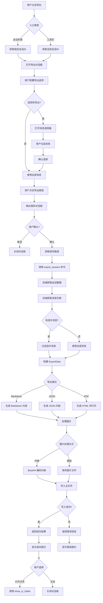

# 会话导出功能架构设计文档

文档版本：1.0  
创建日期：2026-03-21  
相关 TODO：#27~#30

---

## 1. 概述

### 1.1 需求背景

AI_Cue 作为一款面试辅助工具，用户在使用过程中会产生大量有价值的会话记录。当前系统仅支持会话的存储和查看，缺乏导出能力，用户无法：

- 将面试对话保存为本地文档进行复盘
- 分享面试经验给他人
- 备份重要会话数据
- 在其他平台或工具中使用这些数据

### 1.2 目标功能清单

| TODO | 功能 | 优先级 | 描述 |
|------|------|--------|------|
| #27 | Markdown 导出 | P0 | 导出为 .md 文件，包含元数据头和对话内容 |
| #28 | PDF 导出 | P1 | 导出为格式化的 PDF 文档，便于打印和分享 |
| #29 | 选择性导出 | P1 | 支持勾选部分消息进行导出 |
| #30 | 数据库增强 | P2 | 持久化 Provider、Model、Prompt 等元数据 |

### 1.3 设计原则

- 可扩展性：采用策略模式，支持未来新增导出格式（如 HTML、DOCX）
- 高性能：大会话采用异步处理，避免阻塞 UI
- 安全性：文件路径校验、敏感信息脱敏选项
- 用户友好：简洁的操作流程，合理的默认配置

---

## 2. 数据模型增强设计

### 2.1 sessions 表新增字段

```sql
-- 新增字段
ALTER TABLE sessions ADD COLUMN provider TEXT;           -- 使用的 AI Provider（如 'qwen', 'claude'）
ALTER TABLE sessions ADD COLUMN model TEXT;              -- 使用的模型名称（如 'qwen-turbo'）
ALTER TABLE sessions ADD COLUMN prompt_template_id TEXT; -- Prompt 模板 ID（如 'default', 'tech'）
ALTER TABLE sessions ADD COLUMN prompt_content TEXT;     -- 实际使用的 Prompt 内容快照
ALTER TABLE sessions ADD COLUMN interview_context TEXT;  -- 面试背景 JSON（公司、职位、JD要点）
```

增强后的完整表结构：

```sql
CREATE TABLE sessions (
    id TEXT PRIMARY KEY,
    title TEXT NOT NULL DEFAULT '新会话',
    created_at INTEGER NOT NULL,
    updated_at INTEGER NOT NULL,
    -- 新增字段（可为空，兼容历史数据）
    provider TEXT,
    model TEXT,
    prompt_template_id TEXT,
    prompt_content TEXT,
    interview_context TEXT
);
```

### 2.2 messages 表增强评估

经过分析，messages 表不建议新增 provider 字段，理由如下：
- 单个会话内通常使用同一 Provider，在 session 级别记录即可
- 避免数据冗余，减少存储空间
- 如果未来需要支持单会话多 Provider 混合，可通过扩展字段实现

保持现有结构不变，仅在需要时新增 metadata 字段：

```sql
-- 可选扩展（当前版本暂不实现）
ALTER TABLE messages ADD COLUMN metadata TEXT;  -- JSON 格式的扩展元数据
```

### 2.3 数据库迁移方案

创建迁移脚本 `migration_v2.sql`：

```sql
-- 迁移脚本 v2：添加会话元数据字段
-- 执行时间：应用启动时自动检测并执行

-- 检查并添加 provider 字段
ALTER TABLE sessions ADD COLUMN provider TEXT;

-- 检查并添加 model 字段
ALTER TABLE sessions ADD COLUMN model TEXT;

-- 检查并添加 prompt_template_id 字段
ALTER TABLE sessions ADD COLUMN prompt_template_id TEXT;

-- 检查并添加 prompt_content 字段
ALTER TABLE sessions ADD COLUMN prompt_content TEXT;

-- 检查并添加 interview_context 字段
ALTER TABLE sessions ADD COLUMN interview_context TEXT;

-- 更新 schema 版本号
PRAGMA user_version = 2;
```

Rust 端迁移逻辑：

```rust
// database.rs 中添加迁移函数
fn migrate_database(conn: &Connection) -> Result<()> {
    let version: i32 = conn.pragma_query_value(None, "user_version", |row| row.get(0))?;
    
    if version < 2 {
        // 执行 v2 迁移
        conn.execute_batch(include_str!("migrations/v2.sql"))?;
        conn.pragma_update(None, "user_version", 2)?;
    }
    
    Ok(())
}
```

### 2.4 前端 TypeScript 接口同步

```typescript
// types/session.ts

// 面试背景信息
interface InterviewContext {
  company: string;
  position: string;
  jdHighlights: string;
}

// 增强后的 Session 接口
interface Session {
  id: string;
  title: string;
  created_at: number;
  updated_at: number;
  // 新增元数据字段
  provider?: string;
  model?: string;
  prompt_template_id?: string;
  prompt_content?: string;
  interview_context?: InterviewContext;
  // 前端计算字段
  preview?: string;
}

// SessionMessage 保持不变
interface SessionMessage {
  id?: string;
  session_id?: string;
  role: 'user' | 'assistant';
  content: string;
  image?: string;
  created_at?: number;
}
```

---

## 3. 导出数据模型设计

### 3.1 ExportData 统一数据结构

采用中间层设计，将数据库模型转换为导出专用结构，解耦存储和导出逻辑：

```typescript
// types/export.ts

// 导出格式枚举
type ExportFormat = 'markdown' | 'pdf' | 'json';

// 导出元数据
interface ExportMetadata {
  // 基础信息
  sessionId: string;
  sessionTitle: string;
  exportedAt: number;          // 导出时间戳
  exportFormat: ExportFormat;
  appVersion: string;
  
  // 会话信息
  createdAt: number;
  updatedAt: number;
  messageCount: number;
  
  // AI 配置（来自 session 或当前配置）
  provider?: string;
  model?: string;
  promptTemplateId?: string;
  promptTemplateName?: string;  // 模板显示名称
  promptContent?: string;       // 完整 Prompt 内容（可选导出）
  
  // 面试背景
  interviewContext?: {
    company: string;
    position: string;
    jdHighlights: string;
  };
}

// 导出消息项
interface ExportMessage {
  id: string;
  role: 'user' | 'assistant';
  content: string;
  timestamp: number;
  // 图片处理
  hasImage: boolean;
  imageData?: string;          // Base64 数据（内嵌模式）
  imagePath?: string;          // 相对路径（外部文件模式）
}

// 统一导出数据结构
interface ExportData {
  metadata: ExportMetadata;
  messages: ExportMessage[];
}

// 导出配置选项
interface ExportOptions {
  format: ExportFormat;
  includeMetadata: boolean;       // 是否包含元数据头
  includePromptContent: boolean;  // 是否导出 Prompt 内容
  includeImages: boolean;         // 是否包含图片
  imageHandling: 'embed' | 'extract';  // 图片处理方式
  selectedMessageIds?: string[];  // 选择性导出的消息 ID
  outputPath?: string;            // 输出路径（未指定则弹出对话框）
}

// 导出结果
interface ExportResult {
  success: boolean;
  filePath?: string;
  fileSize?: number;
  error?: string;
}
```

### 3.2 消息选择模型

```typescript
// 选择性导出状态管理
interface MessageSelection {
  sessionId: string;
  selectedIds: Set<string>;      // 已选中的消息 ID
  selectAll: boolean;            // 全选状态
}

// 选择操作
interface SelectionActions {
  toggleMessage: (messageId: string) => void;
  selectAll: () => void;
  deselectAll: () => void;
  selectRange: (startId: string, endId: string) => void;  // Shift+点击范围选择
  getSelectedMessages: () => ExportMessage[];
}
```

---

## 4. 导出服务架构

### 4.1 策略模式设计

采用策略模式实现可扩展的导出器架构：

```typescript
// services/export/types.ts

// 导出器接口（策略接口）
interface ExportStrategy {
  readonly format: ExportFormat;
  readonly fileExtension: string;
  readonly mimeType: string;
  
  // 导出核心方法
  export(data: ExportData, options: ExportOptions): Promise<Uint8Array | string>;
  
  // 获取默认文件名
  getDefaultFileName(sessionTitle: string): string;
}

// 导出器工厂
class ExporterFactory {
  private static exporters: Map<ExportFormat, ExportStrategy> = new Map();
  
  static register(exporter: ExportStrategy): void {
    this.exporters.set(exporter.format, exporter);
  }
  
  static getExporter(format: ExportFormat): ExportStrategy {
    const exporter = this.exporters.get(format);
    if (!exporter) {
      throw new Error(`不支持的导出格式: ${format}`);
    }
    return exporter;
  }
  
  static getSupportedFormats(): ExportFormat[] {
    return Array.from(this.exporters.keys());
  }
}
```

### 4.2 MarkdownExporter 实现方案

纯字符串拼接实现，无额外依赖：

```typescript
// services/export/markdownExporter.ts

class MarkdownExporter implements ExportStrategy {
  readonly format: ExportFormat = 'markdown';
  readonly fileExtension = '.md';
  readonly mimeType = 'text/markdown';
  
  async export(data: ExportData, options: ExportOptions): Promise<string> {
    const lines: string[] = [];
    
    // 生成元数据头（YAML Front Matter 格式）
    if (options.includeMetadata) {
      lines.push('---');
      lines.push(`title: ${data.metadata.sessionTitle}`);
      lines.push(`exported_at: ${this.formatDate(data.metadata.exportedAt)}`);
      lines.push(`created_at: ${this.formatDate(data.metadata.createdAt)}`);
      lines.push(`message_count: ${data.metadata.messageCount}`);
      
      if (data.metadata.provider) {
        lines.push(`provider: ${data.metadata.provider}`);
      }
      if (data.metadata.model) {
        lines.push(`model: ${data.metadata.model}`);
      }
      if (data.metadata.promptTemplateName) {
        lines.push(`prompt_template: ${data.metadata.promptTemplateName}`);
      }
      
      // 面试背景
      if (data.metadata.interviewContext) {
        lines.push('interview_context:');
        lines.push(`  company: ${data.metadata.interviewContext.company}`);
        lines.push(`  position: ${data.metadata.interviewContext.position}`);
        if (data.metadata.interviewContext.jdHighlights) {
          lines.push(`  jd_highlights: |`);
          const highlights = data.metadata.interviewContext.jdHighlights.split('\n');
          highlights.forEach(h => lines.push(`    ${h}`));
        }
      }
      
      lines.push('---');
      lines.push('');
    }
    
    // 标题
    lines.push(`# ${data.metadata.sessionTitle}`);
    lines.push('');
    
    // 消息内容
    for (const msg of data.messages) {
      const roleLabel = msg.role === 'user' ? '用户' : 'AI';
      const timestamp = this.formatTime(msg.timestamp);
      
      lines.push(`## ${roleLabel} [${timestamp}]`);
      lines.push('');
      lines.push(msg.content);
      lines.push('');
      
      // 处理图片
      if (msg.hasImage && options.includeImages) {
        if (options.imageHandling === 'embed' && msg.imageData) {
          lines.push(``);
        } else if (msg.imagePath) {
          lines.push(``);
        }
        lines.push('');
      }
    }
    
    // 可选：导出 Prompt 内容
    if (options.includePromptContent && data.metadata.promptContent) {
      lines.push('---');
      lines.push('');
      lines.push('## 附录：System Prompt');
      lines.push('');
      lines.push('```');
      lines.push(data.metadata.promptContent);
      lines.push('```');
    }
    
    return lines.join('\n');
  }
  
  getDefaultFileName(sessionTitle: string): string {
    const safeTitle = sessionTitle.replace(/[<>:"/\\|?*]/g, '_');
    const date = new Date().toISOString().split('T')[0];
    return `${safeTitle}_${date}.md`;
  }
  
  private formatDate(timestamp: number): string {
    return new Date(timestamp).toISOString().split('T')[0];
  }
  
  private formatTime(timestamp: number): string {
    return new Date(timestamp).toLocaleString('zh-CN');
  }
}
```

### 4.3 PDFExporter 技术选型对比

| 方案 | 优点 | 缺点 | 推荐度 |
|------|------|------|--------|
| jsPDF (前端) | 纯 JS 实现，无需后端 | 中文支持需额外字体文件（~10MB），复杂排版困难 | 中 |
| html2pdf.js (前端) | 基于 html2canvas，样式还原度高 | 性能较差，大文档可能卡顿，依赖 DOM | 低 |
| printpdf (Rust) | 原生性能，无 JS 依赖 | 中文字体处理复杂，API 较底层 | 中 |
| Pandoc (外部) | 功能强大，格式转换专业 | 需要用户安装外部程序，部署复杂 | 低 |
| @react-pdf/renderer (前端) | React 组件化，易于维护 | 打包体积大（~3MB），需要学习专用组件 | 高 |
| 浏览器打印 (前端) | 零依赖，利用系统能力 | 用户体验一般，格式控制有限 | 中 |

推荐方案：采用「Markdown 转 HTML + 浏览器打印」的混合方案

理由：
1. 零额外依赖，打包体积不增加
2. 利用系统打印对话框，用户可选择「打印到 PDF」
3. 通过 CSS @media print 精确控制打印样式
4. 中文支持完美，无字体问题
5. 实现成本低，可复用 Markdown 解析逻辑

实现方案：

```typescript
// services/export/pdfExporter.ts

class PDFExporter implements ExportStrategy {
  readonly format: ExportFormat = 'pdf';
  readonly fileExtension = '.pdf';
  readonly mimeType = 'application/pdf';
  
  async export(data: ExportData, options: ExportOptions): Promise<string> {
    // 生成 HTML 内容
    const html = this.generatePrintableHTML(data, options);
    
    // 调用 Tauri 打印命令（或打开打印预览窗口）
    // 返回 HTML 内容，由前端处理打印
    return html;
  }
  
  private generatePrintableHTML(data: ExportData, options: ExportOptions): string {
    const styles = `
      <style>
        @media print {
          body { font-family: "Microsoft YaHei", sans-serif; }
          .message { page-break-inside: avoid; margin-bottom: 1em; }
          .user { background: #f0f0f0; padding: 0.5em; border-radius: 4px; }
          .assistant { background: #e8f4e8; padding: 0.5em; border-radius: 4px; }
          .metadata { color: #666; font-size: 0.9em; margin-bottom: 2em; }
          img { max-width: 100%; height: auto; }
        }
      </style>
    `;
    
    // 构建 HTML 内容...
    return `<!DOCTYPE html><html><head>${styles}</head><body>...</body></html>`;
  }
  
  getDefaultFileName(sessionTitle: string): string {
    const safeTitle = sessionTitle.replace(/[<>:"/\\|?*]/g, '_');
    const date = new Date().toISOString().split('T')[0];
    return `${safeTitle}_${date}.pdf`;
  }
}
```

备选方案（如果需要直接生成 PDF 文件）：

使用 Rust 端的 `printpdf` + `rusttype` 方案：

```rust
// 后端 PDF 生成（备选）
use printpdf::*;
use rusttype::{Font, Scale};

fn export_to_pdf(data: &ExportData, output_path: &str) -> Result<()> {
    let (doc, page1, layer1) = PdfDocument::new(
        &data.metadata.session_title,
        Mm(210.0), Mm(297.0), // A4
        "Layer 1"
    );
    
    // 加载中文字体
    let font_data = include_bytes!("../fonts/SourceHanSansCN-Regular.ttf");
    let font = doc.add_external_font(font_data.as_ref())?;
    
    // 绘制内容...
    
    doc.save(&mut BufWriter::new(File::create(output_path)?))?;
    Ok(())
}
```

### 4.4 JSONExporter 实现方案

```typescript
// services/export/jsonExporter.ts

class JSONExporter implements ExportStrategy {
  readonly format: ExportFormat = 'json';
  readonly fileExtension = '.json';
  readonly mimeType = 'application/json';
  
  async export(data: ExportData, options: ExportOptions): Promise<string> {
    const exportObj = {
      version: '1.0',
      exportedAt: new Date().toISOString(),
      metadata: data.metadata,
      messages: data.messages.map(msg => ({
        ...msg,
        // 根据选项处理图片
        imageData: options.includeImages && options.imageHandling === 'embed' 
          ? msg.imageData 
          : undefined,
        imagePath: options.includeImages && options.imageHandling === 'extract'
          ? msg.imagePath
          : undefined,
      })),
    };
    
    return JSON.stringify(exportObj, null, 2);
  }
  
  getDefaultFileName(sessionTitle: string): string {
    const safeTitle = sessionTitle.replace(/[<>:"/\\|?*]/g, '_');
    const date = new Date().toISOString().split('T')[0];
    return `${safeTitle}_${date}.json`;
  }
}
```

### 4.5 图片处理策略

```typescript
// services/export/imageHandler.ts

type ImageHandling = 'embed' | 'extract';

interface ImageHandlerOptions {
  handling: ImageHandling;
  outputDir?: string;           // 提取模式下的输出目录
  imageQuality?: number;        // 压缩质量 0-100
  maxWidth?: number;            // 最大宽度
}

class ImageHandler {
  // 处理消息中的图片
  async processImage(
    messageId: string,
    base64Data: string,
    options: ImageHandlerOptions
  ): Promise<{ imageData?: string; imagePath?: string }> {
    
    if (options.handling === 'embed') {
      // 内嵌模式：可选压缩后返回 Base64
      const compressed = options.imageQuality 
        ? await this.compressImage(base64Data, options.imageQuality)
        : base64Data;
      return { imageData: compressed };
    }
    
    // 提取模式：保存为独立文件
    const fileName = `image_${messageId}.png`;
    const filePath = `${options.outputDir}/images/${fileName}`;
    
    // 调用 Tauri 命令写入文件
    await invoke('write_binary_file', {
      path: filePath,
      data: this.base64ToBytes(base64Data),
    });
    
    return { imagePath: `./images/${fileName}` };
  }
  
  private async compressImage(base64: string, quality: number): Promise<string> {
    // 使用 Canvas 压缩图片
    const img = new Image();
    img.src = `data:image/png;base64,${base64}`;
    await img.decode();
    
    const canvas = document.createElement('canvas');
    canvas.width = img.width;
    canvas.height = img.height;
    
    const ctx = canvas.getContext('2d')!;
    ctx.drawImage(img, 0, 0);
    
    return canvas.toDataURL('image/jpeg', quality / 100).split(',')[1];
  }
  
  private base64ToBytes(base64: string): Uint8Array {
    const binary = atob(base64);
    const bytes = new Uint8Array(binary.length);
    for (let i = 0; i < binary.length; i++) {
      bytes[i] = binary.charCodeAt(i);
    }
    return bytes;
  }
}
```

---

## 5. Tauri 命令层设计

### 5.1 新增 export_session 命令

```rust
// src-tauri/src/commands.rs

use serde::{Deserialize, Serialize};
use tauri::State;

#[derive(Debug, Deserialize)]
pub struct ExportOptions {
    pub session_id: String,
    pub format: String,              // "markdown" | "pdf" | "json"
    pub include_metadata: bool,
    pub include_prompt_content: bool,
    pub include_images: bool,
    pub image_handling: String,      // "embed" | "extract"
    pub selected_message_ids: Option<Vec<String>>,
    pub output_path: Option<String>,
}

#[derive(Debug, Serialize)]
pub struct ExportResult {
    pub success: bool,
    pub file_path: Option<String>,
    pub file_size: Option<u64>,
    pub error: Option<String>,
}

#[tauri::command]
pub async fn export_session(
    db: State<'_, Database>,
    options: ExportOptions,
) -> Result<ExportResult, String> {
    // 获取会话数据
    let session = db.get_session(&options.session_id)
        .map_err(|e| e.to_string())?;
    
    // 获取消息列表
    let messages = db.get_session_messages(&options.session_id)
        .map_err(|e| e.to_string())?;
    
    // 过滤选中的消息
    let filtered_messages = match &options.selected_message_ids {
        Some(ids) => messages.into_iter()
            .filter(|m| ids.contains(&m.id))
            .collect(),
        None => messages,
    };
    
    // 构建导出数据
    let export_data = build_export_data(session, filtered_messages, &options);
    
    // 根据格式导出
    let content = match options.format.as_str() {
        "markdown" => export_to_markdown(&export_data),
        "json" => export_to_json(&export_data),
        "pdf" => export_to_pdf(&export_data),
        _ => return Err("不支持的导出格式".to_string()),
    };
    
    // 确定输出路径
    let output_path = match options.output_path {
        Some(path) => path,
        None => return Ok(ExportResult {
            success: true,
            file_path: None,
            file_size: None,
            error: Some("需要指定输出路径".to_string()),
        }),
    };
    
    // 写入文件
    std::fs::write(&output_path, &content)
        .map_err(|e| e.to_string())?;
    
    let file_size = std::fs::metadata(&output_path)
        .map(|m| m.len())
        .ok();
    
    Ok(ExportResult {
        success: true,
        file_path: Some(output_path),
        file_size,
        error: None,
    })
}
```

### 5.2 辅助命令

```rust
// src-tauri/src/commands.rs

// 写入文本文件
#[tauri::command]
pub async fn write_text_file(path: String, content: String) -> Result<(), String> {
    // 安全检查：确保路径在允许的范围内
    validate_path(&path)?;
    
    std::fs::write(&path, content)
        .map_err(|e| format!("写入文件失败: {}", e))
}

// 写入二进制文件
#[tauri::command]
pub async fn write_binary_file(path: String, data: Vec<u8>) -> Result<(), String> {
    validate_path(&path)?;
    
    // 确保父目录存在
    if let Some(parent) = std::path::Path::new(&path).parent() {
        std::fs::create_dir_all(parent)
            .map_err(|e| format!("创建目录失败: {}", e))?;
    }
    
    std::fs::write(&path, data)
        .map_err(|e| format!("写入文件失败: {}", e))
}

// 在文件管理器中显示文件
#[tauri::command]
pub async fn show_in_folder(path: String) -> Result<(), String> {
    #[cfg(target_os = "windows")]
    {
        std::process::Command::new("explorer")
            .args(["/select,", &path])
            .spawn()
            .map_err(|e| format!("打开文件夹失败: {}", e))?;
    }
    
    #[cfg(target_os = "macos")]
    {
        std::process::Command::new("open")
            .args(["-R", &path])
            .spawn()
            .map_err(|e| format!("打开文件夹失败: {}", e))?;
    }
    
    #[cfg(target_os = "linux")]
    {
        std::process::Command::new("xdg-open")
            .arg(std::path::Path::new(&path).parent().unwrap_or(std::path::Path::new(".")))
            .spawn()
            .map_err(|e| format!("打开文件夹失败: {}", e))?;
    }
    
    Ok(())
}

// 路径安全校验
fn validate_path(path: &str) -> Result<(), String> {
    let path = std::path::Path::new(path);
    
    // 检查是否包含危险字符
    if path.to_string_lossy().contains("..") {
        return Err("路径不能包含 '..'".to_string());
    }
    
    // 检查是否是绝对路径
    if !path.is_absolute() {
        return Err("必须使用绝对路径".to_string());
    }
    
    Ok(())
}
```

### 5.3 文件保存对话框集成

```typescript
// services/export/exportService.ts

import { save } from '@tauri-apps/plugin-dialog';
import { invoke } from '@tauri-apps/api/core';

class ExportService {
  async exportSession(
    sessionId: string,
    options: Partial<ExportOptions>
  ): Promise<ExportResult> {
    const exporter = ExporterFactory.getExporter(options.format || 'markdown');
    
    // 获取会话信息用于默认文件名
    const session = await invoke<Session>('get_session', { sessionId });
    const defaultFileName = exporter.getDefaultFileName(session.title);
    
    // 弹出保存对话框
    const filePath = await save({
      defaultPath: defaultFileName,
      filters: [{
        name: this.getFilterName(options.format || 'markdown'),
        extensions: [exporter.fileExtension.slice(1)],
      }],
    });
    
    if (!filePath) {
      return { success: false, error: '用户取消了导出' };
    }
    
    // 调用后端导出命令
    return await invoke<ExportResult>('export_session', {
      options: {
        session_id: sessionId,
        format: options.format || 'markdown',
        include_metadata: options.includeMetadata ?? true,
        include_prompt_content: options.includePromptContent ?? false,
        include_images: options.includeImages ?? true,
        image_handling: options.imageHandling || 'embed',
        selected_message_ids: options.selectedMessageIds,
        output_path: filePath,
      },
    });
  }
  
  private getFilterName(format: ExportFormat): string {
    const names: Record<ExportFormat, string> = {
      markdown: 'Markdown 文件',
      pdf: 'PDF 文档',
      json: 'JSON 文件',
    };
    return names[format];
  }
}

export const exportService = new ExportService();
```

---

## 6. 前端 UI 设计

### 6.1 导出入口位置

1. SessionList 会话卡片

```
┌─────────────────────────────────────┐
│ 会话标题                     [···]  │  ← 更多操作按钮
│ 预览内容...                         │
│ 2026-03-21 14:30                    │
└─────────────────────────────────────┘
                                  │
                                  ▼
                          ┌───────────┐
                          │ 重命名    │
                          │ 导出      │  ← 导出入口
                          │ 删除      │
                          └───────────┘
```

2. App 工具栏（当前会话）

```
┌─────────────────────────────────────────────────────────────┐
│ [≡] AI_Cue                              [📤] [⚙] [−] [□] [×]│
│                                           ↑                 │
│                                       导出当前会话          │
└─────────────────────────────────────────────────────────────┘
```

### 6.2 导出对话框设计

```
┌───────────────────────────────────────────────────────────────┐
│ 导出会话                                                   [×]│
├───────────────────────────────────────────────────────────────┤
│                                                               │
│  导出格式                                                     │
│  ┌─────────────────────────────────────────────────────────┐  │
│  │ ○ Markdown (.md)    适合编辑和二次加工                  │  │
│  │ ● PDF (.pdf)        适合打印和分享                      │  │
│  │ ○ JSON (.json)      完整数据，便于导入其他工具          │  │
│  └─────────────────────────────────────────────────────────┘  │
│                                                               │
│  导出选项                                                     │
│  ┌─────────────────────────────────────────────────────────┐  │
│  │ ☑ 包含元数据头（时间、模型、面试背景等）                │  │
│  │ ☐ 包含 System Prompt 内容                               │  │
│  │ ☑ 包含截图图片                                          │  │
│  │   └─ ● 内嵌到文档  ○ 提取为独立文件                     │  │
│  └─────────────────────────────────────────────────────────┘  │
│                                                               │
│  消息范围                                                     │
│  ┌─────────────────────────────────────────────────────────┐  │
│  │ ● 导出全部消息 (12条)                                   │  │
│  │ ○ 选择性导出                                            │  │
│  │   └─ [选择消息...]                                      │  │
│  └─────────────────────────────────────────────────────────┘  │
│                                                               │
├───────────────────────────────────────────────────────────────┤
│                                    [取消]        [导出...]    │
└───────────────────────────────────────────────────────────────┘
```

### 6.3 选择性导出的勾选 UI

```
┌───────────────────────────────────────────────────────────────┐
│ 选择要导出的消息                               [全选] [×]     │
├───────────────────────────────────────────────────────────────┤
│                                                               │
│  ☑ ┌─────────────────────────────────────────────────────┐   │
│    │ 用户 · 14:30                                        │   │
│    │ 请介绍一下你自己                                    │   │
│    └─────────────────────────────────────────────────────┘   │
│                                                               │
│  ☑ ┌─────────────────────────────────────────────────────┐   │
│    │ AI · 14:30                                          │   │
│    │ 我是一名有5年经验的前端工程师，专注于...            │   │
│    └─────────────────────────────────────────────────────┘   │
│                                                               │
│  ☐ ┌─────────────────────────────────────────────────────┐   │
│    │ 用户 · 14:32                                        │   │
│    │ 你对 React Hooks 有什么理解？                       │   │
│    └─────────────────────────────────────────────────────┘   │
│                                                               │
│  ☐ ┌─────────────────────────────────────────────────────┐   │
│    │ AI · 14:32                                          │   │
│    │ React Hooks 是 React 16.8 引入的特性...             │   │
│    └─────────────────────────────────────────────────────┘   │
│                                                               │
├───────────────────────────────────────────────────────────────┤
│  已选择 2/4 条消息                         [确认]             │
└───────────────────────────────────────────────────────────────┘
```

### 6.4 组件结构设计

```typescript
// components/export/ExportDialog.tsx
// 主导出对话框组件

// components/export/FormatSelector.tsx
// 格式选择器

// components/export/ExportOptions.tsx
// 导出选项面板

// components/export/MessageSelector.tsx
// 消息选择器（选择性导出）

// components/export/ExportProgress.tsx
// 导出进度指示器（大会话）
```

---

## 7. 导出流程图



---

## 8. 改动文件清单

### 8.1 新增文件

| 文件路径 | 描述 |
|----------|------|
| src/types/export.ts | 导出相关 TypeScript 类型定义 |
| src/services/export/index.ts | 导出服务入口 |
| src/services/export/types.ts | 导出器接口定义 |
| src/services/export/exporterFactory.ts | 导出器工厂 |
| src/services/export/markdownExporter.ts | Markdown 导出器 |
| src/services/export/pdfExporter.ts | PDF 导出器 |
| src/services/export/jsonExporter.ts | JSON 导出器 |
| src/services/export/imageHandler.ts | 图片处理器 |
| src/services/export/exportService.ts | 导出服务主类 |
| src/components/export/ExportDialog.tsx | 导出对话框 |
| src/components/export/FormatSelector.tsx | 格式选择器 |
| src/components/export/ExportOptions.tsx | 导出选项面板 |
| src/components/export/MessageSelector.tsx | 消息选择器 |
| src/components/export/ExportProgress.tsx | 导出进度组件 |
| src-tauri/src/export.rs | Rust 导出模块 |
| src-tauri/src/migrations/v2.sql | 数据库迁移脚本 |

### 8.2 修改文件

| 文件路径 | 修改内容 |
|----------|----------|
| src/App.tsx | 添加导出入口、集成导出对话框 |
| src/components/SessionList.tsx | 添加会话卡片导出按钮 |
| src/services/sessionManager.ts | 扩展会话查询，支持获取元数据 |
| src/store/config.ts | 添加 Session 接口新字段 |
| src-tauri/src/lib.rs | 注册新命令 |
| src-tauri/src/commands.rs | 添加导出相关命令 |
| src-tauri/src/database.rs | 添加数据库迁移逻辑、扩展会话查询 |
| src-tauri/Cargo.toml | 添加可能需要的依赖 |

---

## 9. 分阶段实施路线图

### 阶段一：Markdown 导出 + 元数据头（TODO #27）

预计工时：3-4 天

任务列表：
1. 创建导出类型定义（src/types/export.ts）
2. 实现导出器工厂和策略接口
3. 实现 MarkdownExporter
4. 添加 Rust 端 export_session 命令
5. 添加 write_text_file 和 show_in_folder 命令
6. 创建基础版 ExportDialog（仅 Markdown 选项）
7. 在 SessionList 添加导出入口
8. 测试和修复

验收标准：
- 可以将会话导出为 Markdown 文件
- Markdown 包含 YAML Front Matter 元数据
- 图片以 Base64 内嵌
- 保存对话框正常工作

### 阶段二：PDF 导出（TODO #28）

预计工时：2-3 天

任务列表：
1. 实现 PDFExporter（基于打印方案）
2. 创建打印样式 CSS
3. 扩展 ExportDialog 支持 PDF 格式
4. 添加 JSON 导出（复用已有架构，工作量小）
5. 测试跨平台打印功能

验收标准：
- 可以将会话导出为 PDF（通过系统打印）
- PDF 格式正确，中文显示正常
- 可以导出为 JSON 格式

### 阶段三：选择性导出（TODO #29）

预计工时：2-3 天

任务列表：
1. 创建 MessageSelector 组件
2. 实现消息选择状态管理
3. 扩展 ExportDialog 集成消息选择
4. 后端支持消息过滤
5. 测试选择性导出流程

验收标准：
- 可以勾选部分消息进行导出
- 支持全选/取消全选
- 选择状态在对话框中正确显示

### 阶段四：数据库增强（TODO #30）

预计工时：2-3 天

任务列表：
1. 创建数据库迁移脚本
2. 实现自动迁移逻辑
3. 更新 Session TypeScript 接口
4. 修改会话创建流程，保存元数据
5. 更新导出逻辑，优先使用持久化元数据
6. 测试迁移和兼容性

验收标准：
- 新会话自动保存 Provider/Model/Prompt 信息
- 历史会话正常兼容
- 导出元数据来源正确

---

## 10. 风险评估与应对策略

| 风险 | 影响 | 概率 | 应对策略 |
|------|------|------|----------|
| PDF 打印兼容性问题 | 部分用户无法生成 PDF | 中 | 提供 Markdown 作为备选，考虑集成 jsPDF 作为 fallback |
| 大会话导出内存溢出 | 应用崩溃 | 低 | 分批处理消息，流式写入文件 |
| 图片 Base64 编码过大 | 文件体积膨胀 | 中 | 提供图片压缩选项，支持提取为独立文件 |
| 数据库迁移失败 | 数据丢失 | 低 | 迁移前自动备份，使用事务确保原子性 |
| 文件路径注入攻击 | 安全漏洞 | 低 | 严格路径校验，禁止 .. 和特殊字符 |
| 中文文件名乱码 | 导出文件名异常 | 低 | 使用 UTF-8 编码，特殊字符替换 |

---

## 11. 技术选型对比表

### 11.1 PDF 生成方案对比

| 方案 | 实现位置 | 打包体积 | 中文支持 | 复杂度 | 推荐 |
|------|----------|----------|----------|--------|------|
| 浏览器打印 | 前端 | 0 | 完美 | 低 | 推荐 |
| jsPDF | 前端 | +10MB | 需字体 | 中 | 备选 |
| html2pdf.js | 前端 | +2MB | 依赖 | 中 | 不推荐 |
| printpdf (Rust) | 后端 | +5MB | 需字体 | 高 | 不推荐 |
| @react-pdf/renderer | 前端 | +3MB | 需字体 | 中 | 备选 |

最终选择：浏览器打印方案（零依赖 + 完美中文支持）

### 11.2 图片处理方案对比

| 方案 | 优点 | 缺点 | 适用场景 |
|------|------|------|----------|
| Base64 内嵌 | 单文件，便于分享 | 文件体积大，某些平台不支持 | Markdown、JSON |
| 独立文件 + 相对路径 | 体积小，可单独管理 | 需要打包，路径可能失效 | PDF、长期存档 |
| 压缩后内嵌 | 平衡体积和便利性 | 有质量损失 | 默认推荐 |

默认选择：Base64 内嵌（用户可选）

### 11.3 状态管理方案对比

| 方案 | 适用性 | 复杂度 | 推荐 |
|------|--------|--------|------|
| React useState | 组件内状态 | 低 | 适合简单场景 |
| Context API | 跨组件共享 | 中 | 推荐导出对话框 |
| Zustand | 全局状态 | 中 | 如需持久化选择 |
| Redux | 复杂应用 | 高 | 过度设计 |

选择：Context API + useState（导出功能相对独立，不需要全局状态库）

---

## 附录 A：ExportDialog 组件完整接口

```typescript
interface ExportDialogProps {
  isOpen: boolean;
  onClose: () => void;
  sessionId: string;
  sessionTitle: string;
  messageCount: number;
}

interface ExportDialogState {
  format: ExportFormat;
  includeMetadata: boolean;
  includePromptContent: boolean;
  includeImages: boolean;
  imageHandling: 'embed' | 'extract';
  exportMode: 'all' | 'selected';
  selectedMessageIds: string[];
  isExporting: boolean;
  showMessageSelector: boolean;
}
```

---

## 附录 B：Rust ExportData 结构

```rust
// src-tauri/src/export.rs

use serde::{Deserialize, Serialize};

#[derive(Debug, Serialize, Deserialize)]
pub struct ExportMetadata {
    pub session_id: String,
    pub session_title: String,
    pub exported_at: i64,
    pub created_at: i64,
    pub updated_at: i64,
    pub message_count: usize,
    pub provider: Option<String>,
    pub model: Option<String>,
    pub prompt_template_id: Option<String>,
    pub prompt_content: Option<String>,
    pub interview_context: Option<InterviewContext>,
}

#[derive(Debug, Serialize, Deserialize)]
pub struct InterviewContext {
    pub company: String,
    pub position: String,
    pub jd_highlights: String,
}

#[derive(Debug, Serialize, Deserialize)]
pub struct ExportMessage {
    pub id: String,
    pub role: String,
    pub content: String,
    pub timestamp: i64,
    pub has_image: bool,
    pub image_data: Option<String>,
}

#[derive(Debug, Serialize, Deserialize)]
pub struct ExportData {
    pub metadata: ExportMetadata,
    pub messages: Vec<ExportMessage>,
}
```

---

文档结束
