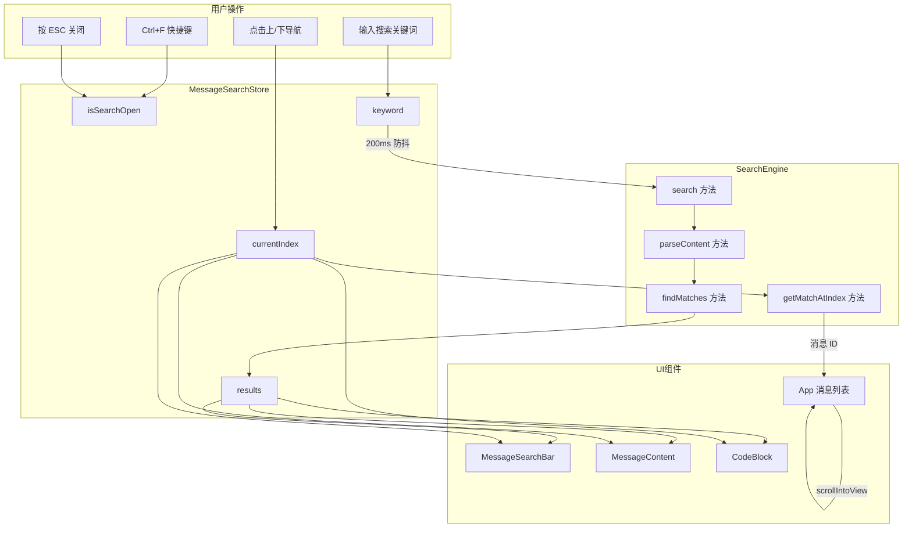

# 消息气泡内搜索功能架构设计

文档版本：1.0  
创建日期：2026-03-22  
状态：设计阶段

---

## 1. 需求概述

### 1.1 功能目标

在当前会话的消息气泡中实现关键词搜索和高亮功能，帮助用户快速定位历史对话中的关键信息。该功能作为 AI 面试助手的重要辅助能力，支持用户在长对话中快速查找特定技术术语、代码片段或问答内容。

### 1.2 核心交互流程

```
用户触发搜索 → 输入关键词 → 实时高亮匹配 → 上/下导航跳转 → ESC 关闭
```

触发方式：
- 键盘快捷键：Ctrl+F（Windows）/ Cmd+F（macOS）
- 界面按钮：标题栏搜索图标（可选）

交互细节：
1. 触发后搜索栏从消息列表上方滑入显示
2. 用户输入关键词，200ms 防抖后触发搜索
3. 所有匹配文本高亮显示（黄色背景）
4. 当前焦点匹配项使用橙色背景突出
5. 上/下箭头按钮或快捷键在匹配结果间跳转
6. 跳转时自动滚动到目标消息并居中显示
7. ESC 键或关闭按钮退出搜索模式

### 1.3 功能边界

包含：
- 当前会话内的消息搜索
- 文本段和代码块的统一搜索
- 大小写不敏感匹配
- 结果计数和导航

不包含（未来可扩展）：
- 跨会话全局搜索
- 正则表达式搜索
- 查找替换功能
- 搜索历史记录

---

## 2. 架构设计

### 2.1 分层架构概览

采用三层架构设计，实现关注点分离，便于测试和复用：

```
┌─────────────────────────────────────────────────────────────────┐
│                        UI 渲染层                                 │
│  ┌─────────────────┐  ┌─────────────────┐  ┌─────────────────┐  │
│  │ MessageSearchBar│  │ MessageContent  │  │    CodeBlock    │  │
│  │   (搜索栏组件)   │  │  (高亮文本渲染)  │  │  (高亮代码渲染)  │  │
│  └─────────────────┘  └─────────────────┘  └─────────────────┘  │
└─────────────────────────────┬───────────────────────────────────┘
                              │ 订阅 / 触发
┌─────────────────────────────▼───────────────────────────────────┐
│                       状态管理层                                 │
│  ┌───────────────────────────────────────────────────────────┐  │
│  │                  messageSearchStore                        │  │
│  │  - isSearchOpen, keyword, results, currentIndex            │  │
│  │  - openSearch(), closeSearch(), setKeyword(), nextResult() │  │
│  └───────────────────────────────────────────────────────────┘  │
└─────────────────────────────┬───────────────────────────────────┘
                              │ 调用
┌─────────────────────────────▼───────────────────────────────────┐
│                       搜索引擎层                                 │
│  ┌───────────────────────────────────────────────────────────┐  │
│  │                   searchEngine.ts                          │  │
│  │  - searchMessages(): 纯函数，执行文本匹配                    │  │
│  │  - buildHighlightRanges(): 构建高亮区间                     │  │
│  │  - 无 UI 依赖，可独立单元测试                                │  │
│  └───────────────────────────────────────────────────────────┘  │
└─────────────────────────────────────────────────────────────────┘
```

层次职责：

1. 搜索引擎层（searchEngine.ts）
   - 纯逻辑处理，无 React/UI 依赖
   - 输入：消息列表 + 搜索关键词
   - 输出：结构化搜索结果
   - 可独立进行单元测试

2. 状态管理层（messageSearchStore）
   - 使用 Zustand 管理搜索状态
   - 响应用户操作，调用搜索引擎
   - 维护搜索结果和导航状态

3. UI 渲染层（React 组件）
   - 搜索栏交互界面
   - 高亮文本渲染
   - 导航和滚动控制

### 2.2 搜索引擎设计

#### 2.2.1 核心数据结构

```typescript
// 单个匹配区间
interface MatchRange {
  start: number;  // 匹配起始位置（相对于段落内容）
  end: number;    // 匹配结束位置
}

// 单条搜索结果
interface SearchMatch {
  messageId: string;           // 所属消息 ID
  messageIndex: number;        // 消息在列表中的索引
  segmentIndex: number;        // 内容段索引（0=第一个文本/代码段）
  segmentType: 'text' | 'code'; // 段类型
  matchRanges: MatchRange[];   // 该段内所有匹配区间
}

// 搜索结果汇总
interface SearchResult {
  keyword: string;             // 搜索关键词
  totalMatches: number;        // 总匹配数
  matches: SearchMatch[];      // 所有匹配项
}

// 搜索配置选项
interface SearchOptions {
  caseSensitive?: boolean;     // 大小写敏感，默认 false
  wholeWord?: boolean;         // 全词匹配，默认 false
  regex?: boolean;             // 正则模式，默认 false
  maxResults?: number;         // 最大结果数，默认无限制
}
```

#### 2.2.2 搜索服务实现

```typescript
// src/services/searchEngine.ts

// 消息接口（与 App.tsx 中 Message 保持一致）
interface Message {
  id: string;
  role: 'user' | 'assistant';
  content: string;
  timestamp: number;
  isComplete?: boolean;
}

// 内容段接口（与 MessageContent.tsx 中 ContentSegment 一致）
interface ContentSegment {
  type: 'text' | 'code';
  content: string;
  language?: string;
}

/**
 * 搜索引擎核心类
 * 提供纯函数式的搜索能力，无副作用
 */
export class SearchEngine {
  /**
   * 在消息列表中搜索关键词
   * @param messages - 消息列表
   * @param keyword - 搜索关键词
   * @param options - 搜索选项
   * @returns 搜索结果
   */
  static search(
    messages: Message[],
    keyword: string,
    options: SearchOptions = {}
  ): SearchResult {
    // 空关键词直接返回空结果
    if (!keyword || keyword.trim().length === 0) {
      return { keyword: '', totalMatches: 0, matches: [] };
    }

    const {
      caseSensitive = false,
      wholeWord = false,
      regex = false,
      maxResults,
    } = options;

    const matches: SearchMatch[] = [];
    let totalMatches = 0;

    // 构建搜索模式
    const pattern = this.buildPattern(keyword, { caseSensitive, wholeWord, regex });
    if (!pattern) {
      return { keyword, totalMatches: 0, matches: [] };
    }

    // 遍历消息
    for (let messageIndex = 0; messageIndex < messages.length; messageIndex++) {
      const message = messages[messageIndex];
      
      // 跳过未完成的流式消息
      if (message.isComplete === false) {
        continue;
      }

      // 解析消息内容为段落
      const segments = this.parseContent(message.content);

      // 遍历段落
      for (let segmentIndex = 0; segmentIndex < segments.length; segmentIndex++) {
        const segment = segments[segmentIndex];
        const matchRanges = this.findMatches(segment.content, pattern);

        if (matchRanges.length > 0) {
          matches.push({
            messageId: message.id,
            messageIndex,
            segmentIndex,
            segmentType: segment.type,
            matchRanges,
          });
          totalMatches += matchRanges.length;

          // 检查是否达到最大结果数
          if (maxResults && totalMatches >= maxResults) {
            return { keyword, totalMatches, matches };
          }
        }
      }
    }

    return { keyword, totalMatches, matches };
  }

  /**
   * 构建搜索正则模式
   * @param keyword - 搜索关键词
   * @param options - 搜索选项
   * @returns 正则表达式或 null
   */
  private static buildPattern(
    keyword: string,
    options: { caseSensitive: boolean; wholeWord: boolean; regex: boolean }
  ): RegExp | null {
    try {
      let pattern: string;

      if (options.regex) {
        // 正则模式：直接使用用户输入（需要转义校验）
        pattern = keyword;
      } else {
        // 普通模式：转义正则特殊字符
        pattern = this.escapeRegExp(keyword);
      }

      if (options.wholeWord) {
        // 全词匹配：添加单词边界
        pattern = `\\b${pattern}\\b`;
      }

      const flags = options.caseSensitive ? 'g' : 'gi';
      return new RegExp(pattern, flags);
    } catch (error) {
      // 正则语法错误时返回 null
      console.warn('无效的搜索模式:', error);
      return null;
    }
  }

  /**
   * 转义正则表达式特殊字符
   * @param str - 原始字符串
   * @returns 转义后的字符串
   */
  private static escapeRegExp(str: string): string {
    return str.replace(/[.*+?^${}()|[\]\\]/g, '\\$&');
  }

  /**
   * 在文本中查找所有匹配
   * @param text - 待搜索文本
   * @param pattern - 搜索模式
   * @returns 匹配区间数组
   */
  private static findMatches(text: string, pattern: RegExp): MatchRange[] {
    const ranges: MatchRange[] = [];
    let match: RegExpExecArray | null;

    // 重置正则状态
    pattern.lastIndex = 0;

    while ((match = pattern.exec(text)) !== null) {
      ranges.push({
        start: match.index,
        end: match.index + match[0].length,
      });

      // 防止空匹配导致的无限循环
      if (match[0].length === 0) {
        pattern.lastIndex++;
      }
    }

    return ranges;
  }

  /**
   * 解析消息内容为段落（与 MessageContent.tsx 的 parseContent 保持一致）
   * @param content - 消息原始内容
   * @returns 内容段数组
   */
  private static parseContent(content: string): ContentSegment[] {
    const segments: ContentSegment[] = [];
    const codeBlockRegex = /```([a-zA-Z0-9_+-]*)?\n?([\s\S]*?)```/g;
    let lastIndex = 0;

    for (const match of content.matchAll(codeBlockRegex)) {
      const matchIndex = match.index ?? 0;
      
      // 代码块之前的文本
      if (matchIndex > lastIndex) {
        segments.push({
          type: 'text',
          content: content.slice(lastIndex, matchIndex),
        });
      }

      // 代码块
      segments.push({
        type: 'code',
        language: match[1] || undefined,
        content: match[2].replace(/^\n/, '').replace(/\n$/, ''),
      });

      lastIndex = matchIndex + match[0].length;
    }

    // 最后的文本
    if (lastIndex < content.length) {
      segments.push({
        type: 'text',
        content: content.slice(lastIndex),
      });
    }

    return segments.length > 0 ? segments : [{ type: 'text', content }];
  }

  /**
   * 获取指定消息和段落的高亮区间
   * 用于 UI 层按需获取高亮信息
   * @param result - 搜索结果
   * @param messageId - 消息 ID
   * @param segmentIndex - 段索引
   * @returns 匹配区间数组
   */
  static getHighlightRanges(
    result: SearchResult,
    messageId: string,
    segmentIndex: number
  ): MatchRange[] {
    const match = result.matches.find(
      m => m.messageId === messageId && m.segmentIndex === segmentIndex
    );
    return match?.matchRanges || [];
  }

  /**
   * 获取结果中第 N 个匹配的位置信息
   * 用于导航跳转
   * @param result - 搜索结果
   * @param index - 匹配索引（从 0 开始）
   * @returns 匹配位置信息或 null
   */
  static getMatchAtIndex(
    result: SearchResult,
    index: number
  ): { messageId: string; messageIndex: number; segmentIndex: number; rangeIndex: number } | null {
    let currentIndex = 0;

    for (const match of result.matches) {
      for (let rangeIndex = 0; rangeIndex < match.matchRanges.length; rangeIndex++) {
        if (currentIndex === index) {
          return {
            messageId: match.messageId,
            messageIndex: match.messageIndex,
            segmentIndex: match.segmentIndex,
            rangeIndex,
          };
        }
        currentIndex++;
      }
    }

    return null;
  }
}
```

#### 2.2.3 可扩展性设计

搜索引擎预留了以下扩展点：

1. 搜索模式扩展
   - SearchOptions 中的 regex 和 wholeWord 参数已定义
   - 未来可添加模糊搜索、拼音搜索等模式

2. 搜索范围扩展
   - 当前仅搜索消息内容
   - 未来可扩展搜索消息元数据（时间、角色等）
   - 可扩展为跨会话搜索（结合数据库 FTS5）

3. 结果排序扩展
   - 当前按消息顺序返回结果
   - 未来可支持按相关度、时间等排序

### 2.3 高亮渲染机制

#### 2.3.1 渲染流程

高亮渲染在 MessageContent 的 parseContent 之后插入处理层：

```
消息内容 → parseContent() → ContentSegment[] → applyHighlight() → 渲染
                                    ↑
                            highlightRanges（来自 store）
```

#### 2.3.2 文本高亮实现

```typescript
// src/components/MessageContent.tsx 中新增

interface HighlightedTextProps {
  text: string;
  ranges: MatchRange[];
  currentRange?: { segmentIndex: number; rangeIndex: number } | null;
  segmentIndex: number;
}

/**
 * 高亮文本渲染组件
 * 将文本按照高亮区间拆分为多个片段，分别渲染
 */
function HighlightedText({ 
  text, 
  ranges, 
  currentRange, 
  segmentIndex 
}: HighlightedTextProps) {
  // 无高亮区间时直接返回原文本
  if (ranges.length === 0) {
    return <>{text}</>;
  }

  const fragments: React.ReactNode[] = [];
  let lastEnd = 0;

  ranges.forEach((range, rangeIndex) => {
    // 高亮前的普通文本
    if (range.start > lastEnd) {
      fragments.push(
        <span key={`text-${rangeIndex}-pre`}>
          {text.slice(lastEnd, range.start)}
        </span>
      );
    }

    // 判断是否为当前焦点
    const isCurrent = currentRange?.segmentIndex === segmentIndex && 
                      currentRange?.rangeIndex === rangeIndex;

    // 高亮文本
    fragments.push(
      <mark
        key={`highlight-${rangeIndex}`}
        className={isCurrent 
          ? 'bg-orange-400 text-orange-900 rounded px-0.5' 
          : 'bg-yellow-300 text-yellow-900 rounded px-0.5'
        }
        data-search-highlight={isCurrent ? 'current' : 'match'}
      >
        {text.slice(range.start, range.end)}
      </mark>
    );

    lastEnd = range.end;
  });

  // 最后的普通文本
  if (lastEnd < text.length) {
    fragments.push(
      <span key="text-end">{text.slice(lastEnd)}</span>
    );
  }

  return <>{fragments}</>;
}
```

#### 2.3.3 高亮样式设计

样式需要与现有消息气泡样式协调：

```css
/* 普通高亮 - 黄色背景 */
mark[data-search-highlight="match"] {
  background-color: rgb(253 224 71); /* yellow-300 */
  color: rgb(113 63 18);              /* yellow-900 */
  border-radius: 2px;
  padding: 0 2px;
}

/* 当前焦点高亮 - 橙色背景 */
mark[data-search-highlight="current"] {
  background-color: rgb(251 146 60); /* orange-400 */
  color: rgb(124 45 18);              /* orange-900 */
  border-radius: 2px;
  padding: 0 2px;
  box-shadow: 0 0 0 2px rgba(251, 146, 60, 0.3);
}

/* 用户消息中的高亮（浅色背景气泡） */
.bg-amber-200\/60 mark[data-search-highlight="match"] {
  background-color: rgb(253 224 71);
}

/* 助手消息中的高亮（深色背景气泡） */
.bg-amber-800 mark[data-search-highlight="match"] {
  background-color: rgb(254 240 138); /* yellow-200 更亮以适应深色背景 */
  color: rgb(133 77 14);
}
```

#### 2.3.4 代码块内高亮

CodeBlock 组件需要独立处理高亮，保持代码格式不被破坏：

```typescript
// src/components/CodeBlock.tsx 扩展

interface CodeBlockProps {
  content: string;
  language?: string;
  variant: 'user' | 'assistant';
  highlightRanges?: MatchRange[];       // 新增：高亮区间
  currentHighlight?: number | null;      // 新增：当前焦点索引
}

/**
 * 为代码内容应用高亮
 * 保持代码块的 pre/code 结构不变
 */
function highlightCodeContent(
  content: string,
  ranges: MatchRange[],
  currentIndex: number | null
): React.ReactNode {
  if (ranges.length === 0) {
    return content;
  }

  const fragments: React.ReactNode[] = [];
  let lastEnd = 0;

  ranges.forEach((range, idx) => {
    // 高亮前的代码文本
    if (range.start > lastEnd) {
      fragments.push(content.slice(lastEnd, range.start));
    }

    const isCurrent = currentIndex === idx;

    // 高亮的代码文本（使用 span 而非 mark 避免影响代码语义）
    fragments.push(
      <span
        key={`code-hl-${idx}`}
        className={isCurrent 
          ? 'bg-orange-300 text-orange-900 rounded' 
          : 'bg-yellow-200 text-yellow-900 rounded'
        }
        data-search-highlight={isCurrent ? 'current' : 'match'}
      >
        {content.slice(range.start, range.end)}
      </span>
    );

    lastEnd = range.end;
  });

  // 最后的代码文本
  if (lastEnd < content.length) {
    fragments.push(content.slice(lastEnd));
  }

  return fragments;
}
```

#### 2.3.5 流式输出兼容

对于正在生成中的消息（isComplete === false），采用延迟搜索策略：

1. 搜索时跳过未完成消息
   - SearchEngine.search() 中已实现 isComplete === false 跳过逻辑

2. 消息完成后自动更新搜索结果
   - 监听 messages 变化，当有新消息完成时重新搜索
   - 使用 useMemo 优化，仅在 keyword 或 messages 变化时重算

```typescript
// 在 messageSearchStore 中
useEffect(() => {
  if (keyword && messages.some(m => m.isComplete)) {
    // 消息完成状态变化时，重新执行搜索
    const newResult = SearchEngine.search(messages, keyword);
    setResults(newResult);
  }
}, [messages, keyword]);
```

### 2.4 导航与滚动

#### 2.4.1 导航逻辑

```typescript
// 在 messageSearchStore 中

const navigateToResult = (index: number) => {
  const { results } = get();
  if (!results || results.totalMatches === 0) return;

  // 循环导航
  const totalMatches = results.totalMatches;
  const normalizedIndex = ((index % totalMatches) + totalMatches) % totalMatches;
  
  set({ currentIndex: normalizedIndex });

  // 获取目标匹配位置
  const target = SearchEngine.getMatchAtIndex(results, normalizedIndex);
  if (target) {
    // 触发滚动（通过事件或回调）
    scrollToMessage(target.messageId);
  }
};

const nextResult = () => {
  const { currentIndex, results } = get();
  if (results && results.totalMatches > 0) {
    navigateToResult(currentIndex + 1);
  }
};

const prevResult = () => {
  const { currentIndex, results } = get();
  if (results && results.totalMatches > 0) {
    navigateToResult(currentIndex - 1);
  }
};
```

#### 2.4.2 滚动实现

滚动需要考虑消息列表的 DOM 结构和现有的智能滚动逻辑：

```typescript
/**
 * 滚动到指定消息
 * @param messageId - 目标消息 ID
 */
function scrollToMessage(messageId: string) {
  // 使用 data-message-id 属性定位消息元素
  const messageElement = document.querySelector(
    `[data-message-id="${messageId}"]`
  ) as HTMLElement | null;

  if (messageElement) {
    // 使用 scrollIntoView 居中显示
    messageElement.scrollIntoView({
      behavior: 'smooth',
      block: 'center',
      inline: 'nearest',
    });

    // 添加短暂的视觉反馈（可选）
    messageElement.classList.add('search-focus-flash');
    setTimeout(() => {
      messageElement.classList.remove('search-focus-flash');
    }, 500);
  }
}

// 视觉反馈动画
// 在 index.css 中添加
.search-focus-flash {
  animation: searchFlash 0.5s ease-out;
}

@keyframes searchFlash {
  0% { box-shadow: 0 0 0 3px rgba(251, 146, 60, 0.5); }
  100% { box-shadow: none; }
}
```

#### 2.4.3 与现有滚动逻辑的协调

App.tsx 中已有智能滚动控制（autoScrollEnabled），搜索导航需要与之协调：

```typescript
// 搜索导航时临时禁用自动滚动
const scrollToSearchResult = useCallback((messageId: string) => {
  // 暂停自动滚动
  updateAutoScroll(false);
  
  // 执行搜索结果滚动
  scrollToMessage(messageId);
  
  // 设置冷却时间，避免立即恢复自动滚动
  scrollCooldownRef.current = Date.now() + 2000;
}, [updateAutoScroll]);
```

### 2.5 状态管理（Zustand Store）

#### 2.5.1 Store 定义

```typescript
// src/store/messageSearch.ts

import { create } from 'zustand';
import { SearchEngine, SearchResult, SearchOptions } from '../services/searchEngine';

// 搜索模式
type SearchMode = 'plain' | 'regex' | 'wholeWord';

interface MessageSearchState {
  // 搜索 UI 状态
  isSearchOpen: boolean;
  
  // 搜索参数
  keyword: string;
  searchMode: SearchMode;
  
  // 搜索结果
  results: SearchResult | null;
  
  // 导航状态
  currentIndex: number;  // 当前焦点在所有匹配中的索引
  
  // 性能优化
  lastSearchTime: number;  // 上次搜索时间戳
  
  // Actions
  openSearch: () => void;
  closeSearch: () => void;
  setKeyword: (keyword: string) => void;
  setSearchMode: (mode: SearchMode) => void;
  executeSearch: (messages: Message[]) => void;
  nextResult: () => void;
  prevResult: () => void;
  goToResult: (index: number) => void;
  clearResults: () => void;
  
  // 获取当前焦点的消息 ID
  getCurrentMessageId: () => string | null;
  
  // 获取指定消息的高亮区间
  getHighlightRanges: (messageId: string, segmentIndex: number) => MatchRange[];
  
  // 判断指定位置是否为当前焦点
  isCurrentHighlight: (messageId: string, segmentIndex: number, rangeIndex: number) => boolean;
}

export const useMessageSearch = create<MessageSearchState>((set, get) => ({
  // 初始状态
  isSearchOpen: false,
  keyword: '',
  searchMode: 'plain',
  results: null,
  currentIndex: 0,
  lastSearchTime: 0,
  
  // 打开搜索
  openSearch: () => set({ 
    isSearchOpen: true,
    // 打开时清空之前的搜索状态
    keyword: '',
    results: null,
    currentIndex: 0,
  }),
  
  // 关闭搜索
  closeSearch: () => set({ 
    isSearchOpen: false,
    // 关闭时清空结果以释放内存
    results: null,
    currentIndex: 0,
  }),
  
  // 设置关键词（不立即搜索，由组件防抖后调用 executeSearch）
  setKeyword: (keyword) => set({ keyword }),
  
  // 设置搜索模式
  setSearchMode: (searchMode) => set({ searchMode }),
  
  // 执行搜索
  executeSearch: (messages) => {
    const { keyword, searchMode } = get();
    
    // 空关键词时清空结果
    if (!keyword.trim()) {
      set({ results: null, currentIndex: 0 });
      return;
    }
    
    // 构建搜索选项
    const options: SearchOptions = {
      caseSensitive: false,
      wholeWord: searchMode === 'wholeWord',
      regex: searchMode === 'regex',
    };
    
    // 执行搜索
    const results = SearchEngine.search(messages, keyword, options);
    
    set({ 
      results,
      currentIndex: 0,  // 重置到第一个结果
      lastSearchTime: Date.now(),
    });
  },
  
  // 下一个结果
  nextResult: () => {
    const { results, currentIndex } = get();
    if (!results || results.totalMatches === 0) return;
    
    const newIndex = (currentIndex + 1) % results.totalMatches;
    set({ currentIndex: newIndex });
  },
  
  // 上一个结果
  prevResult: () => {
    const { results, currentIndex } = get();
    if (!results || results.totalMatches === 0) return;
    
    const newIndex = (currentIndex - 1 + results.totalMatches) % results.totalMatches;
    set({ currentIndex: newIndex });
  },
  
  // 跳转到指定结果
  goToResult: (index) => {
    const { results } = get();
    if (!results || results.totalMatches === 0) return;
    
    const normalizedIndex = Math.max(0, Math.min(index, results.totalMatches - 1));
    set({ currentIndex: normalizedIndex });
  },
  
  // 清空结果
  clearResults: () => set({ 
    results: null, 
    currentIndex: 0,
    keyword: '',
  }),
  
  // 获取当前焦点的消息 ID
  getCurrentMessageId: () => {
    const { results, currentIndex } = get();
    if (!results) return null;
    
    const match = SearchEngine.getMatchAtIndex(results, currentIndex);
    return match?.messageId || null;
  },
  
  // 获取指定消息段的高亮区间
  getHighlightRanges: (messageId, segmentIndex) => {
    const { results } = get();
    if (!results) return [];
    
    return SearchEngine.getHighlightRanges(results, messageId, segmentIndex);
  },
  
  // 判断是否为当前焦点
  isCurrentHighlight: (messageId, segmentIndex, rangeIndex) => {
    const { results, currentIndex } = get();
    if (!results) return false;
    
    const currentMatch = SearchEngine.getMatchAtIndex(results, currentIndex);
    if (!currentMatch) return false;
    
    return currentMatch.messageId === messageId &&
           currentMatch.segmentIndex === segmentIndex &&
           currentMatch.rangeIndex === rangeIndex;
  },
}));
```

#### 2.5.2 Store 使用示例

```typescript
// 在 App.tsx 中使用
import { useMessageSearch } from './store/messageSearch';

function App() {
  const {
    isSearchOpen,
    keyword,
    results,
    currentIndex,
    openSearch,
    closeSearch,
    setKeyword,
    executeSearch,
    nextResult,
    prevResult,
    getCurrentMessageId,
  } = useMessageSearch();

  // Ctrl+F 快捷键绑定
  useEffect(() => {
    const handleKeyDown = (e: KeyboardEvent) => {
      if ((e.ctrlKey || e.metaKey) && e.key === 'f') {
        e.preventDefault();
        openSearch();
      }
      if (e.key === 'Escape' && isSearchOpen) {
        closeSearch();
      }
    };
    
    window.addEventListener('keydown', handleKeyDown);
    return () => window.removeEventListener('keydown', handleKeyDown);
  }, [isSearchOpen, openSearch, closeSearch]);

  // 搜索关键词变化时执行搜索（防抖）
  useEffect(() => {
    const timer = setTimeout(() => {
      if (keyword) {
        executeSearch(messages);
      }
    }, 200);
    
    return () => clearTimeout(timer);
  }, [keyword, messages, executeSearch]);

  // 导航时滚动到目标消息
  useEffect(() => {
    const messageId = getCurrentMessageId();
    if (messageId) {
      scrollToMessage(messageId);
    }
  }, [currentIndex, getCurrentMessageId]);

  // ... 渲染逻辑
}
```

---

## 3. 组件设计

### 3.1 新增组件

#### 3.1.1 MessageSearchBar 组件

```typescript
// src/components/MessageSearchBar.tsx

import { useRef, useEffect, useCallback } from 'react';
import { Search, X, ChevronUp, ChevronDown } from 'lucide-react';
import { useMessageSearch } from '../store/messageSearch';

interface MessageSearchBarProps {
  className?: string;
}

/**
 * 消息搜索栏组件
 * 位于消息列表上方，提供搜索输入和导航功能
 */
export function MessageSearchBar({ className = '' }: MessageSearchBarProps) {
  const inputRef = useRef<HTMLInputElement>(null);
  
  const {
    isSearchOpen,
    keyword,
    results,
    currentIndex,
    setKeyword,
    closeSearch,
    nextResult,
    prevResult,
  } = useMessageSearch();

  // 打开时自动聚焦输入框
  useEffect(() => {
    if (isSearchOpen && inputRef.current) {
      inputRef.current.focus();
      inputRef.current.select();
    }
  }, [isSearchOpen]);

  // 键盘快捷键处理
  const handleKeyDown = useCallback((e: React.KeyboardEvent) => {
    if (e.key === 'Enter') {
      e.preventDefault();
      if (e.shiftKey) {
        prevResult();
      } else {
        nextResult();
      }
    }
    if (e.key === 'Escape') {
      closeSearch();
    }
  }, [nextResult, prevResult, closeSearch]);

  // 不显示时返回 null
  if (!isSearchOpen) {
    return null;
  }

  // 计算显示文本
  const matchCount = results?.totalMatches || 0;
  const displayIndex = matchCount > 0 ? currentIndex + 1 : 0;

  return (
    <div 
      className={`flex items-center gap-2 px-3 py-2 bg-amber-100/90 border-b border-amber-200 animate-slideDown ${className}`}
    >
      {/* 搜索图标 */}
      <Search className="w-4 h-4 text-amber-500 flex-shrink-0" />
      
      {/* 搜索输入框 */}
      <input
        ref={inputRef}
        type="text"
        value={keyword}
        onChange={(e) => setKeyword(e.target.value)}
        onKeyDown={handleKeyDown}
        placeholder="搜索消息..."
        maxLength={200}
        className="flex-1 bg-white/80 border border-amber-300 rounded-lg px-3 py-1.5 text-sm text-amber-900 placeholder:text-amber-400 focus:outline-none focus:border-amber-500 transition-colors"
      />
      
      {/* 结果计数器 */}
      <span className="text-xs text-amber-600 whitespace-nowrap min-w-[60px] text-center">
        {keyword ? (
          matchCount > 0 
            ? `${displayIndex} / ${matchCount}`
            : '无匹配'
        ) : ''}
      </span>
      
      {/* 导航按钮 */}
      <div className="flex items-center gap-0.5">
        <button
          onClick={prevResult}
          disabled={matchCount === 0}
          className="p-1 rounded hover:bg-amber-200/50 disabled:opacity-30 disabled:cursor-not-allowed transition-colors"
          title="上一个 (Shift+Enter)"
        >
          <ChevronUp className="w-4 h-4 text-amber-700" />
        </button>
        <button
          onClick={nextResult}
          disabled={matchCount === 0}
          className="p-1 rounded hover:bg-amber-200/50 disabled:opacity-30 disabled:cursor-not-allowed transition-colors"
          title="下一个 (Enter)"
        >
          <ChevronDown className="w-4 h-4 text-amber-700" />
        </button>
      </div>
      
      {/* 关闭按钮 */}
      <button
        onClick={closeSearch}
        className="p-1 rounded hover:bg-amber-200/50 transition-colors"
        title="关闭 (Esc)"
      >
        <X className="w-4 h-4 text-amber-700" />
      </button>
    </div>
  );
}

// 入场动画
// 在 index.css 中添加
@keyframes slideDown {
  from {
    opacity: 0;
    transform: translateY(-10px);
  }
  to {
    opacity: 1;
    transform: translateY(0);
  }
}

.animate-slideDown {
  animation: slideDown 150ms ease-out;
}
```

### 3.2 修改组件

#### 3.2.1 MessageContent.tsx 修改

需要修改 MessageContent 组件以支持高亮渲染：

```typescript
// 新增 props
interface MessageContentProps {
  content: string;
  variant: "user" | "assistant";
  isComplete?: boolean;
  interruptReason?: 'user_abort' | 'error' | 'timeout' | 'network';
  onContinue?: () => void;
  isGenerating?: boolean;
  // 新增：搜索高亮相关
  messageId?: string;
  highlightEnabled?: boolean;  // 是否启用高亮
}

// 在组件内部获取高亮信息
import { useMessageSearch } from '../store/messageSearch';

export function MessageContent({
  content,
  variant,
  isComplete = true,
  interruptReason,
  onContinue,
  isGenerating,
  messageId,
  highlightEnabled = false,
}: MessageContentProps) {
  const { getHighlightRanges, isCurrentHighlight } = useMessageSearch();
  const segments = parseContent(content);

  // 渲染时为每个段落获取高亮信息
  return (
    <div className="space-y-2">
      {segments.map((segment, index) => {
        // 获取该段的高亮区间
        const ranges = highlightEnabled && messageId 
          ? getHighlightRanges(messageId, index)
          : [];

        if (segment.type === "code") {
          return (
            <CodeBlock
              key={`code-${index}`}
              content={segment.content}
              language={segment.language}
              variant={variant}
              highlightRanges={ranges}
              // 传递当前焦点判断函数
              isCurrentHighlight={(rangeIndex) => 
                messageId ? isCurrentHighlight(messageId, index, rangeIndex) : false
              }
            />
          );
        }

        const normalizedText = segment.content.trim();
        if (!normalizedText) {
          return null;
        }

        return (
          <div
            key={`text-${index}`}
            className="whitespace-pre-wrap break-words"
          >
            {ranges.length > 0 ? (
              <HighlightedText
                text={normalizedText}
                ranges={ranges}
                segmentIndex={index}
                isCurrentHighlight={(rangeIndex) => 
                  messageId ? isCurrentHighlight(messageId, index, rangeIndex) : false
                }
              />
            ) : (
              normalizedText
            )}
          </div>
        );
      })}

      {/* 未完成提示 + 继续生成按钮（保持原有逻辑） */}
      {/* ... */}
    </div>
  );
}
```

#### 3.2.2 CodeBlock.tsx 修改

```typescript
// 扩展 props
interface CodeBlockProps {
  content: string;
  language?: string;
  variant: 'user' | 'assistant';
  // 新增
  highlightRanges?: MatchRange[];
  isCurrentHighlight?: (rangeIndex: number) => boolean;
}

export function CodeBlock({ 
  content, 
  language, 
  variant,
  highlightRanges = [],
  isCurrentHighlight = () => false,
}: CodeBlockProps) {
  // ... 原有状态和逻辑

  return (
    <div className={`overflow-hidden rounded-xl ${wrapperClass} group`}>
      {/* 头部保持不变 */}
      <div className="flex items-center justify-between px-3 py-1.5 border-b border-black/10">
        {/* ... */}
      </div>

      {/* 代码内容 - 应用高亮 */}
      <pre className="overflow-x-auto px-3 py-3 text-[13px] leading-6 font-mono">
        <code>
          {highlightRanges.length > 0 ? (
            highlightCodeContent(content, highlightRanges, isCurrentHighlight)
          ) : (
            content
          )}
        </code>
      </pre>
    </div>
  );
}

/**
 * 为代码内容应用高亮
 */
function highlightCodeContent(
  content: string,
  ranges: MatchRange[],
  isCurrentHighlight: (rangeIndex: number) => boolean
): React.ReactNode {
  const fragments: React.ReactNode[] = [];
  let lastEnd = 0;

  ranges.forEach((range, idx) => {
    // 高亮前的代码
    if (range.start > lastEnd) {
      fragments.push(content.slice(lastEnd, range.start));
    }

    const isCurrent = isCurrentHighlight(idx);

    // 高亮代码
    fragments.push(
      <span
        key={`code-hl-${idx}`}
        className={isCurrent 
          ? 'bg-orange-300 text-orange-900 rounded' 
          : 'bg-yellow-200 text-yellow-900 rounded'
        }
      >
        {content.slice(range.start, range.end)}
      </span>
    );

    lastEnd = range.end;
  });

  // 剩余代码
  if (lastEnd < content.length) {
    fragments.push(content.slice(lastEnd));
  }

  return fragments;
}
```

#### 3.2.3 App.tsx 修改

在 App.tsx 中集成搜索栏和快捷键绑定：

```typescript
import { MessageSearchBar } from './components/MessageSearchBar';
import { useMessageSearch } from './store/messageSearch';

function App() {
  const {
    isSearchOpen,
    openSearch,
    closeSearch,
    executeSearch,
    keyword,
    getCurrentMessageId,
    currentIndex,
  } = useMessageSearch();

  // Ctrl+F 快捷键
  useEffect(() => {
    const handleKeyDown = (e: KeyboardEvent) => {
      // Ctrl+F 或 Cmd+F 打开搜索
      if ((e.ctrlKey || e.metaKey) && e.key === 'f') {
        e.preventDefault();
        if (isSearchOpen) {
          // 已打开时聚焦输入框
          document.querySelector<HTMLInputElement>('[data-search-input]')?.focus();
        } else {
          openSearch();
        }
      }
    };
    
    window.addEventListener('keydown', handleKeyDown);
    return () => window.removeEventListener('keydown', handleKeyDown);
  }, [isSearchOpen, openSearch]);

  // 关键词变化时执行搜索
  useEffect(() => {
    if (!keyword) return;
    
    const timer = setTimeout(() => {
      executeSearch(messages);
    }, 200);
    
    return () => clearTimeout(timer);
  }, [keyword, messages, executeSearch]);

  // 当前焦点变化时滚动
  useEffect(() => {
    if (!isSearchOpen) return;
    
    const messageId = getCurrentMessageId();
    if (messageId) {
      // 滚动到目标消息
      const element = document.querySelector(`[data-message-id="${messageId}"]`);
      if (element) {
        element.scrollIntoView({ behavior: 'smooth', block: 'center' });
      }
    }
  }, [currentIndex, isSearchOpen, getCurrentMessageId]);

  return (
    <div className="...">
      {/* 标题栏 */}
      <div data-tauri-drag-region className="...">
        {/* 可选：在标题栏添加搜索按钮 */}
        <button
          onClick={openSearch}
          className="flex items-center justify-center w-6 h-6 rounded hover:bg-amber-200/50"
          title="搜索消息 (Ctrl+F)"
        >
          <Search className="w-3.5 h-3.5 text-amber-700" />
        </button>
      </div>

      {/* 搜索栏 */}
      <MessageSearchBar />

      {/* 消息列表 */}
      <div ref={scrollRef} className="...">
        {messages.map((message) => (
          <div
            key={message.id}
            data-message-id={message.id}  // 添加消息 ID 属性用于滚动定位
            className={`message-enter flex ${...}`}
          >
            <div className={`max-w-[90%] px-4 py-2.5 text-sm ${...}`}>
              <MessageContent
                content={message.content}
                variant={message.role}
                isComplete={message.isComplete}
                interruptReason={message.interruptReason}
                isGenerating={isGenerating}
                onContinue={() => handleContinueGeneration(message.id)}
                // 新增：搜索高亮
                messageId={message.id}
                highlightEnabled={isSearchOpen}
              />
            </div>
          </div>
        ))}
      </div>

      {/* ... 其他内容 */}
    </div>
  );
}
```

---

## 4. 性能策略

### 4.1 搜索防抖

用户输入时使用 200ms 防抖，避免每次按键都触发搜索计算：

```typescript
// 在组件中
const [debouncedKeyword, setDebouncedKeyword] = useState('');

useEffect(() => {
  const timer = setTimeout(() => {
    setDebouncedKeyword(keyword);
  }, 200);
  return () => clearTimeout(timer);
}, [keyword]);

useEffect(() => {
  if (debouncedKeyword) {
    executeSearch(messages);
  }
}, [debouncedKeyword, messages, executeSearch]);
```

### 4.2 虚拟化准备

当前消息列表未使用虚拟化，搜索功能设计为兼容未来虚拟列表：

1. 搜索结果使用消息索引而非 DOM 引用
2. 高亮渲染按需计算（getHighlightRanges 按消息 ID 查询）
3. 滚动定位使用 data-message-id 属性而非数组索引

未来升级为虚拟列表时，只需：
- 修改滚动定位逻辑以适配虚拟列表的 scrollToIndex API
- 高亮渲染逻辑无需修改

### 4.3 增量搜索（可选优化）

当关键词变化为追加字符时，可复用已有结果进行增量过滤：

```typescript
// 增量搜索优化示例
const executeSearchOptimized = (messages: Message[]) => {
  const { keyword, results: prevResults } = get();
  
  // 如果新关键词是旧关键词的超集，可以在已有结果上过滤
  if (prevResults && keyword.startsWith(prevResults.keyword)) {
    const incrementalResults = filterExistingResults(prevResults, keyword);
    if (incrementalResults) {
      set({ results: incrementalResults });
      return;
    }
  }
  
  // 否则执行全量搜索
  const results = SearchEngine.search(messages, keyword);
  set({ results });
};
```

这是可选优化，初期实现可直接使用全量搜索。

### 4.4 高亮渲染优化

仅对可视区域内的消息计算高亮（使用 IntersectionObserver）：

```typescript
// 可选优化：仅渲染可见消息的高亮
function useVisibleMessages(messages: Message[]) {
  const [visibleIds, setVisibleIds] = useState<Set<string>>(new Set());
  
  useEffect(() => {
    const observer = new IntersectionObserver(
      (entries) => {
        setVisibleIds((prev) => {
          const next = new Set(prev);
          entries.forEach((entry) => {
            const id = (entry.target as HTMLElement).dataset.messageId;
            if (id) {
              if (entry.isIntersecting) {
                next.add(id);
              } else {
                next.delete(id);
              }
            }
          });
          return next;
        });
      },
      { rootMargin: '100px' }  // 预加载可视区域外 100px
    );
    
    // 观察所有消息元素
    document.querySelectorAll('[data-message-id]').forEach((el) => {
      observer.observe(el);
    });
    
    return () => observer.disconnect();
  }, [messages]);
  
  return visibleIds;
}

// 在 MessageContent 中使用
const isVisible = visibleIds.has(messageId);
const ranges = isVisible && highlightEnabled && messageId 
  ? getHighlightRanges(messageId, index)
  : [];
```

这是可选优化，在消息数量较少（< 100 条）时收益不大。

### 4.5 流式消息跳过

在搜索时自动跳过未完成的流式消息：

```typescript
// SearchEngine.search() 中
for (const message of messages) {
  // 跳过未完成的流式消息
  if (message.isComplete === false) {
    continue;
  }
  // ... 搜索逻辑
}
```

消息完成后，通过 messages 数组引用变化自动触发重新搜索。

---

## 5. 安全性

### 5.1 XSS 防护

高亮渲染完全使用 React 组件（JSX），不使用 innerHTML 或 dangerouslySetInnerHTML：

```typescript
// 安全：使用 React 组件渲染
<mark className="...">{matchedText}</mark>

// 禁止：不使用 innerHTML
// element.innerHTML = `<mark>${matchedText}</mark>`;  // 危险！
```

React 的 JSX 会自动转义特殊字符，防止 XSS 攻击。

### 5.2 正则注入防护

当支持正则搜索模式时，需要对用户输入进行校验：

```typescript
private static buildPattern(
  keyword: string,
  options: { caseSensitive: boolean; wholeWord: boolean; regex: boolean }
): RegExp | null {
  try {
    let pattern: string;

    if (options.regex) {
      // 正则模式：验证正则语法
      // 尝试构建正则，无效时返回 null
      try {
        new RegExp(keyword);
        pattern = keyword;
      } catch {
        console.warn('无效的正则表达式');
        return null;
      }
      
      // 可选：限制正则复杂度，防止 ReDoS 攻击
      if (this.isRegexTooComplex(keyword)) {
        console.warn('正则表达式过于复杂');
        return null;
      }
    } else {
      // 普通模式：转义特殊字符
      pattern = this.escapeRegExp(keyword);
    }

    // ... 构建正则
  } catch (error) {
    console.warn('构建搜索模式失败:', error);
    return null;
  }
}

// 检测正则复杂度（简化实现）
private static isRegexTooComplex(pattern: string): boolean {
  // 限制嵌套量词等可能导致指数级回溯的模式
  const dangerousPatterns = [
    /\(\?[^)]*\*[^)]*\*/, // 嵌套量词
    /\{(\d+),(\d+)\}.*\{(\d+),(\d+)\}/, // 多个范围量词
  ];
  
  return dangerousPatterns.some((p) => p.test(pattern));
}
```

### 5.3 输入长度限制

限制搜索关键词的最大长度，防止过长输入导致性能问题：

```typescript
// 在 MessageSearchBar 中
<input
  type="text"
  value={keyword}
  onChange={(e) => {
    // 限制最大长度为 200 字符
    const value = e.target.value.slice(0, 200);
    setKeyword(value);
  }}
  maxLength={200}
  // ...
/>
```

在 Store 层也做校验：

```typescript
setKeyword: (keyword) => {
  // 二次校验长度
  if (keyword.length > 200) {
    keyword = keyword.slice(0, 200);
  }
  set({ keyword });
},
```

---

## 6. 可扩展性设计

### 6.1 搜索引擎复用

搜索引擎层与 UI 完全解耦，可在以下场景复用：

1. 全局跨会话搜索
   ```typescript
   // 结合数据库 FTS5 全文索引
   async function globalSearch(keyword: string) {
     // 先用数据库快速筛选会话
     const sessionIds = await invoke('search_sessions_fts', { keyword });
     
     // 加载相关会话消息
     const messages = await loadSessionsMessages(sessionIds);
     
     // 使用 SearchEngine 进行精确匹配和高亮
     return SearchEngine.search(messages, keyword);
   }
   ```

2. 导出前预览搜索
   ```typescript
   // 在导出对话框中提供搜索功能
   function ExportPreview({ messages }: { messages: Message[] }) {
     const [keyword, setKeyword] = useState('');
     const results = useMemo(
       () => SearchEngine.search(messages, keyword),
       [messages, keyword]
     );
     // ... 渲染预览
   }
   ```

3. 代码编辑器内搜索联动
   ```typescript
   // 搜索结果中点击代码块，自动在编辑器中定位
   const handleCodeHighlightClick = (match: SearchMatch) => {
     if (match.segmentType === 'code') {
       codeEditor.setContent(getCodeContent(match));
       codeEditor.highlightRange(match.matchRanges[0]);
     }
   };
   ```

### 6.2 搜索模式扩展

SearchOptions 接口预留了扩展点：

```typescript
interface SearchOptions {
  caseSensitive?: boolean;   // 大小写敏感
  wholeWord?: boolean;       // 全词匹配
  regex?: boolean;           // 正则模式
  maxResults?: number;       // 最大结果数
  
  // 未来扩展
  fuzzy?: boolean;           // 模糊匹配
  pinyin?: boolean;          // 拼音搜索
  synonyms?: boolean;        // 同义词搜索
  scope?: 'all' | 'user' | 'assistant';  // 搜索范围
}
```

Store 中的 searchMode 也预留了扩展：

```typescript
type SearchMode = 'plain' | 'regex' | 'wholeWord' | 'fuzzy';
```

### 6.3 查找替换扩展

搜索结果的结构化设计支持未来添加替换功能：

```typescript
// 未来扩展：替换接口
interface ReplaceResult {
  originalContent: string;
  replacedContent: string;
  replacements: number;
}

function replaceAll(
  content: string,
  result: SearchResult,
  replacement: string
): ReplaceResult {
  // 使用搜索结果中的精确位置进行替换
  let replacedContent = content;
  let offset = 0;
  
  for (const match of result.matches) {
    for (const range of match.matchRanges) {
      const start = range.start + offset;
      const end = range.end + offset;
      replacedContent = 
        replacedContent.slice(0, start) + 
        replacement + 
        replacedContent.slice(end);
      offset += replacement.length - (end - start);
    }
  }
  
  return {
    originalContent: content,
    replacedContent,
    replacements: result.totalMatches,
  };
}
```

---

## 7. 数据流图



数据流说明：

1. 触发阶段
   - 用户按 Ctrl+F → 更新 isSearchOpen → 搜索栏显示

2. 搜索阶段
   - 用户输入关键词 → 更新 keyword → 200ms 防抖
   - 防抖后调用 SearchEngine.search()
   - search() 调用 parseContent() 解析消息
   - parseContent() 调用 findMatches() 查找匹配
   - 结果存入 results

3. 渲染阶段
   - MessageSearchBar 订阅 results 显示计数
   - MessageContent 根据 results 渲染高亮
   - CodeBlock 根据 results 渲染代码高亮

4. 导航阶段
   - 用户点击上/下 → 更新 currentIndex
   - 调用 getMatchAtIndex() 获取目标位置
   - 触发 scrollIntoView 滚动到目标

5. 关闭阶段
   - 用户按 ESC → 更新 isSearchOpen → 搜索栏隐藏
   - 清空 results 释放内存

---

## 8. 实施路线图

### 阶段一：搜索引擎 + 状态管理（纯逻辑层）

预计耗时：1-2 小时

任务清单：
1. 创建 src/services/searchEngine.ts
   - 实现 SearchEngine 类
   - 实现 search()、parseContent()、findMatches() 方法
   - 实现辅助方法 getHighlightRanges()、getMatchAtIndex()

2. 创建 src/store/messageSearch.ts
   - 定义状态接口和初始值
   - 实现所有 actions

3. 单元测试
   - 测试基本搜索功能
   - 测试大小写不敏感
   - 测试代码块搜索
   - 测试空关键词处理
   - 测试特殊字符转义

验收标准：
- SearchEngine.search() 返回正确的结构化结果
- Store actions 正确更新状态
- 所有单元测试通过

### 阶段二：搜索栏 UI + 快捷键绑定

预计耗时：1 小时

任务清单：
1. 创建 src/components/MessageSearchBar.tsx
   - 实现搜索输入框
   - 实现结果计数器
   - 实现导航按钮
   - 实现关闭按钮
   - 添加入场动画

2. 在 App.tsx 中集成
   - 添加 Ctrl+F 快捷键监听
   - 在消息列表上方渲染 MessageSearchBar
   - 实现搜索防抖

3. 添加样式
   - 在 index.css 中添加搜索栏动画
   - 调整搜索栏与现有 UI 的视觉协调

验收标准：
- Ctrl+F 可打开搜索栏
- ESC 可关闭搜索栏
- 输入关键词后可看到结果计数
- Enter/Shift+Enter 可触发导航

### 阶段三：MessageContent 高亮渲染集成

预计耗时：1.5 小时

任务清单：
1. 创建 HighlightedText 组件
   - 实现文本拆分和高亮渲染
   - 支持普通高亮和当前焦点高亮样式

2. 修改 MessageContent.tsx
   - 添加 messageId 和 highlightEnabled props
   - 集成 HighlightedText 组件
   - 连接 messageSearchStore

3. 修改 App.tsx 消息渲染
   - 为每个消息元素添加 data-message-id 属性
   - 传递高亮相关 props 给 MessageContent

4. 添加高亮样式
   - 在 index.css 中添加高亮样式
   - 区分用户消息和助手消息中的高亮样式

验收标准：
- 搜索时文本段正确高亮
- 当前焦点使用橙色突出显示
- 高亮样式与消息气泡背景协调

### 阶段四：CodeBlock 高亮 + 导航滚动

预计耗时：1.5 小时

任务清单：
1. 修改 CodeBlock.tsx
   - 添加 highlightRanges 和 isCurrentHighlight props
   - 实现 highlightCodeContent 函数
   - 保持代码格式不被破坏

2. 实现滚动导航
   - 实现 scrollToMessage 函数
   - 与现有智能滚动逻辑协调
   - 添加滚动视觉反馈

3. 完善导航逻辑
   - 实现循环导航
   - 优化导航时的焦点更新

验收标准：
- 代码块内高亮正确显示
- 点击上/下按钮时自动滚动到目标消息
- 滚动行为平滑且居中显示

### 阶段五：性能优化和边界处理

预计耗时：1 小时

任务清单：
1. 性能优化
   - 验证搜索防抖效果
   - 添加流式消息跳过逻辑
   - 可选：实现可见区域优化

2. 边界处理
   - 处理空消息列表
   - 处理超长关键词
   - 处理特殊字符
   - 处理无匹配结果

3. 用户体验优化
   - 优化搜索栏动画
   - 添加键盘快捷键提示
   - 添加无结果时的提示

4. 集成测试
   - 测试完整搜索流程
   - 测试与现有功能的兼容性

验收标准：
- 大量消息时搜索响应流畅
- 所有边界情况处理正确
- 用户体验符合预期

---

## 9. 涉及文件清单

### 新增文件

| 文件路径 | 说明 |
|---------|------|
| src/services/searchEngine.ts | 搜索引擎核心逻辑 |
| src/store/messageSearch.ts | 搜索状态管理 Zustand store |
| src/components/MessageSearchBar.tsx | 搜索栏组件 |

### 修改文件

| 文件路径 | 修改内容 |
|---------|---------|
| src/components/MessageContent.tsx | 添加高亮渲染支持 |
| src/components/CodeBlock.tsx | 添加代码高亮支持 |
| src/App.tsx | 集成搜索栏、快捷键绑定、传递 props |
| src/index.css | 添加高亮样式和动画 |

### 文件依赖关系

```
App.tsx
├── MessageSearchBar.tsx
│   └── messageSearch.ts (store)
├── MessageContent.tsx
│   ├── messageSearch.ts (store)
│   ├── searchEngine.ts (types)
│   └── CodeBlock.tsx
│       └── searchEngine.ts (types)
└── messageSearch.ts (store)
    └── searchEngine.ts
```

---

## 10. 风险与缓解

### 10.1 性能风险

风险：大量消息时搜索计算耗时导致 UI 卡顿

缓解措施：
1. 使用 200ms 防抖减少搜索频率
2. 搜索逻辑为纯 CPU 计算，不阻塞渲染
3. 可选：使用 Web Worker 将搜索移到后台线程
4. 可选：实现增量搜索减少重复计算

评估：当前消息列表无虚拟化，单会话消息量通常 < 100 条，风险较低

### 10.2 兼容性风险

风险：与现有组件（MessageContent、CodeBlock）修改产生冲突

缓解措施：
1. 新增 props 设置默认值，不影响现有调用方
2. highlightEnabled 默认为 false，仅在搜索打开时启用
3. 充分测试现有功能不受影响

### 10.3 用户体验风险

风险：搜索功能干扰正常对话流程

缓解措施：
1. 搜索栏非模态，不阻塞消息输入
2. ESC 快速关闭，随时退出搜索
3. 搜索时仍可滚动查看消息
4. 关闭搜索后自动清除高亮

### 10.4 状态管理风险

风险：搜索状态与消息状态同步问题（如消息删除、新消息到来）

缓解措施：
1. 搜索结果使用消息 ID 而非索引
2. messages 数组变化时自动重新搜索
3. 消息删除后，无效的搜索结果会被新搜索覆盖
4. 流式消息跳过，完成后再纳入搜索范围

### 10.5 内存泄漏风险

风险：搜索结果缓存导致内存占用过大

缓解措施：
1. 关闭搜索时清空 results
2. 切换会话时清空搜索状态
3. 搜索结果只存储必要信息（ID、索引、区间）
4. 不缓存消息内容副本

---

## 附录：类型定义汇总

```typescript
// src/services/searchEngine.ts

// 匹配区间
export interface MatchRange {
  start: number;
  end: number;
}

// 单条搜索匹配
export interface SearchMatch {
  messageId: string;
  messageIndex: number;
  segmentIndex: number;
  segmentType: 'text' | 'code';
  matchRanges: MatchRange[];
}

// 搜索结果
export interface SearchResult {
  keyword: string;
  totalMatches: number;
  matches: SearchMatch[];
}

// 搜索选项
export interface SearchOptions {
  caseSensitive?: boolean;
  wholeWord?: boolean;
  regex?: boolean;
  maxResults?: number;
}

// src/store/messageSearch.ts

// 搜索模式
export type SearchMode = 'plain' | 'regex' | 'wholeWord';

// Store 状态
export interface MessageSearchState {
  isSearchOpen: boolean;
  keyword: string;
  searchMode: SearchMode;
  results: SearchResult | null;
  currentIndex: number;
  lastSearchTime: number;
  
  openSearch: () => void;
  closeSearch: () => void;
  setKeyword: (keyword: string) => void;
  setSearchMode: (mode: SearchMode) => void;
  executeSearch: (messages: Message[]) => void;
  nextResult: () => void;
  prevResult: () => void;
  goToResult: (index: number) => void;
  clearResults: () => void;
  getCurrentMessageId: () => string | null;
  getHighlightRanges: (messageId: string, segmentIndex: number) => MatchRange[];
  isCurrentHighlight: (messageId: string, segmentIndex: number, rangeIndex: number) => boolean;
}
```

---

文档结束
