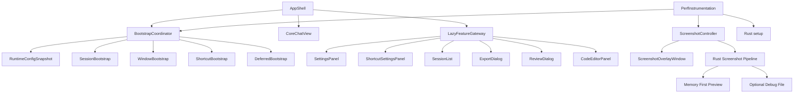

# 性能优化架构设计文档

> 日期：2026-03-22
> 范围：TODO #54、TODO #55，以及相关的前后端启动链路、截图链路、配置读取链路、日志与可观测性链路

---

## 1. 文档目标

本文档用于指导 AI_Cue 后续一轮分阶段性能优化，目标不是做一次性激进重构，而是在不破坏现有功能稳定性的前提下，系统性解决以下问题：

1. 应用启动阶段加载链路偏长，首屏可交互时间偏慢。
2. 设置页、快捷键页、会话页等非核心能力在首屏阶段占用资源。
3. 截图功能从点击到蒙版可操作之间存在明显等待。
4. 配置读取、初始化编排、日志输出存在重复开销。
5. 当前缺少统一性能基线、指标体系、阶段验收标准。

本文档强调四个方向：

1. 可扩展：后续新增设置面板、工具面板、Provider、截图模式时，不需要重新推翻启动链路。
2. 可维护：模块职责清晰，初始化顺序可推理，问题可以定位。
3. 高性能：优先优化关键路径，避免为了局部收益引入全局复杂度。
4. 代码安全：性能优化不能破坏窗口保护、配置安全、错误兜底和资源清理。

本文档的“全链路”边界定义如下：

1. 包含前端首屏启动、Tauri 后端启动、配置读取、窗口恢复、快捷键初始化、截图蒙版链路、日志与性能埋点链路。
2. 不包含 AI Provider 请求本身的网络推理性能优化，不包含模型侧延迟优化，不包含数据库查询专项优化。
3. 若后续需要扩展到 AI 网络链路、RAG 链路、Agent 链路，应另开专项设计，避免本轮范围失控。

---

## 2. 背景与现状

### 2.1 当前待优化需求

| 编号 | 需求 | 当前状态 |
|------|------|----------|
| #54 | 启动速度优化（懒加载设置面板等非核心模块） | 未完成 |
| #55 | 性能优化，截图功能蒙版出现太慢 | 未完成 |

### 2.2 当前架构中的性能痛点

通过对 `src/App.tsx`、`src/components/ScreenshotSelector.tsx`、`src/store/config.ts`、`src/services/shortcutManager.ts`、`src/services/windowManager.ts`、`src-tauri/src/lib.rs`、`src-tauri/src/screenshot.rs` 的调研，可以确认当前问题主要集中在以下几类。

#### 2.2.1 首屏入口承担了过多职责

`src/App.tsx` 既承担主聊天界面渲染，又承担以下职责：

1. 会话恢复
2. 配置读取
3. 窗口透明度恢复
4. 窗口位置恢复
5. 快捷键初始化
6. 紧凑模式恢复
7. 消息搜索
8. 截图、录音、导出、复盘等多个功能入口管理

这导致两个问题：

1. 首屏渲染和应用初始化高度耦合，任何一个初始化步骤变慢，都会影响用户体感。
2. `App.tsx` 模块体积和职责持续膨胀，不利于后续维护。

#### 2.2.2 非首屏能力被静态纳入主入口

当前主入口静态引入了多个并非首屏必需的模块：

1. `SettingsPanel`
2. `ShortcutSettingsPanel`
3. `SessionList`
4. `ExportDialog`
5. `ReviewDialog`
6. `CodeEditorPanel`

虽然 `CodeEditorPanel` 内部对 Monaco 做了懒加载，但组件本身仍由主入口静态引用。这样会带来两个副作用：

1. 首屏构建依赖图变大。
2. 主入口代码解析、依赖分析和运行时挂载负担变重。

#### 2.2.3 配置读取存在重复开销

`loadConfig()` 当前会按字段逐个读取 Store 或 localStorage，并进行迁移与修复。启动期多个 `useEffect` 重复调用 `loadConfig()`，包括：

1. 会话恢复
2. 窗口透明度恢复
3. 快捷键初始化
4. 其他功能入口可能的配置读取

这意味着：

1. 启动阶段存在重复 IPC 与重复解析。
2. 配置迁移和校验逻辑重复执行。
3. 后续新增初始化点时，容易继续放大这一问题。

#### 2.2.4 截图蒙版链路路径过长

当前截图链路大致如下：

```text
点击截图按钮
-> 隐藏主窗口
-> 固定等待 150ms
-> Rust 全屏截图
-> 将整张截图保存到临时文件
-> 创建 screenshot WebviewWindow
-> screenshot 页面加载
->  从磁盘读取整张截图
-> 用户开始拖拽选区
```

这条链路的瓶颈不在单一模块，而是多段成本叠加：

1. 主窗口隐藏与焦点切换
2. 全屏截图耗时
3. PNG 落盘耗时
4. 新 WebviewWindow 创建耗时
5. 图片从磁盘重新加载耗时

#### 2.2.5 启动期日志输出偏多

前端存在较多 `console.log`、`console.warn`、`console.error`。其中一部分是调试期必要信息，但另一部分出现在高频初始化路径上，例如：

1. 快捷键初始化
2. 配置加载
3. localStorage / Store 切换
4. 窗口位置恢复

问题不在于日志本身，而在于：

1. 启动阶段多次输出会增加噪声与调试成本。
2. 初始化信息没有统一层级和采样策略。
3. 后续若引入性能埋点，容易与现有日志混杂。

#### 2.2.6 Rust 后端启动阶段尚未分层

`src-tauri/src/lib.rs` 的 `setup` 目前在启动时完成：

1. 日志系统初始化
2. 数据库初始化
3. Provider 注册表初始化
4. 动态 Provider 描述符加载

其中数据库初始化是必要路径，但动态 Provider 加载不一定必须阻塞首屏。当前缺少明确分层，后续再加入更多启动能力时，风险会持续增大。

---

## 3. 已知证据与基线

### 3.1 构建结果证据

对当前前端执行 `npm run build` 后，得到如下关键结果：

| 产物 | 体积 | 说明 |
|------|------|------|
| `dist/assets/main-*.js` | 220.46 KB | 主入口业务 chunk |
| `dist/assets/index-*.js` | 205.34 KB | 主页面相关 chunk |
| `dist/assets/monaco-editor-*.js` | 3,807.66 KB | Monaco 主体 chunk，极大 |
| `dist/assets/screenshot-*.js` | 5.75 KB | 截图页 JS 很轻 |

可推导出两个结论：

1. 启动速度问题主要在主入口初始化与非核心依赖，不在截图页 bundle。
2. 截图蒙版慢的核心不在截图页 JS 包体积，而在截图数据生成与窗口切换链路。

### 3.2 当前性能结论

在没有统一埋点之前，可以先得出工程层面的定性结论：

1. 首屏问题是结构性问题，不是单纯某个函数写得慢。
2. 截图蒙版问题是跨层链路问题，涉及前端、Tauri 窗口、Rust 截图、文件 I/O。
3. 配置读取和初始化编排问题是后续所有功能增长的放大器，必须优先治理。

---

## 4. 总体设计原则

### 4.1 关键路径优先

优先优化用户最容易感知的路径：

1. 冷启动到可输入
2. 热启动到可输入
3. 点击截图到蒙版可拖拽
4. 点击设置到设置页可操作

次要路径放在第二批处理：

1. 导出对话框
2. 复盘对话框
3. 会话搜索页面
4. 非首屏日志整理

### 4.2 首屏只做最少必要工作

首屏只保留四类必须完成的任务：

1. 主窗口最小 UI 渲染
2. 必要配置快照加载
3. 必要数据库依赖准备
4. 基础输入能力可用

其他能力遵循以下规则：

1. 非首屏不用就不加载
2. 不立即交互就不立即初始化
3. 可以异步完成的任务不阻塞首屏

### 4.3 初始化要集中编排

所有启动逻辑必须从“各自 `useEffect` 竞争执行”转为“统一启动编排器分层调度”，这样才能保证：

1. 可读性
2. 可观测性
3. 错误隔离
4. 扩展时不失控

### 4.4 性能优化不能牺牲安全性

本项目存在明显安全边界，不能因追求速度而破坏：

1. 主窗口 `contentProtected` 行为
2. 截图临时资源清理
3. 配置持久化一致性
4. 全局快捷键可控性
5. 异常链路下的窗口恢复

### 4.5 不做一轮过度重构

本轮优化采用“分阶段、可回退”的渐进策略，不做以下事情：

1. 不一次性重写整个 `App.tsx`
2. 不一次性替换所有状态管理方式
3. 不引入重量级状态框架或性能框架
4. 不为了理论最优而牺牲交付确定性

---

## 5. 优化目标与验收指标

### 5.1 功能目标

本轮优化完成后，应满足以下目标：

1. 首屏阶段仅加载核心聊天界面与必要运行时。
2. 设置、快捷键、会话列表、导出、复盘等面板按需加载。
3. 配置只在启动关键路径读取一次，后续复用快照或缓存。
4. 截图蒙版出现速度显著提升，空白等待明显缩短。
5. 启动和截图关键链路可被埋点观测。

### 5.2 指标目标

由于当前尚无统一埋点，本文档定义先验目标，实际阈值应以基线采样后修正。

| 指标 | 当前状态 | 优化目标 |
|------|----------|----------|
| 冷启动到首屏可交互时间 | 未量化 | 建立基线后至少下降 20% |
| 热启动到首屏可交互时间 | 未量化 | 建立基线后至少下降 25% |
| 点击截图到蒙版可拖拽时间 | 体感明显偏慢 | 建立基线后至少下降 30% |
| 首屏配置读取次数 | 多次 | 关键路径限制为 1 次 |
| 首屏非核心面板静态引入数量 | 多个 | 降为 0 |
| 启动期高噪声日志数量 | 偏多 | 仅保留必要错误与关键指标 |

### 5.3 工程验收目标

| 维度 | 验收标准 |
|------|----------|
| 可扩展性 | 新增功能面板可按统一懒加载协议接入 |
| 可维护性 | 启动编排逻辑集中，不再分散在多个不相关 `useEffect` 中 |
| 性能 | 指标达到本轮基线改善目标 |
| 安全性 | 截图失败、取消、异常退出时临时资源可回收，主窗口可恢复 |
| 稳定性 | 多显示器、DPI 缩放、紧凑模式、快捷键均不回退 |

### 5.4 测量协议

为避免“优化完成”缺乏客观依据，本轮统一采用以下测量协议。

#### 5.4.1 术语定义

| 术语 | 定义 |
|------|------|
| 冷启动 | 完全关闭应用后重新启动，不复用已有窗口实例 |
| 热启动 | 应用资源已在系统缓存中，关闭后短时间内再次启动 |
| 首屏可交互 | 输入框已可聚焦、发送按钮可点击、标题栏已完成渲染 |
| 截图蒙版可拖拽 | 截图页已显示交互层，鼠标按下后可立即产生选区 |
| 基线 | 在优化前按统一环境测得的中位值 |

#### 5.4.2 测量环境要求

1. 同一台机器对比，不允许跨设备比较。
2. 同一电源模式下对比，优先接电测试。
3. 同一屏幕布局与 DPI 设置下对比。
4. 测试前关闭明显干扰项，例如大型下载、编译任务、全盘扫描。
5. 每个指标至少采样 10 次，取中位值作为对比依据。

#### 5.4.3 记录要求

1. 每次优化前先记录基线。
2. 每个阶段完成后复测同一指标。
3. 结果记录必须包含设备标识、系统版本、显示器数量、DPI、测试时间。
4. 百分比改善只能基于同一测量协议得出。

#### 5.4.4 阶段门禁

1. 没有基线数据，不允许宣称“性能已提升”。
2. 指标改善未达阶段目标时，不应进入下一阶段大改动。
3. 若某阶段收益不足但引入复杂度显著增加，应优先回滚或降级为实验方案。

---

## 6. 总体架构设计

### 6.1 目标架构概览



该架构分成四层：

1. AppShell 层：负责最小可用 UI 和路由式视图切换。
2. BootstrapCoordinator 层：负责统一启动编排。
3. LazyFeatureGateway 层：负责非核心功能按需加载。
4. ScreenshotController 层：负责截图链路的跨层协同和性能优化。

---

## 7. 分阶段优化方案

## 7.1 第 0 阶段：建立性能基线与埋点

### 7.1.1 目标

先解决“怎么测”的问题，再进入“怎么改”。

### 7.1.2 设计内容

引入统一轻量埋点，不依赖外部 SDK，只记录关键时间点：

前端埋点：

1. `app_bootstrap_start`
2. `config_loaded`
3. `core_ui_ready`
4. `session_restored`
5. `shortcuts_ready`
6. `screenshot_click`
7. `screenshot_window_ready`
8. `screenshot_image_ready`
9. `screenshot_interactive`

后端埋点：

1. `rust_setup_start`
2. `logging_init_done`
3. `database_init_done`
4. `provider_registry_ready`
5. `dynamic_provider_load_done`
6. `capture_full_screen_done`
7. `crop_screenshot_done`

### 7.1.3 设计要求

1. 埋点默认低噪声，仅开发环境详细输出。
2. 生产环境仅保留必要聚合统计，不打印长串调试信息。
3. 埋点接口必须幂等，失败不能影响业务流程。
4. 埋点格式统一，便于后续导出或诊断。

### 7.1.4 产出

1. 一份启动与截图链路基线数据
2. 一份改造前后对比表
3. 一份回归判断依据

---

## 7.2 第 1 阶段：启动链路瘦身

### 7.2.1 目标

将首屏启动从“多条初始化链路并发竞争”改为“有优先级的单次编排”。

### 7.2.2 核心设计

新增一个启动快照概念：

```ts
type RuntimeConfigSnapshot = {
  config: AppConfig;
  promptMode: PromptMode;
  compactModeEnabled: boolean;
  windowOpacity: number;
  shortcutConfig: ShortcutConfig;
};
```

启动阶段只允许做一次关键配置读取，得到 `RuntimeConfigSnapshot`，后续模块全部从该快照获取数据，避免多次 `loadConfig()`。

### 7.2.3 启动编排顺序

建议顺序如下：

1. 记录 `app_bootstrap_start`
2. 读取并生成 `RuntimeConfigSnapshot`
3. 同步应用最小窗口状态，例如透明度、紧凑模式标记
4. 渲染主界面壳层
5. 异步恢复最近会话
6. 异步注册快捷键
7. 异步恢复窗口位置
8. 延后执行非关键任务

### 7.2.4 延后任务定义

以下任务不应阻塞首屏渲染：

1. 非当前视图面板准备
2. 非关键日志初始化的详细输出
3. 可延迟的 Provider 描述符加载结果同步
4. 次级 UI 状态准备

### 7.2.5 收益

1. 减少重复 I/O
2. 降低首屏 `useEffect` 竞争
3. 启动流程更可推理
4. 为未来新增初始化点提供标准入口

---

## 7.3 第 2 阶段：首屏视图与非核心能力拆层

### 7.3.1 目标

让用户尽快看到可输入、可发送、可截图的主界面，其余功能按需进入。

### 7.3.2 功能分层

将前端能力分为三类：

#### A 类：首屏核心能力

1. 标题栏
2. 消息列表
3. 输入框
4. 发送按钮
5. 录音按钮
6. 截图按钮
7. 基础网络状态显示

#### B 类：延迟初始化能力

1. 会话恢复
2. 快捷键注册
3. 窗口位置恢复
4. 紧凑模式完整切换逻辑

#### C 类：按需加载能力

1. 设置页
2. 快捷键设置页
3. 会话列表页
4. 导出对话框
5. 复盘对话框
6. 代码编辑器面板

### 7.3.3 设计要求

1. C 类能力全部通过统一懒加载网关进入。
2. 每个面板都应有轻量 fallback。
3. 懒加载不能改变业务语义，只改变加载时机。
4. 对话主路径不依赖这些面板的同步初始化。

### 7.3.4 对 Monaco 的处理原则

当前 `CodeEditorPanel` 已内部懒加载 Monaco，但还不够。

本轮要求：

1. `CodeEditorPanel` 自身从主入口剥离，避免首屏静态依赖。
2. Monaco 相关资源仍继续保留独立 chunk。
3. 仅在代码模式开启或用户主动打开编辑器时才加载编辑器面板。

### 7.3.5 对未来扩展的收益

后续新增“知识库管理页”“Agent 工作流页”“搜索增强页”时，只要接入同一 LazyFeatureGateway，就不会重复污染首屏。

---

## 7.4 第 3 阶段：截图蒙版保守提速

### 7.4.1 目标

在不推翻现有截图架构的前提下，先压缩用户可感知空白期，快速获取第一轮收益。

### 7.4.2 现有问题拆解

当前截图慢，通常不是某一处算法慢，而是以下五段叠加：

1. 主窗口隐藏延迟
2. 全屏截图生成
3. 全图落盘
4. 截图窗口创建
5. 截图图片重新读取与渲染

### 7.4.3 设计路线

本阶段只做保守提速，不引入跨层大改造：

1. 将固定 `150ms` 等待改为更可靠的窗口隐藏完成策略，避免硬编码等待。
2. 截图窗口创建流程前移，尽量减少“黑屏等待”。
3. 截图页优先展示交互层和遮罩，再异步填充背景图。
4. 若背景图未就绪，也应优先让用户感知到截图模式已进入。

### 7.4.4 建议的新截图链路

```text
点击截图按钮
-> 记录 screenshot_click
-> 主窗口进入安全隐藏态
-> Rust 捕获屏幕图像到内存
-> 立即创建截图窗口并展示遮罩
-> 将预览图注入截图页
-> 记录 screenshot_interactive
-> 用户拖拽选区
-> Rust 在内存图像上裁剪
-> 仅在需要调试时落盘 debug 文件
-> 恢复主窗口
```

### 7.4.5 保守提速阶段的验收标准

1. 点击截图后，用户先看到截图交互态，再看到背景图，不允许长时间无反馈。
2. 固定等待常量减少或移除后，截图失败率不能上升。
3. 取消截图、截图失败、截图成功三条路径都能恢复主窗口。
4. 多显示器和高 DPI 场景不能出现坐标错位。

### 7.4.6 为什么不直接做常驻截图窗口

常驻截图窗口是可选增强方向，但不作为本轮必做，原因如下：

1. 引入额外生命周期管理复杂度
2. 多显示器和 DPI 适配复杂度更高
3. 容易引入窗口状态同步问题
4. 第一轮先通过内存链路和前置交互层就能拿到较大收益

因此本阶段采用“先解决主链路瓶颈，再决定是否需要常驻窗口”的策略。

---

## 7.5 第 4 阶段：截图链路内存优先化

### 7.5.1 目标

从架构上减少整图落盘与重新读取的往返成本，把截图链路从“磁盘优先”调整为“内存优先”。

### 7.5.2 前置条件

本阶段不是直接进入开发，而是先通过技术预研门禁。

预研必须回答以下问题：

1. Tauri 2 当前链路下，截图预览图从 Rust 传到截图页最稳定的方式是什么。
2. 在 2K、4K、多屏场景下，单次传输的内存峰值是多少。
3. 哪个分辨率阈值下应自动回退到磁盘链路。
4. 预览图释放时机是什么，如何避免长时间占用内存。

若预研结论不稳定，本阶段暂停，继续保留第 3 阶段保守提速结果。

### 7.5.3 数据契约建议

建议定义清晰的数据契约，而不是在窗口参数里临时拼接大数据：

前端需要的最小预览数据：

1. `captureId`
2. `logicalWidth`
3. `logicalHeight`
4. `physicalWidth`
5. `physicalHeight`
6. `previewTransportType`
7. `previewPayloadRef`

其中：

1. `previewTransportType` 用于声明走内存引用、Blob URL、临时文件还是兼容磁盘模式。
2. `previewPayloadRef` 只保存可解析引用，不直接混杂业务参数。

### 7.5.4 回退策略

必须显式定义回退条件：

1. 图像尺寸超过安全阈值
2. 内存预览构建失败
3. Webview 接收失败
4. 高 DPI 或多屏场景下坐标映射校验失败

任何一种情况都允许自动回退到当前稳定的磁盘链路。

### 7.5.5 本阶段验收标准

1. 在主流单屏与高 DPI 场景下，截图蒙版可拖拽时间继续下降。
2. 内存峰值可观测、可回收。
3. 调试文件不再是主链路刚性依赖。
4. 回退路径稳定可用。

---

## 7.6 第 5 阶段：Rust 启动与后端初始化优化

### 7.6.1 目标

减少 Tauri `setup` 对前端首屏路径的阻塞影响，同时保持后端初始化安全性。

### 7.6.2 初始化分层

后端初始化分为三层：

#### 第一层：强依赖初始化

必须在应用进入可用状态前完成：

1. 日志基础设施初始化
2. 数据库初始化
3. 基本命令注册

#### 第二层：早期异步初始化

建议在首屏出现后尽快完成：

1. Provider 注册表完善
2. 动态 Provider 描述符加载

#### 第三层：惰性初始化

只有功能真正触发时才加载：

1. 某些重型诊断能力
2. 非首屏统计与导出辅助能力

### 7.6.3 动态 Provider 加载原则

当前动态 Provider 加载在 `setup` 内完成，这不利于扩展。

本轮建议：

1. 先保留内置 Provider 初始化不变。
2. 动态 Provider 描述符加载移到“首屏后异步任务”。
3. 加载失败不阻塞聊天主流程。
4. 加载结果通过统一状态回写前端，而不是硬阻塞启动。

### 7.6.4 动态 Provider 就绪状态模型

为避免异步化后出现不可预期行为，建议定义明确状态：

| 状态 | 含义 | 前端行为 |
|------|------|----------|
| idle | 尚未开始加载 | 不显示动态 Provider |
| loading | 正在异步加载 | 显示“正在加载可扩展 Provider” |
| ready | 已完成加载 | 正常展示可用项 |
| degraded | 加载失败但主流程可用 | 展示轻量告警，不阻塞主界面 |

后端需要同步提供可识别的错误语义，前端不能靠字符串猜测状态。

### 7.6.5 安全要求

1. 任何延后初始化都不能导致命令调用时空指针或未注册状态崩溃。
2. 后端必须提供“未就绪但可识别”的错误信息，而不是 panic。
3. 截图、会话、基础聊天命令必须始终处于可靠可用状态。

---

## 7.7 第 6 阶段：日志与可观测性治理

### 7.7.1 目标

让日志为性能优化服务，而不是制造噪声。

### 7.7.2 日志治理原则

1. 开发环境保留必要调试信息。
2. 生产环境禁止高频无意义日志。
3. 关键链路使用结构化事件记录，而不是随手 `console.log`。
4. 性能埋点与错误日志分层管理。

### 7.7.3 前端日志分级

| 级别 | 使用场景 |
|------|----------|
| error | 用户操作失败、窗口恢复失败、截图关键失败 |
| warn | 降级执行、兼容路径、可恢复异常 |
| info | 仅开发环境或显式诊断开关开启时输出 |
| debug | 默认关闭，仅问题定位时使用 |

### 7.7.4 要求

1. 快捷键注册细节不再默认全量打印。
2. 配置加载成功不再每次输出冗余日志。
3. 启动阶段只输出关键生命周期节点。
4. 截图性能链路通过统一埋点记录，不靠散乱日志拼接。
5. 业务日志遵循项目既有策略；性能埋点作为非功能监控数据，默认不记录正文、截图内容和密钥字段，二者不得混用。

---

## 8. 模块设计与职责边界

### 8.1 前端模块职责建议

| 模块 | 职责 | 是否首屏核心 |
|------|------|--------------|
| `AppShell` | 渲染最小 UI 壳层，承接核心视图 | 是 |
| `BootstrapCoordinator` | 统一启动编排与状态聚合 | 是 |
| `RuntimeConfigSnapshot` | 启动配置快照与缓存 | 是 |
| `LazyFeatureGateway` | 统一非核心面板懒加载入口 | 否 |
| `ScreenshotController` | 管理截图入口、窗口切换、状态恢复 | 是 |
| `PerfInstrumentation` | 统一性能埋点和指标记录 | 是 |
| `FeaturePanels/*` | 设置、快捷键、会话、导出、复盘等按需面板 | 否 |

### 8.2 后端模块职责建议

| 模块 | 职责 |
|------|------|
| `startup` | 管理后端初始化阶段和时序 |
| `screenshot` | 管理屏幕捕获、内存预览、裁剪、调试文件 |
| `logging` | 结构化日志输出与级别控制 |
| `ai/loader` | 动态 Provider 加载与状态回写 |
| `database` | 提供稳定会话读写基础能力 |

### 8.3 设计约束

1. 启动编排器只负责调度，不直接承载大段业务逻辑。
2. 配置模块只负责配置，不负责窗口、副作用、快捷键注册。
3. 截图控制器只负责截图流程，不混入聊天请求逻辑。
4. UI 面板尽量无副作用，进入时加载，退出时释放。

---

## 9. 可扩展性设计

### 9.1 面板扩展协议

后续新增功能页必须满足统一协议：

1. 支持懒加载
2. 支持轻量 fallback
3. 支持独立错误边界
4. 不要求首屏初始化

这样后续新增页面时，不需要回到主入口重新做大改。

### 9.2 启动任务扩展协议

新增初始化任务必须声明：

1. 是否阻塞首屏
2. 是否依赖配置快照
3. 是否可失败降级
4. 是否需要性能埋点

示例分类：

| 任务 | 类型 |
|------|------|
| 数据库初始化 | 阻塞首屏 |
| 快捷键注册 | 首屏后异步 |
| 动态 Provider 加载 | 首屏后异步 |
| 导出服务准备 | 惰性初始化 |

### 9.3 截图能力扩展协议

未来若支持：

1. 多显示器截图
2. 活动窗口截图
3. OCR 前处理
4. 连续截图模式

都应在 `ScreenshotController + Rust screenshot pipeline` 之上扩展，而不是继续把细节散落到 `App.tsx`。

---

## 10. 可维护性设计

### 10.1 降低主入口复杂度

本轮优化后，`App.tsx` 应逐步收缩为：

1. 视图编排
2. 核心交互绑定
3. 状态注入

而不是继续承担：

1. 全部初始化副作用
2. 截图细节
3. 窗口恢复细节
4. 快捷键注册细节
5. 配置协调细节

### 10.2 避免隐式耦合

重点避免以下耦合：

1. 配置读取逻辑和窗口副作用耦合
2. 截图链路和消息发送链路耦合
3. 面板显示状态与模块加载时机耦合混乱
4. 启动顺序依赖散落在多个 `useEffect`

### 10.3 统一异常模型

优化过程中必须统一处理以下异常：

1. 配置读取失败
2. 快捷键注册失败
3. 窗口位置恢复失败
4. 截图失败
5. 截图取消
6. 截图窗口关闭异常
7. 动态 Provider 加载失败

要求：

1. 关键路径失败要有可恢复兜底。
2. 非关键路径失败不能拖垮主流程。
3. 用户可感知错误应简洁明确。

---

## 11. 安全设计

性能优化必须纳入安全约束，尤其是截图链路和配置链路。

### 11.1 截图链路安全

1. 临时截图资源必须在成功、取消、失败三条路径下都能清理。
2. 不允许因内存预览方案而造成图像数据无控制泄露。
3. 调试截图必须是显式可控行为，不应无限制堆积。
4. 主窗口恢复逻辑必须放在 `finally` 或同等级兜底路径，避免隐藏后无法恢复。

### 11.2 配置链路安全

1. 配置快照只做运行时缓存，不改变原始持久化边界。
2. 配置读取失败时要有降级默认值。
3. 不允许为性能而绕过必要的配置修复与迁移逻辑。

### 11.3 日志安全

1. 性能埋点不记录敏感内容正文。
2. 日志中不输出完整 API Key、完整截图内容、完整用户输入。
3. 若后续支持性能报告导出，应只包含指标，不包含敏感业务数据。

### 11.4 窗口与交互安全

1. 不得破坏主窗口 `contentProtected` 设计目标。
2. 不得因延迟初始化导致快捷键误触发到空处理器。
3. 不得因截图链路改造造成主窗口焦点恢复异常。

---

## 12. 实施顺序建议

### 12.1 建议顺序

1. 第 0 阶段：埋点与基线
2. 第 1 阶段：配置快照与启动编排
3. 第 2 阶段：非核心面板懒加载
4. 第 3 阶段：截图蒙版保守提速
5. 第 4 阶段：截图链路内存优先化
6. 第 5 阶段：Rust 启动异步分层
7. 第 6 阶段：日志治理与验收收尾

### 12.2 不建议的顺序

以下顺序风险高，不建议采用：

1. 先重构截图后端，再补埋点
2. 先大拆 `App.tsx`，再考虑验收指标
3. 先删除日志，再排查性能
4. 一次性并行改动启动、截图、配置、面板所有模块

原因是：

1. 无基线会让优化结果无法证明。
2. 大规模同时改动会放大回归范围。
3. 截图链路涉及窗口和资源管理，必须渐进推进。

---

## 13. 风险分析与回滚策略

### 13.1 风险清单

| 风险 | 说明 | 缓解措施 |
|------|------|----------|
| 启动顺序回归 | 首屏更快，但会话恢复或快捷键失效 | 用分层编排和验收清单保障 |
| 懒加载白屏 | 面板首次打开时出现明显空白 | 为每个面板提供轻量 fallback |
| 截图窗口状态异常 | 主窗口隐藏后未恢复 | 在取消、失败、成功路径统一恢复 |
| 多显示器适配回归 | 截图坐标和缩放映射错误 | 单屏、多屏、不同 DPI 分开测试 |
| 日志过度裁剪 | 线上定位问题困难 | 保留结构化关键日志，不做全删 |
| 动态 Provider 延后加载回归 | 首次使用动态 Provider 时不可用 | 增加就绪状态和显式错误提示 |

### 13.2 回滚策略

每一阶段都必须可独立回滚：

1. 配置快照若出问题，可回退到原 `loadConfig()` 调用链。
2. 懒加载若出现白屏，可回退单个面板的懒加载策略。
3. 截图内存优先链路若不稳定，可先保留磁盘链路作为兼容模式。
4. 动态 Provider 延后初始化若产生兼容问题，可暂时恢复同步加载。

---

## 14. 验证与回归计划

### 14.1 启动链路验证

需要验证以下场景：

1. 冷启动，无历史会话
2. 冷启动，有历史会话
3. 热启动，有紧凑模式配置
4. 热启动，有透明度和悬停恢复配置
5. 快捷键已配置，启动后立即可用

### 14.2 截图链路验证

需要验证以下场景：

1. 单显示器，100% 缩放
2. 单显示器，高 DPI 缩放
3. 多显示器，主屏截图
4. 点击截图后立即取消
5. 点击截图后完成裁剪
6. 截图窗口异常关闭
7. 截图失败后主窗口恢复

### 14.3 性能验收方式

每个阶段交付前需要输出：

1. 变更前指标
2. 变更后指标
3. 差异分析
4. 是否达到阶段目标

没有指标，不允许声称“优化完成”。

### 14.4 阶段性交付物

| 阶段 | 必要交付物 |
|------|------------|
| 第 0 阶段 | 埋点表、基线报告、术语定义 |
| 第 1 阶段 | 启动编排方案、配置快照落地、回归结果 |
| 第 2 阶段 | 懒加载清单、fallback 清单、首屏体积对比 |
| 第 3 阶段 | 截图保守提速结果、失败恢复验证 |
| 第 4 阶段 | 技术预研结论、数据契约、回退开关、性能对比 |
| 第 5 阶段 | 后端初始化分层结果、动态 Provider 状态验证 |
| 第 6 阶段 | 日志治理清单、最终性能对比、验收总结 |

---

## 15. 本轮优化后的目标状态

完成本轮设计落地后，项目应达到以下状态：

1. 主入口只承担核心聊天 UI 和少量必要编排。
2. 非核心面板不再污染首屏路径。
3. 配置读取不再在启动期重复执行。
4. 截图蒙版出现明显提速，用户可感知等待显著降低。
5. 后端启动更分层，未来继续增长时不容易失控。
6. 性能诊断具备统一基线、统一埋点、统一验收标准。

这套方案不是“为了这两个 TODO 临时打补丁”，而是为后续 3 期功能继续扩展建立性能基础设施。后续无论新增 RAG、Agent、知识库、工作流还是更多面板，都可以在这套规则下继续演进，而不会再次把首屏和截图链路拖慢。

---

## 16. 后续实施建议

建议后续实施按以下原则执行：

1. 每一阶段单独提交，避免大批量混改。
2. 每一阶段先补埋点，再做改造，再做对比。
3. 先解决结构性问题，再处理局部微优化。
4. 截图链路优先做“保守提速”，确认稳定后再进入“内存优先”。
5. 任何性能优化都必须附带回归验证结果。

---

## 17. 逐阶段实施计划总览

本章节将前文的设计方案进一步细化为可执行实施计划，供后续开发阶段直接使用。这里仍然不写具体业务代码，只定义每一阶段应该做什么、改哪些文件、如何验证、何时进入下一阶段。

### 17.1 实施总原则

1. 严格按阶段推进，不并行推进多个高风险阶段。
2. 每一阶段开始前，先确认上一阶段的验收结果已经固化。
3. 每一阶段只解决一个主问题，避免把“结构治理”“局部优化”“架构重构”混在一起。
4. 所有阶段都必须保留可回滚方案。
5. 所有阶段都必须有明确的文件影响边界。
6. 所有阶段都必须保留后续扩展空间，不能用一次性硬编码换取短期性能收益。

### 17.2 阶段总表

| 阶段 | 核心目标 | 主风险 | 是否允许跳过 |
|------|----------|--------|--------------|
| 第 0 阶段 | 建立埋点和基线 | 测量口径不一致 | 不允许 |
| 第 1 阶段 | 启动配置快照与启动编排 | 启动顺序回归 | 不允许 |
| 第 2 阶段 | 非核心模块懒加载与首屏瘦身 | 面板首次打开白屏 | 不允许 |
| 第 3 阶段 | 截图链路保守提速 | 窗口恢复异常 | 不允许 |
| 第 4 阶段 | 截图链路内存优先化 | 内存占用和回退路径不稳定 | 允许，若预研不通过则暂停 |
| 第 5 阶段 | Rust 启动链路分层 | 后端状态未就绪异常 | 不建议跳过 |
| 第 6 阶段 | 日志治理与收尾验收 | 定位信息不足 | 不允许 |

### 17.3 推荐执行节奏

建议以“小阶段、强验证、快回滚”的节奏执行：

1. 每个阶段控制在单独一轮实现和验证周期内完成。
2. 每个阶段结束后必须产出对比记录，再进入下一阶段。
3. 若某阶段收益不明显，应优先暂停该方向，先处理收益更确定的阶段。

---

## 18. 文件影响地图

本节不是最终改动清单，而是实施前的文件边界地图。后续编码时，优先在这些文件内工作，避免把性能相关逻辑再次散落。

### 18.1 前端已有文件

| 文件 | 当前职责 | 计划角色 |
|------|----------|----------|
| `src/App.tsx` | 主界面、初始化、副作用、截图、会话、快捷键、窗口恢复等全部混合 | 逐步收缩为视图壳层和核心交互入口 |
| `src/main.tsx` | 挂载 React 根节点 | 保持轻量，视情况补启动埋点入口 |
| `src/screenshot.tsx` | 截图页挂载入口 | 保持轻量，承接截图页初始化埋点 |
| `src/components/ScreenshotSelector.tsx` | 截图蒙版 UI、选区、确认取消 | 承接截图交互层优化和异步背景显示 |
| `src/store/config.ts` | 配置读取、迁移、校验、持久化 | 配合抽出运行时配置快照与读取缓存策略 |
| `src/services/shortcutManager.ts` | 全局快捷键注册与日志输出 | 降低日志噪声，适配新启动编排 |
| `src/services/windowManager.ts` | 透明度、紧凑模式、窗口记忆、穿透模式 | 配合启动编排和窗口恢复顺序调整 |

### 18.2 前端建议新增文件

| 文件 | 目的 |
|------|------|
| `src/bootstrap/bootstrapCoordinator.ts` | 统一管理前端启动阶段顺序 |
| `src/bootstrap/runtimeConfigSnapshot.ts` | 启动期单次配置快照与缓存 |
| `src/services/perf/perfInstrumentation.ts` | 前端统一性能埋点 |
| `src/services/screenshot/screenshotController.ts` | 从 `App.tsx` 中拆出截图流程控制 |
| `src/components/lazy/LazyFeatureGateway.tsx` | 统一管理非核心面板的懒加载入口 |

### 18.3 后端已有文件

| 文件 | 当前职责 | 计划角色 |
|------|----------|----------|
| `src-tauri/src/lib.rs` | Tauri 启动入口、插件注册、数据库初始化、Provider 初始化 | 做初始化分层与启动埋点 |
| `src-tauri/src/screenshot.rs` | 全屏截图、裁剪、调试图保存、取消清理 | 做截图主链路提速和内存优先化预研 |
| `src-tauri/src/logging.rs` | 日志基础设施 | 配合性能埋点与日志分级治理 |
| `src-tauri/src/ai/loader.rs` | 动态 Provider 加载 | 迁移为首屏后异步初始化 |

### 18.4 后端建议新增文件

| 文件 | 目的 |
|------|------|
| `src-tauri/src/startup.rs` | 统一后端启动阶段定义和启动时序管理 |
| `src-tauri/src/perf.rs` | 后端性能埋点工具或启动指标工具 |

### 18.5 暂不建议触碰的文件

以下文件本轮不应主动扩散修改范围，除非实施中确有强依赖：

1. `src/services/aiChat.ts`
2. `src/services/speechRecognition.ts`
3. `src-tauri/src/qwen.rs`
4. `src-tauri/src/ai/openai_compat.rs`
5. `src-tauri/src/ai/claude.rs`
6. `src-tauri/src/database.rs`

原因是：

1. 本轮性能优化重点不在 AI 网络请求链路。
2. 不必要的文件扩散会放大回归面。
3. 先处理启动、截图、配置、日志主路径，收益更确定。

---

## 19. 第 0 阶段实施计划：建立埋点与基线

### 19.1 阶段目标

建立统一测量口径，让后续所有优化都能被客观验证。

### 19.2 预计修改文件

创建：

1. `src/services/perf/perfInstrumentation.ts`
2. `src-tauri/src/perf.rs`

修改：

1. `src/main.tsx`
2. `src/App.tsx`
3. `src/screenshot.tsx`
4. `src-tauri/src/lib.rs`
5. `src-tauri/src/screenshot.rs`

### 19.3 执行步骤

- [ ] 定义前端埋点事件枚举，统一命名和字段结构。
- [ ] 定义后端埋点事件枚举，统一命名和字段结构。
- [ ] 在主应用启动入口插入 `app_bootstrap_start`、`core_ui_ready` 类事件。
- [ ] 在截图页入口插入 `screenshot_window_ready`、`screenshot_interactive` 类事件。
- [ ] 在 Rust `setup` 和截图命令中插入对应时间点采集。
- [ ] 明确埋点默认输出策略，区分开发环境与生产环境。
- [ ] 记录冷启动、热启动、截图蒙版出现时间的首轮基线。
- [ ] 生成一份基线表，作为第 1 阶段入口依据。

### 19.4 验证方式

执行和记录以下动作：

1. 冷启动 10 次，统计中位值。
2. 热启动 10 次，统计中位值。
3. 截图蒙版点击到可拖拽 10 次，统计中位值。

建议执行命令：

1. `npm run build`
2. `npm run tauri dev`

### 19.5 阶段出口

只有满足以下条件，才能进入第 1 阶段：

1. 埋点事件命名冻结，不再频繁改名。
2. 三类核心基线数据已经采集完成。
3. 埋点不会影响正常业务流程。

### 19.6 回滚信号

出现以下任一情况应立即回滚埋点改动：

1. 埋点导致页面初始化失败。
2. 埋点造成高频异常日志。
3. 埋点引入明显卡顿或渲染抖动。

---

## 20. 第 1 阶段实施计划：启动配置快照与启动编排

### 20.1 阶段目标

把当前分散在 `App.tsx` 多个 `useEffect` 中的启动逻辑集中起来，减少重复配置读取和初始化竞争。

### 20.2 预计修改文件

创建：

1. `src/bootstrap/bootstrapCoordinator.ts`
2. `src/bootstrap/runtimeConfigSnapshot.ts`

修改：

1. `src/App.tsx`
2. `src/store/config.ts`
3. `src/services/windowManager.ts`
4. `src/services/shortcutManager.ts`

### 20.3 执行步骤

- [ ] 抽象运行时配置快照结构，明确哪些字段属于启动关键配置。
- [ ] 将启动期的 `loadConfig()` 多次调用收敛为单次关键读取。
- [ ] 建立前端启动编排器，统一调度会话恢复、窗口恢复、快捷键初始化。
- [ ] 将现有启动逻辑按优先级分类为“阻塞首屏”“首屏后异步”“惰性初始化”。
- [ ] 调整 `App.tsx`，让它只消费启动结果，不再自己协调全部副作用。
- [ ] 检查窗口透明度、紧凑模式、会话恢复之间的顺序依赖。
- [ ] 检查快捷键初始化与窗口状态恢复之间的隐式耦合。
- [ ] 对重构前后进行埋点对比，验证是否减少配置读取次数和首屏等待。

### 20.4 验证方式

重点验证：

1. 应用首次启动时是否正常显示主界面。
2. 有历史会话时是否正常恢复。
3. 紧凑模式和透明度是否仍正确生效。
4. 快捷键是否在启动后可用。
5. 配置读取是否在关键路径只发生一次。

建议执行命令：

1. `npm run build`
2. `npm run tauri dev`

### 20.5 阶段出口

1. 启动关键路径只保留一次配置读取。
2. 启动逻辑的职责边界已经固定。
3. 冷启动和热启动指标相较基线有可见改善。

### 20.6 回滚信号

1. 会话恢复异常。
2. 快捷键偶发失效。
3. 紧凑模式或透明度恢复错误。
4. 首屏虽然更快，但功能状态错乱。

---

## 21. 第 2 阶段实施计划：非核心模块懒加载与首屏瘦身

### 21.1 阶段目标

把首屏之外的能力从主入口依赖图中剥离，降低启动期解析、挂载和认知复杂度。

### 21.2 预计修改文件

创建：

1. `src/components/lazy/LazyFeatureGateway.tsx`

修改：

1. `src/App.tsx`
2. `src/components/SettingsPanel.tsx`
3. `src/components/ShortcutSettingsPanel.tsx`
4. `src/components/SessionList.tsx`
5. `src/components/export/ExportDialog.tsx`
6. `src/components/review/ReviewDialog.tsx`
7. `src/components/CodeEditorPanel.tsx`

### 21.3 执行步骤

- [ ] 列出所有非首屏模块及其触发方式。
- [ ] 定义统一懒加载入口和 fallback 展示策略。
- [ ] 将设置页、快捷键页、会话页改为按需加载。
- [ ] 将导出对话框、复盘对话框改为按需加载。
- [ ] 将代码编辑器面板从 `App.tsx` 静态依赖中移出。
- [ ] 检查懒加载后首次打开体验，避免明显白屏。
- [ ] 检查状态透传方式，防止因拆层导致 props 混乱。
- [ ] 对 build 产物进行前后对比，确认主入口体积变化。

### 21.4 验证方式

重点验证：

1. 首屏可交互时间是否继续下降。
2. 首次打开设置页、快捷键页、会话页时是否可接受。
3. 代码编辑器首次打开是否只在真正需要时加载。
4. 面板关闭后回到主界面是否稳定。

建议执行命令：

1. `npm run build`
2. `npm run tauri dev`

### 21.5 阶段出口

1. 非核心面板不再由主入口静态引入。
2. 首屏聊天主路径保持完整可用。
3. 面板首次打开虽然允许有短暂加载态，但不允许体验断裂。

### 21.6 回滚信号

1. 首次打开面板白屏过长。
2. 懒加载导致状态丢失或回退异常。
3. 打包结果改善不明显但复杂度显著升高。

---

## 22. 第 3 阶段实施计划：截图链路保守提速

### 22.1 阶段目标

在不引入高风险架构改造的前提下，先把截图蒙版体感速度做出第一轮明显改善。

### 22.2 预计修改文件

创建：

1. `src/services/screenshot/screenshotController.ts`

修改：

1. `src/App.tsx`
2. `src/screenshot.tsx`
3. `src/components/ScreenshotSelector.tsx`
4. `src-tauri/src/screenshot.rs`

### 22.3 执行步骤

- [ ] 将截图触发流程从 `App.tsx` 中抽离成独立控制器。
- [ ] 审核主窗口隐藏、截图窗口创建、截图资源准备的顺序。
- [ ] 移除或缩短固定等待常量，改为更稳定的阶段信号。
- [ ] 调整截图页渲染顺序，让用户先看到交互态再等待背景图。
- [ ] 优化截图页加载提示，避免点击截图后长时间无反馈。
- [ ] 加强取消、失败、成功三条路径下的主窗口恢复逻辑。
- [ ] 对截图链路重新测量，验证保守提速收益。

### 22.4 验证方式

重点验证：

1. 点击截图后是否更快看到遮罩或交互层。
2. 取消截图是否稳定恢复主窗口。
3. 截图失败时是否稳定恢复主窗口。
4. 高 DPI 和多显示器下选区坐标是否准确。

建议执行命令：

1. `npm run build`
2. `npm run tauri dev`

### 22.5 阶段出口

1. 截图链路体感明显改善。
2. 主窗口恢复稳定性不下降。
3. 截图失败率不高于改造前。

### 22.6 回滚信号

1. 主窗口偶发无法恢复。
2. 截图页偶发打不开。
3. 用户虽然更快看到界面，但选区逻辑出现错乱。

---

## 23. 第 4 阶段实施计划：截图链路内存优先化

### 23.1 阶段目标

在第 3 阶段稳定的基础上，进一步减少整图落盘与重新读取成本。

### 23.2 预计修改文件

创建：

1. `src/services/screenshot/previewTransport.ts`

修改：

1. `src/services/screenshot/screenshotController.ts`
2. `src/screenshot.tsx`
3. `src/components/ScreenshotSelector.tsx`
4. `src-tauri/src/screenshot.rs`

### 23.3 本阶段前置门禁

进入编码前必须先完成一轮技术预研，输出以下结论：

1. 内存预览数据从 Rust 到 Webview 的可靠传输方案。
2. 2K、4K、多屏情况下的内存峰值估算。
3. 自动回退到磁盘链路的阈值设计。
4. 预览图释放时机与资源回收策略。

若预研未通过，本阶段直接暂停，不进入实现。

### 23.4 执行步骤

- [ ] 定义截图预览数据契约，明确字段和传输方式。
- [ ] 为预览链路加入 transport 抽象，避免与磁盘链路耦合死。
- [ ] 改造 Rust 侧截图结果输出，支持内存优先预览。
- [ ] 改造截图页消费逻辑，优先读取预览数据引用。
- [ ] 保留磁盘链路为兼容回退路径。
- [ ] 增加内存释放与失败清理逻辑。
- [ ] 在主流场景下重新测量截图蒙版指标。

### 23.5 验证方式

重点验证：

1. 单屏 100% 缩放
2. 单屏高 DPI
3. 多屏主屏截图
4. 大分辨率截图下的回退机制
5. 长时间使用后的内存释放情况

建议执行命令：

1. `npm run build`
2. `npm run tauri dev`

### 23.6 阶段出口

1. 截图主链路不再刚性依赖整图落盘。
2. 内存峰值在可接受范围内。
3. 回退链路稳定可用。

### 23.7 回滚信号

1. 内存占用明显异常。
2. 大分辨率或多屏场景不稳定。
3. 预览链路收益有限但实现复杂度显著增加。

---

## 24. 第 5 阶段实施计划：Rust 启动链路分层

### 24.1 阶段目标

把后端 `setup` 中混合的初始化任务按优先级分层，降低对首屏路径的阻塞影响。

### 24.2 预计修改文件

创建：

1. `src-tauri/src/startup.rs`

修改：

1. `src-tauri/src/lib.rs`
2. `src-tauri/src/logging.rs`
3. `src-tauri/src/ai/loader.rs`
4. `src-tauri/src/perf.rs`

### 24.3 执行步骤

- [ ] 梳理后端 `setup` 中哪些任务属于强依赖初始化。
- [ ] 将动态 Provider 加载迁移为首屏后异步初始化候选项。
- [ ] 给后端初始化定义统一阶段和状态结构。
- [ ] 定义动态 Provider 的就绪状态和错误语义。
- [ ] 确保聊天、会话、截图基础命令在任何时候都可用。
- [ ] 验证异步初始化失败时不会拖垮主流程。
- [ ] 对比改造前后启动时序。

### 24.4 验证方式

重点验证：

1. 后端启动不影响主界面出现。
2. 动态 Provider 未就绪时前端行为可理解。
3. 基础聊天、会话、截图命令不受影响。

建议执行命令：

1. `npm run build`
2. `npm run tauri dev`

### 24.5 阶段出口

1. 后端初始化已经按层拆清。
2. 动态 Provider 异步状态对前端可观测。
3. 首屏路径进一步去阻塞。

### 24.6 回滚信号

1. Provider 状态不稳定。
2. 后端命令在未就绪状态下行为异常。
3. 启动性能收益不明显但异常处理复杂度过高。

---

## 25. 第 6 阶段实施计划：日志治理与最终验收

### 25.1 阶段目标

清理性能优化过程中产生的临时调试噪声，形成最终可交付状态。

### 25.2 预计修改文件

修改：

1. `src/services/shortcutManager.ts`
2. `src/store/config.ts`
3. `src/App.tsx`
4. `src-tauri/src/logging.rs`
5. `src-tauri/src/lib.rs`
6. 与性能埋点相关的所有文件

### 25.3 执行步骤

- [ ] 清理不再需要的高频 `console.log` 和临时调试输出。
- [ ] 保留关键错误日志、关键生命周期日志和结构化性能事件。
- [ ] 对照第 0 阶段基线输出最终对比报告。
- [ ] 按启动、截图、懒加载、后端初始化四大类回归测试。
- [ ] 汇总所有阶段的收益、风险、残留问题与后续建议。

### 25.4 验证方式

重点验证：

1. 开发环境日志仍可用于排障。
2. 生产链路噪声显著降低。
3. 所有阶段目标已有数据支撑。
4. 没有因日志清理导致定位能力断层。

建议执行命令：

1. `npm run build`
2. `npm run tauri dev`

### 25.5 阶段出口

1. 性能优化结果已形成最终对比报告。
2. 高噪声日志已经收敛。
3. 文档、指标、风险、回滚信息完整闭环。

### 25.6 回滚信号

1. 关键排障信息被误删。
2. 优化结果无法复现或无法证明。
3. 最终状态虽然更安静，但出现“问题难定位”的新风险。

---

## 26. 跨阶段依赖关系

### 26.1 强依赖关系

| 前置阶段 | 后置阶段 | 依赖原因 |
|----------|----------|----------|
| 第 0 阶段 | 第 1 至第 6 阶段 | 没有基线就无法证明优化效果 |
| 第 1 阶段 | 第 2 阶段 | 首屏瘦身要依赖稳定的启动编排 |
| 第 3 阶段 | 第 4 阶段 | 内存优先化必须建立在保守提速稳定的基础上 |
| 第 5 阶段 | 第 6 阶段 | 日志治理需要建立在最终启动结构相对稳定之后 |

### 26.2 可并行度说明

理论上，第 2 阶段和第 5 阶段存在部分独立性，但当前项目不建议并行开发，原因如下：

1. 两者都会影响启动链路观测结果。
2. 并行推进会干扰埋点对比。
3. 当前目标是稳妥落地，不是最大化并行开发速度。

---

## 27. 每阶段提交与评审建议

### 27.1 提交粒度建议

建议每个阶段至少拆成以下提交粒度：

1. 阶段准备提交：只引入结构、埋点或壳层，不改变核心行为。
2. 主改动提交：完成该阶段的核心优化。
3. 收尾提交：补测试、补日志治理、补文档。

### 27.2 评审重点

| 阶段 | 评审重点 |
|------|----------|
| 第 0 阶段 | 埋点是否低侵入、口径是否统一 |
| 第 1 阶段 | 启动顺序是否清晰、是否消除重复配置读取 |
| 第 2 阶段 | 是否真的减轻了首屏，而不是把复杂度转移到别处 |
| 第 3 阶段 | 截图恢复路径是否安全 |
| 第 4 阶段 | 内存链路是否有明确回退与释放策略 |
| 第 5 阶段 | 后端未就绪状态是否被正确建模 |
| 第 6 阶段 | 日志清理后是否仍可排障，最终指标是否可信 |

---

## 28. 实施完成后的文档更新要求

在后续真正编码落地时，每完成一个阶段，需要同步回写文档中的以下内容：

1. 实际修改文件
2. 实际收益数据
3. 偏离原计划的原因
4. 是否触发回退
5. 是否需要调整后续阶段顺序

这样这份文档才能从“计划文档”持续演进成“实施记录”，保持长期可维护性，而不是写完即过期。
